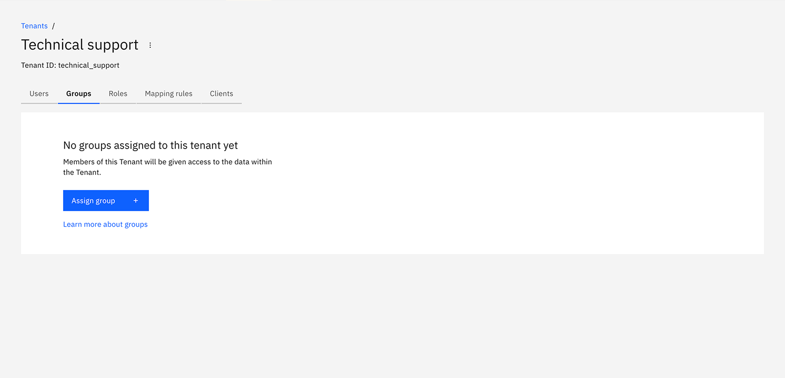
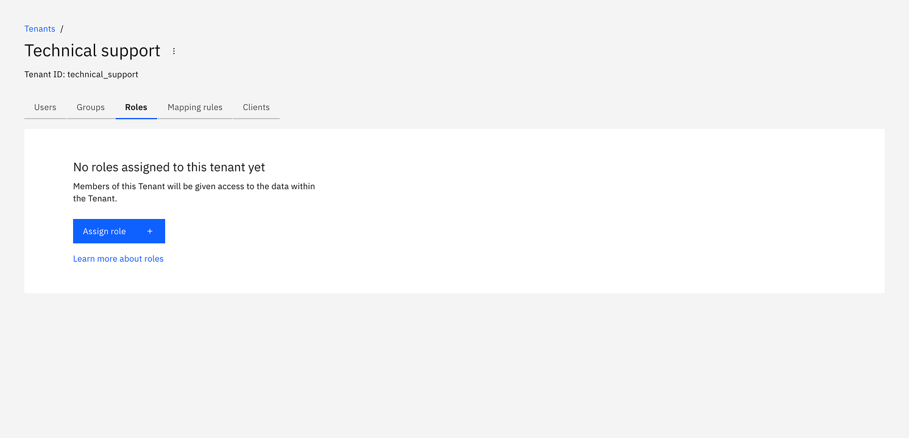
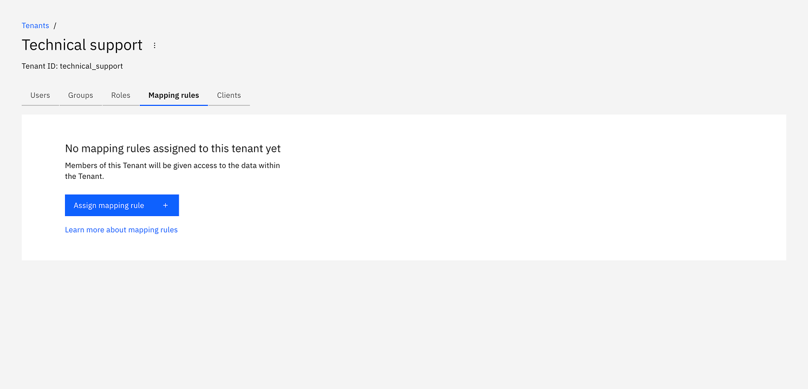
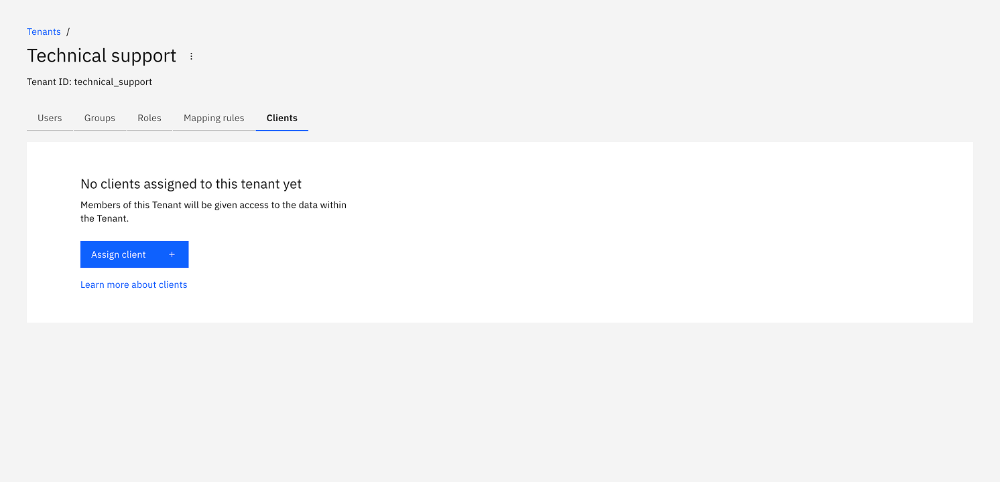

:::info
Multi-tenancy is currently only supported for Camunda 8 Self-Managed. It is not yet available on SaaS.
:::

Multi-tenancy in Camunda 8 allows a single installation to serve multiple distinct tenants, providing logical data isolation for different teams, departments, or clients. To learn more about multi-tenancy, refer to the [multi-tenancy concepts](../concepts/multi-tenancy.md).

Tenants for the Orchestration Cluster are managed directly in [Identity](identity-introduction.md).
By default, tenancy is enabled, but tenancy checks are disabled. All data is mapped to the `<default>` tenant. This allows administrators to manage tenants and their assignments without enforcing tenancy checks prematurely.

To enable multi-tenancy checks, refer to the [Self-Managed configuration properties](/self-managed/components/orchestration-cluster/core-settings/configuration/properties.md#multi-tenancy).

## Create a tenant

:::note
A `<default>` tenant is automatically created during Identity startup.
:::

1. Log in to Identity and navigate to the **Tenants** tab.

   

2. Click to create a new tenant. In the modal, enter ID and name for the tenant, and optionally the description. Then confirm to **create the tenant**:

   

3. The new tenant will be created. If it doesn't appear in the table right away, reload the page.

   

4. Click on the tenant to view the details and manage assignments:

   

## Tenant assignments

Depending on your Self-Managed setup, you can assign [users](user.md), [groups](group.md), [roles](role.md), [mapping rules](./mapping-rules/manage-mapping-rules.md), and [clients](client.md) to a tenant as follows:

### Assign users to a tenant

From the **Users** tab you can see the assigned users and add new users to a tenant.

1. Click to assign a user. In the modal, enter the username that you'd like to assign. Confirm the assignment by clicking **Assign user**:

   

2. The user will be assigned to the tenant. If it doesn't appear in the table right away, reload the page.

   

### Assign groups to a tenant

From the **Groups** tab you can see the assigned groups and add new groups to a tenant.

1. Click to assign a group. In the modal, search for a group ID that you'd like to assign. Confirm the assignment by clicking **Assign group**:

   

2. The group will be assigned to the tenant. If it doesn't appear in the table right away, reload the page.

   

### Assign roles to a tenant

From the **Roles** tab you can see the assigned roles and add new roles to a tenant.

1. Click to assign a role. In the modal, search for a role ID that you'd like to assign. Confirm the assignment by clicking **Assign role**:

   

2. The role will be assigned to the tenant. If it doesn't appear in the table right away, reload the page.

   

### Assign mapping rules to a tenant

From the **Mapping rules** tab you can see the assigned mapping rules and add new mapping rules to a tenant.

1. Click to assign a mapping rule. In the modal, search for a mapping rule ID that you'd like to assign. Confirm the assignment by clicking **Assign mapping rule**:

   

2. The mapping rule will be assigned to the tenant. If it doesn't appear in the table right away, reload the page.

   

### Assign clients to a tenant

From the **Clients** tab you can see the assigned clients and add new clients to a tenant.

1. Click to assign a client. In the modal, enter the client ID that you'd like to assign. Confirm the assignment by clicking **Assign client**:

   

2. The client will be assigned to the tenant. If it doesn't appear in the table right away, reload the page.

   
