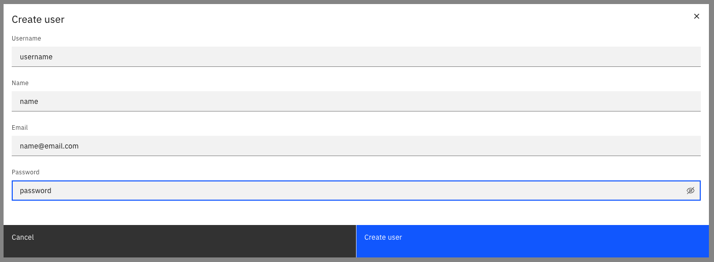
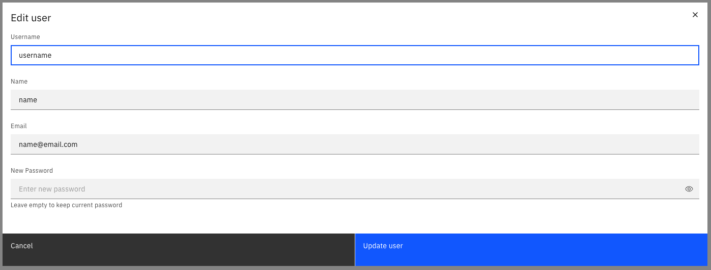

:::note
User management in Identity is only supported by Self-Managed deployments. For SaaS, see how to [connect your identity provider](/components/console/manage-organization/external-sso.md).
:::

User management is the process of creating, updating, and deleting users in your orchestration cluster. Users can be assigned roles and permissions to access applications and perform actions on resources.

### Create a user

To create a user:

1. Log in to Identity in your cluster, and click on the **Users** tab.
2. Click on the `Create user` button, and provide the following the user details:
   - **Username**: The username for the user.
   - **Name**: The name of the user.
   - **Email**: The email address of the user.
   - **Password**: The password for the user.
3. Click on the **Create user** button to finish.

The user is created, and can now log in to the Camunda 8 web application.

### Update a user

1. Log in to Identity in your cluster, and click on the **Users** tab.
2. Click on the **pencil icon** next to the user you want to update.
   :::note
   You can also select the user, and click the three vertical dots > **Update**.
   :::
3. Update the user details:
   - **Name**: The name of the user.
   - **Email**: The email address of the user.
   - **Password**: The password for the user.
4. Click on the **Save** button to finish.

The user details are updated, and the user can now use these credentials to log in.

### Delete a user

1. Log in to Identity in your cluster, and click on the **Users** tab.
2. Click on the **Delete** button next to the user you want to delete.
   :::note
   You can also select the user, and click the three vertical dots > **Delete**.
   :::
3. Confirm the deletion by clicking on the **Delete** button in the confirmation dialog.

The user is deleted, and can no longer log in to the Camunda 8 web application.

### Assign authorizations to a user

See the [authorization](./authorization.md) section to learn how to create authorizations for users.
