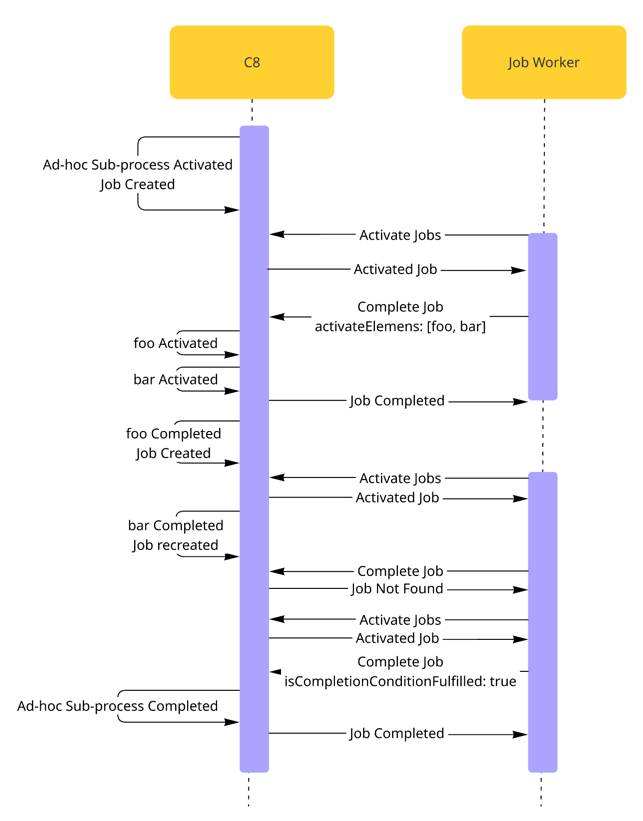

Ad-hoc sub-processes are a special kind of [embedded subprocesses](../embedded-subprocesses/embedded-subprocesses.md) with an **ad-hoc marker** (represented
by a **~** tilde character). Compared to regular subprocesses, ad-hoc sub-processes allow more flexibility
for executing inner elements.


The inner elements of an ad-hoc sub-process are not connected to a start or end event. Each element can be executed
multiple times, in any order, or skipped.

If elements depend on each other, the elements can be connected by a sequence flow to build a structured sequence
within the ad-hoc sub-process.

An ad-hoc sub-process can be handled [internally by Zeebe](#bpmn-implementation), or by using a [Job worker](#job-worker-implementation).

### Constraints

An ad-hoc sub-process has the following constraints:

- Must have at least one activity
- Must not have start events or end events

## BPMN implementation

By default, ad-hoc sub-processes are handled internally in Zeebe. You can model which [elements to activate](#activate-an-element) and when the sub-process is [completed](#completion).
Alternatively, use the [ad-hoc sub-process API](/apis-tools/orchestration-cluster-api-rest/specifications/activate-ad-hoc-sub-process-activities.api.mdx) to activate elements manually.

### Activate an element

An ad-hoc sub-process can define an expression `activeElementsCollection` that should return a
[list](../../feel/language-guide/feel-data-types.md#list) of strings. Each string in the list should match to an ID of
an inner element of the ad-hoc sub-process. Usually, the expression accesses a process instance variable that was
created before and holds the list of element IDs.


When a process instance reaches an ad-hoc sub-process, it evaluates the expression `activeElementsCollection` and
activates all elements whose element IDs are in the list.

If the list is empty or the expression is not defined, no element is activated and the ad-hoc sub-process remains active.

If the expression doesn't evaluate to a list of strings, or the list contains other values than inner element IDs, the
process instance creates an incident.

:::note
Currently, it is not possible to activate elements dynamically after the ad-hoc sub-process is activated, only on
entering the subprocess.
:::

### Completion

An ad-hoc sub-process can define an optional `completionCondition` [boolean expression](/components/modeler/feel/language-guide/feel-boolean-expressions.md)
that is evaluated every time an inner element is completed.

- If the expression evaluates to `true` after completing an inner element, the ad-hoc sub-process is completed and the process instance takes the outgoing sequence flows.
- If no `completionCondition` is defined, the ad-hoc sub-process is completed after all [activated elements](#activate-an-element)
  are completed.

A `cancelRemainingInstances` boolean attribute can be configured to influence the ad-hoc sub-process behavior when the completion condition is met.

- If set to `true` (default value), all remaining active instances of inner elements are terminated and the ad-hoc sub-process is directly completed.
- If set to `false`, the ad-hoc sub-process waits for the completion of all active instances before completing.

## Job worker implementation

You can handle an ad-hoc sub-process using a [Job worker](/components/concepts/job-workers.md). To do this, define the sub-process with a task definition. The Job worker can then control the sub-process by activating inner elements and deciding when it completes.

When an ad-hoc sub-process is defined as a Job worker, it creates a Job upon activation. The worker must decide what the next step is.  
It can use the `adHocSubProcessElements` variable (see [Special ad-hoc sub-process variables](#special-ad-hoc-sub-process-variables)) to determine available elements.

When a process instance reaches an ad-hoc sub-process with a Job worker implementation:



1. Zeebe creates a corresponding Job and waits for its completion.
2. The Job worker decides which elements to activate and completes the Job with an [`adHocSubProcess` Job result](/apis-tools/orchestration-cluster-api-rest/specifications/complete-job.api.mdx).
3. Zeebe activates the elements from the Job result.
4. When any of the flows inside the ad-hoc sub-process completes, Zeebe creates a new Job for the ad-hoc sub-process.
5. The Job worker decides the next step. It can activate more elements or fulfill the completion condition. If the condition is fulfilled, the Job worker can specify whether to cancel active elements. It cannot fulfill both the completion condition and activate new elements at the same time.

Because a worker can activate multiple elements at once, and Zeebe creates a Job whenever one completes, the Job for the ad-hoc sub-process may be recreated during execution. There is only one active Job for the ad-hoc sub-process at a time. The Job worker should expect that:

- A Job may be recreated while it is still processing.
- Job completion may result in a `NOT_FOUND` rejection.

## Collect output

You can collect the output of inner flows in an ad-hoc sub-process by defining the `outputCollection` and `outputElement` expressions.

- `outputCollection` defines the variable name that stores the collected output (for example, `results`). This variable is created as a local variable of the ad-hoc sub-process and updated whenever an inner flow completes. When the ad-hoc sub-process completes, the `outputCollection` variable is [propagated](components/concepts/variables.md#variable-propagation) to the parent scope.

- `outputElement` defines the output of the inner flow (for example, `= result`). This expression usually [accesses a variable](/components/modeler/feel/language-guide/feel-variables.md#access-variable) of the inner flow that holds the output value. This variable should be created with the output value, for example, by a Job worker providing a variable with the name `result`.

When an inner flow completes, the `outputElement` expression is evaluated and the result is added to the `outputCollection`.

## Special ad-hoc sub-process variables

When an ad-hoc sub-process is activated, the `adHocSubProcessElements` variable is created in its scope.
This variable provides metadata about the sub-process and its inner elements. Job workers can use it to decide which elements to activate.

The variable contains a list of activatable elements. Each element includes:

- `elementId`: The ID of the element.
- `elementName`: The name of the element.
- `documentation`: The documentation of the element.
- `properties`: The properties defined on the element.
- `parameters`: Parameters defined using the [`fromAi`](/components/modeler/feel/builtin-functions/feel-built-in-functions-miscellaneous.md#fromaivalue) FEEL function.

:::info
Do not update the `adHocSubProcessElements` variable. Changing its value can cause unexpected behavior.
:::

## Variable mappings

An ad-hoc sub-process can define input and output
[variable mappings](../../../concepts/variables.md#inputoutput-variable-mappings).

**Input variable mappings** are applied on activating the ad-hoc sub-process and before evaluating the expression
`activeElementsCollection`. They can be used to create local variables for the ad-hoc sub-process.

**Output variable mappings** are applied on completing the ad-hoc sub-process. They can be used to propagate local variables
from the ad-hoc sub-process into the process instance. By default, no local variables are propagated.

## Additional resources

### XML representation

```xml
<bpmn:adHocSubProcess id="ad-hoc-subprocess" name="Ad-hoc sub-process" cancelRemainingInstances="false">
  <bpmn:extensionElements>
    <zeebe:adHoc activeElementsCollection="=activeElements" />
  </bpmn:extensionElements>
  ... more contained elements ...
  <bpmn:completionCondition xsi:type="bpmn:tFormalExpression">=myCondition</bpmn:completionCondition>
</bpmn:adHocSubProcess>
```
