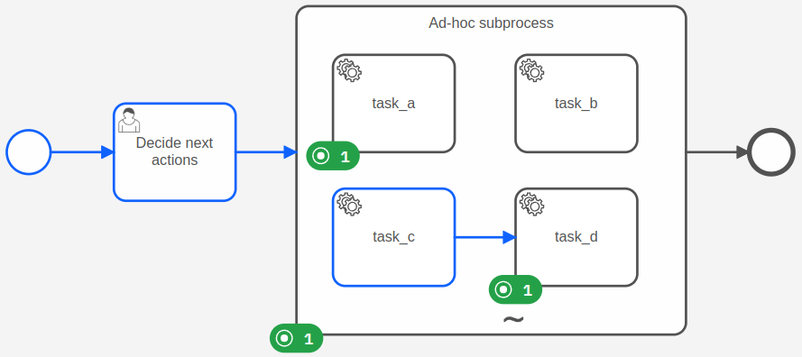
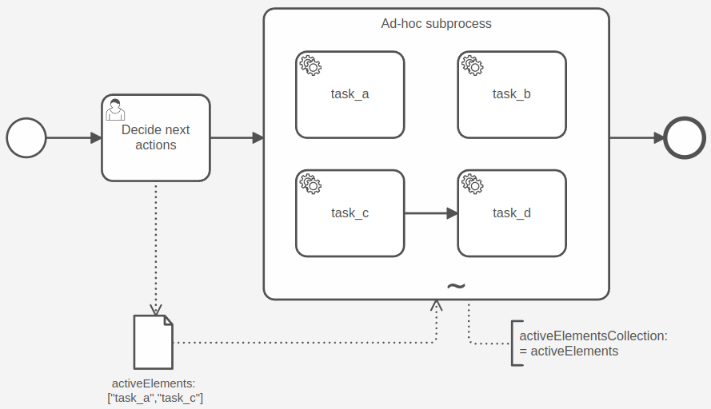

Ad-hoc sub-processes are a special kind of [embedded subprocesses](../embedded-subprocesses/embedded-subprocesses.md) with an **ad-hoc marker** (represented
by a **~** tilde character). Compared to regular subprocesses, ad-hoc sub-processes allow more flexibility
for executing inner elements.



The inner elements of an ad-hoc sub-process are not connected to a start or end event. Each element can be executed
multiple times, in any order, or skipped.

If elements depend on each other, the elements can be connected by a sequence flow to build a structured sequence
within the ad-hoc sub-process.

When a process instance reaches an ad-hoc sub-process, it [activates the inner elements](#activate-an-element) and
completes the ad-hoc sub-process depending on the [completion condition](#completion). After completion, the process
instance takes the outgoing sequence flows.

### Constraints

An ad-hoc sub-process has the following constraints:

- Must have at least one activity
- Must not have start events or end events

## Activate an element

An ad-hoc sub-process can define an expression `activeElementsCollection` that should return a
[list](../../feel/language-guide/feel-data-types.md#list) of strings. Each string in the list should match to an ID of
an inner element of the ad-hoc sub-process. Usually, the expression accesses a process instance variable that was
created before and holds the list of element IDs.



When a process instance reaches an ad-hoc sub-process, it evaluates the expression `activeElementsCollection` and
activates all elements whose element IDs are in the list.

If the list is empty or the expression is not defined, no element is activated and the ad-hoc sub-process remains active.

If the expression doesn't evaluate to a list of strings, or the list contains other values than inner element IDs, the
process instance creates an incident.

:::note
Currently, it is not possible to activate elements dynamically after the ad-hoc sub-process is activated, only on
entering the subprocess.
:::

## Completion

An ad-hoc sub-process can define an optional `completionCondition` [boolean expression](/components/modeler/feel/language-guide/feel-boolean-expressions.md)
that is evaluated every time an inner element is completed.

- If the expression evaluates to `true` after completing an inner element, the ad-hoc sub-process is completed and the process instance takes the outgoing sequence flows.
- If no `completionCondition` is defined, the ad-hoc sub-process is completed after all [activated elements](#activate-an-element)
  are completed.

A `cancelRemainingInstances` boolean attribute can be configured to influence the ad-hoc sub-process behavior when the completion condition is met.

- If set to `true` (default value), all remaining active instances of inner elements are terminated and the ad-hoc sub-process is directly completed.
- If set to `false`, the ad-hoc sub-process waits for the completion of all active instances before completing.

## Collecting the output

The output of the inner flows of the ad-hoc sub-process can be collected by defining the `outputCollection` and the `outputElement` expression.

`outputCollection` defines the name of the variable under which the collected output is stored (e.g. `results`). It is automatically created as a local variable of the ad-hoc sub-process and is updated when an inner flow is completed.
When the ad-hoc sub-process is completed the variable is propagated to its parent scope.

`outputElement` is an expression that defined the output of the inner flow (e.g. `= result`). Usually, it [accesses a variable](/components/modeler/feel/language-guide/feel-variables.md#access-variable) of the inner flow that holds the output value.
This variable should be created with the output value; for example, by a job worker providing a variable with the name `result`.

When the inner flow is completed, the `outputElement` expressions is evaluated and the result is inserted into the `outputCollection`.

## Special ad-hoc sub-process variables

On activation of the ad-hoc sub-process the `adHocSubProcessElements` variable is created on the scope of the ad-hoc sub-process.
The variable contains some metadata about the ad-hoc sub-process and its inner elements, which can be used by job workers to determine which action to take.
The variable contains a list of activatable elements. Each of these elements contains the following properties:

- `elementId`: The ID of the element.
- `elementName`: The name of the element.
- `documentation`: The documentation of the element.
- `properties`: The properties defined on the element.
- `parameters`: Parameters defined using the [`fromAi`](/components/modeler/feel/builtin-functions/feel-built-in-functions-miscellaneous.md#fromaivalue) FEEL function.

:::info Updating the value of the `adHocSubProcessElements` variable can lead to unexpected behavior. It is not recommended to update this variable.
:::

## Variable mappings

An ad-hoc sub-process can define input and output
[variable mappings](../../../concepts/variables.md#inputoutput-variable-mappings).

**Input variable mappings** are applied on activating the ad-hoc sub-process and before evaluating the expression
`activeElementsCollection`. They can be used to create local variables for the ad-hoc sub-process.

**Output variable mappings** are applied on completing the ad-hoc sub-process. They can be used to propagate local variables
from the ad-hoc sub-process into the process instance. By default, no local variables are propagated.

## Additional resources

### XML representation

```xml
<bpmn:adHocSubProcess id="ad-hoc-subprocess" name="Ad-hoc sub-process" cancelRemainingInstances="false">
  <bpmn:extensionElements>
    <zeebe:adHoc activeElementsCollection="=activeElements" />
  </bpmn:extensionElements>
  ... more contained elements ...
  <bpmn:completionCondition xsi:type="bpmn:tFormalExpression">=myCondition</bpmn:completionCondition>
</bpmn:adHocSubProcess>
```
