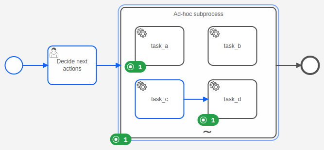
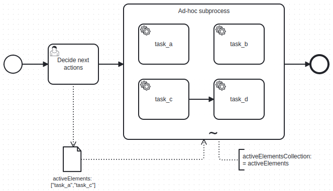

The ad-hoc marker (represented by a **~** tilde character) is only available
for [embedded subprocesses](../embedded-subprocesses/embedded-subprocesses.md), and are therefore called **ad-hoc subprocesses**.
Compared to regular subprocesses, ad-hoc subprocesses allow more flexibility for executing inner elements.



The inner elements of an ad-hoc subprocess are not connected to a start or end event. Each element can be executed
multiple times, in any order, or skipped.

If elements depend on each other, the elements can be connected by a sequence flow to build a structured sequence
within the ad-hoc subprocess.

When a process instance reaches an ad-hoc subprocess, it [activates the inner elements](#activate-an-element) and waits
for their completion. After the last element is completed, the process instance completes the ad-hoc subprocess and
takes the outgoing sequence flows.

### Constraints

An ad-hoc subprocess has the following constraints:

- Must have at least one activity
- Must not have start events or end events
- Any intermediate catch event must have an outgoing sequence flow

## Activate an element

An ad-hoc subprocess can define an expression `activeElementsCollection` that should return a
[list](../../feel/language-guide/feel-data-types.md#list) of strings. Each string in the list should match to an ID of
an inner element of the ad-hoc subprocess. Usually, the expression accesses a process instance variable that was
created before and holds the list of element IDs.



When a process instance reaches an ad-hoc subprocess, it evaluates the expression `activeElementsCollection` and
activates all elements whose element IDs are in the list.

If the list is empty or the expression is not defined, no element is activated and the ad-hoc subprocess remains active.

If the expression doesn't evaluate to a list of strings, or the list contains other values than inner element IDs, the
process instance creates an incident.

:::note
Currently, it is not possible to activate elements dynamically after the ad-hoc subprocess is activated, only on
entering the subprocess.
:::

## Variable mappings

An ad-hoc subprocess can define input and output
[variable mappings](../../../concepts/variables.md#inputoutput-variable-mappings).

**Input variable mappings** are applied on activating the ad-hoc subprocess and before evaluating the expression
`activeElementsCollection`. They can be used to create local variables for the ad-hoc subprocess.

**Output variable mappings** are applied on completing the ad-hoc subprocess. They can be used to propagate local variables
from the ad-hoc subprocess into the process instance. By default, no local variables are propagated.

## Additional resources

### XML representation

```xml
<bpmn:adHocSubProcess id="ad-hoc-subprocess" name="Ad-hoc subprocess">
  <bpmn:extensionElements>
    <zeebe:adHoc activeElementsCollection="=activeElements" />
  </bpmn:extensionElements>
  ... more contained elements ...
</bpmn:adHocSubProcess>
```
