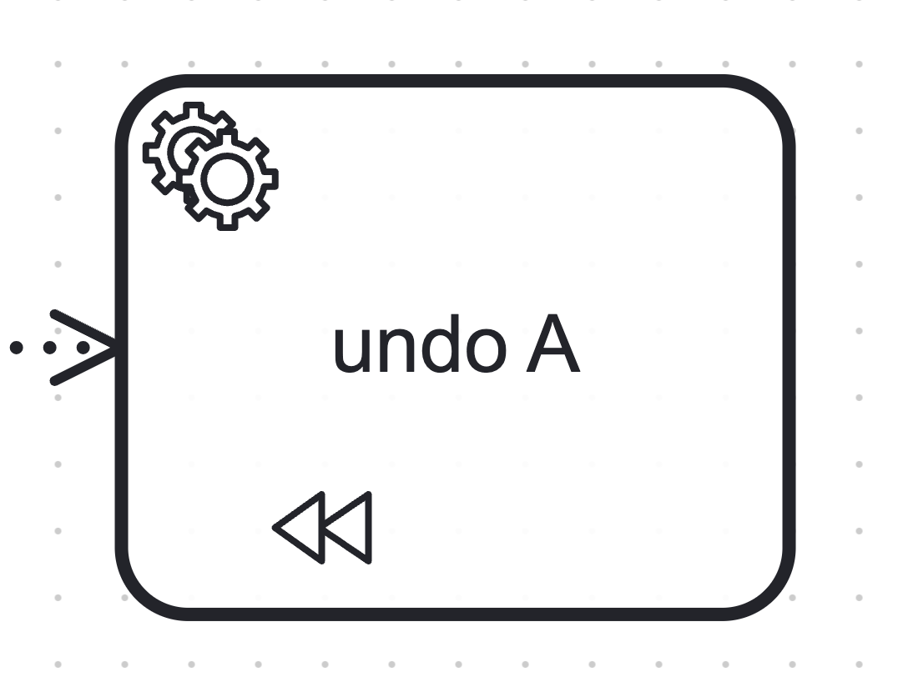
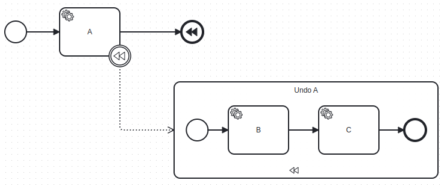
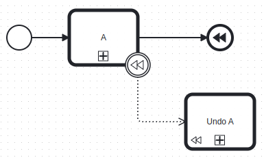
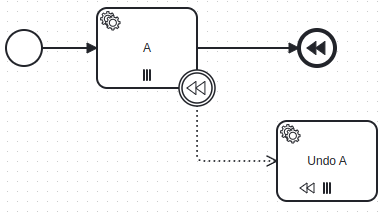

The following activities can be marked as compensation:

- [Service tasks](../service-tasks/service-tasks.md)
- [User tasks](../user-tasks/user-tasks.md)
- [Send tasks](../send-tasks/send-tasks.md)
- [Receive tasks](../receive-tasks/receive-tasks.md)
- [Business rule tasks](../business-rule-tasks/business-rule-tasks.md)
- [Script tasks](../script-tasks/script-tasks.md)
- [Manual tasks](../manual-tasks/manual-tasks.md)
- [Undefined tasks](../undefined-tasks/undefined-tasks.mdx)

## Compensation handlers

Compensation handlers are activities or subprocesses attached to other activities using a compensation boundary event. When the process reaches a compensation throw event, it triggers the compensation handlers. If the compensation activity has been completed more than once, the compensation handler is invoked for the same amount.

If the compensation handler has input variable mappings, those are applied before completing the compensation handler. At the same way, if the compensation handler has output variable mappings, those are applied after invoking the compensation handler.

Compensation handlers might be interrupted if the process or subprocess is terminated, interrupted compensation handlers can't be re-activated.

### Embedded subprocess as compensation handler

The subprocess contains the steps to undo the actions of the compensation activity. Using a subprocess can be useful if a sequence of steps is required to undo the actions of the activity.

### Call activity as compensation handler

The call activity contains the steps to undo the actions of the compensation activity. Using a call activity can be useful in combination with a call activity as the compensation activity since compensation isn't propagated to the child process.

### Multi-instance activity as compensation handler

The multi-instance activity offers the option to operate sequentially or in parallel, and it requires an input collection. Combining it with a compensation activity is advantageous, as the compensation handler for a multi-instance activity is invoked only once, rather than for each item in the input collection. Notably, both the compensation activity and its handler can iterate over the same input collection items.
