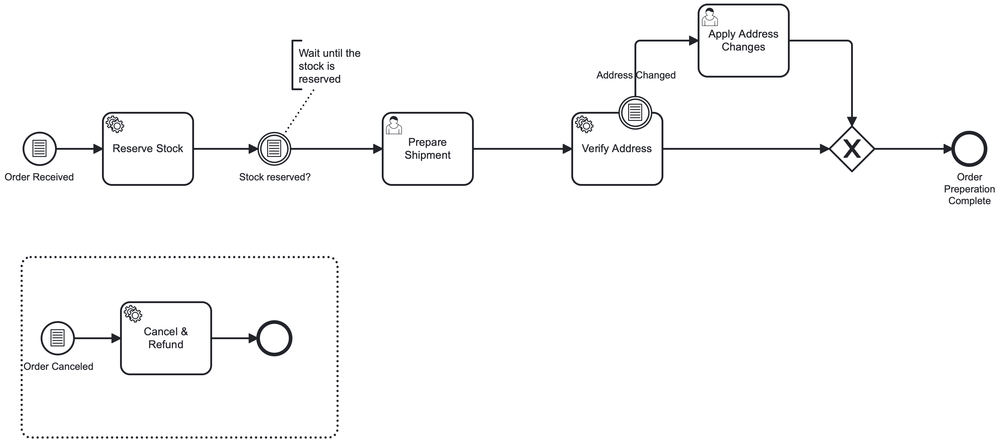

Conditional events are a powerful modeling tool when process instances should react to changes in process state rather than to an explicitly delivered notification. For example, when a variable crosses a threshold, a required set of fields becomes complete, a risk score changes, or a business rule flips from false to true.

This is especially handy when the producer of the change is not a single known sender (or there are many), when you don’t want to build correlation logic, or when the process logic is naturally expressed as guard conditions over process state.

A conditional event triggers when its condition evaluates to `true`.
The engine evaluates the FEEL expression over process variables and triggers the event automatically when its scope starts and when the relevant variables change.
The diagram below shows all the four types of conditional events: root level start, event subprocess start, intermediate catch, and boundary events.



In this example, the process starts with a root-level conditional start event.
Root level conditional start events can be triggered via Orchestration Cluster API or Camunda Client SDKs.
// TODO - link to triggering section below
A new instance is created once the condition `=orderReceived = true` evaluates to true.

The intermediate conditional catch event acts like a wait-until condition.
It continues to “Ship order” only after inventory is successfully reserved.

The interrupting conditional boundary event attached to “Review order” handles changes mid-review.
If the delivery address is changed, the boundary event triggers and interrupts the user task, routing execution to “Apply changes” before completing the order preparation.

Finally, the interrupting event subprocess can cancel the work at any time while the instance is running.
If order is canceled while preparing the order, the conditional start event inside the event subprocess fires and interrupts the main process, starting the cancellation subprocess to handle the cancellation logic.

// TODO - start here

## Interrupting vs. non-interrupting events

Some conditional events—such as event subprocess start events and boundary events—can be interrupting or non-interrupting.

- Interrupting: When triggered, the event stops the current execution path before continuing along the event’s outgoing flow.
- Non-interrupting: When triggered, the event starts an additional execution path while the current activity or scope continues.

Conditional events behave differently depending on where they appear in the BPMN model. The following sections describe each supported event type in Camunda 8.

## Types of conditional events

Camunda 8 supports conditional events in the following positions:

- Root conditional start events (on the process)
- Conditional event subprocess start events (interrupting and non-interrupting)
- Intermediate conditional catch events
- Conditional boundary events (interrupting and non-interrupting)

In all cases, the event triggers when its condition evaluates to `true`.

### Conditional start events

A conditional start event starts a process instance or an event subprocess when its condition becomes `true`.

- Root conditional start events start a new process instance.
- Event subprocess conditional start events start an event subprocess within an active process instance.

Event subprocess conditional start events can be interrupting or non-interrupting. See [Interrupting vs. non-interrupting events](#interrupting-vs-non-interrupting-events).

You might use conditional start events to:

- Start an escalation process when a case’s `priority` becomes `"high"`.
- Trigger a monitoring subprocess when a risk score crosses a threshold.

To start processes via conditional start events from external systems, use the Orchestration Cluster REST API. See [Evaluate root-level conditional start events](../../../../apis-tools/orchestration-cluster-api-rest/specifications/evaluate-conditionals.api.mdx) for request and response details.

### Intermediate conditional catch events

An intermediate conditional catch event waits until its condition becomes `true`.

When the process instance reaches the event, it waits until the condition evaluates to `true`, then continues along the outgoing sequence flow. For details on evaluation timing and scope rules, see [Evaluation semantics](../../../concepts/conditions.md#evaluation-semantics).

Intermediate conditional catch events are always interrupting, as they represent a waiting point in the process flow.

Typical use cases include:

- “Wait until `processorAvailable` becomes `true`, then proceed to `Assign task`.”

### Conditional boundary events

A conditional boundary event is attached to an activity and monitors data while the activity is active.

When the activity is entered, the engine evaluates the boundary event’s condition and continues to monitor relevant variable changes.

Conditional boundary events can be interrupting or non-interrupting. See [Interrupting vs. non-interrupting events](#interrupting-vs-non-interrupting-events).

Typical use cases include:

- Interrupting: “If `customerCancelled = true` while `Review application` is running, cancel the review.”
- Non-interrupting: “While waiting for documents, start separate checks whenever `documentReceived = true`.”

## Conditions

### Condition expressions (FEEL)

Conditional events use FEEL expressions in the `bpmn:condition` element. The expression must evaluate to a boolean value (`true` or `false`).

Example:

```xml title="Conditional event definition with FEEL condition"
<bpmn:conditionalEventDefinition id="ConditionalEventDefinition_1">
  <bpmn:condition xsi:type="bpmn:tFormalExpression">
    = x > 1
  </bpmn:condition>
</bpmn:conditionalEventDefinition>
```

The FEEL expression is evaluated using variables available in the event’s scope.

For details on how and when conditions are evaluated, see [Evaluation semantics](../../../concepts/conditions.md#evaluation-semantics).

### Variable filters

Variable filters restrict when a conditional event is re-evaluated in response to variable changes.

Define a filter by adding a `zeebe:conditionalFilter` extension element:

```xml title="Conditional event with Zeebe variable filter"
<bpmn:conditionalEventDefinition id="ConditionalEventDefinition_1rp6yz6">
  <bpmn:condition xsi:type="bpmn:tFormalExpression">
    = x > 1
  </bpmn:condition>

  <bpmn:extensionElements>
    <zeebe:conditionalFilter
      variableNames="var1, var2"
      variableEvents="create, update" />
  </bpmn:extensionElements>
</bpmn:conditionalEventDefinition>
```

The `zeebe:conditionalFilter` extension supports:

- `variableNames` limits evaluation to changes of specific variables in the relevant scope.

- `variableEvents` specifies which variable events trigger evaluation. Supported values:
  - `create`
  - `update`
  - `create, update`

For runtime behavior and limitations of variable filters, see [Variable filter semantics](../../../concepts/conditions.md#variable-filter-semantics).

## Modeling conditional events in Modeler

Camunda Modeler (desktop and web) supports conditional start events, intermediate conditional catch events, and conditional boundary events. Use the properties panel to define the FEEL condition and optional variable filters.

## XML representation

### Conditional start event

```xml
<bpmn:startEvent id="ConditionalStart">
  <bpmn:conditionalEventDefinition id="ConditionalEventDefinition_Start">
    <bpmn:condition xsi:type="bpmn:tFormalExpression">= amount > 100</bpmn:condition>
  </bpmn:conditionalEventDefinition>
</bpmn:startEvent>
```

### Intermediate conditional catch event

```xml
<bpmn:intermediateCatchEvent id="WaitForCondition">
  <bpmn:conditionalEventDefinition id="ConditionalEventDefinition_Catch">
    <bpmn:condition xsi:type="bpmn:tFormalExpression">
      = processorAvailable
    </bpmn:condition>

    <bpmn:extensionElements>
      <zeebe:conditionalFilter
        variableNames="processorAvailable"
        variableEvents="create, update" />
    </bpmn:extensionElements>
  </bpmn:conditionalEventDefinition>
</bpmn:intermediateCatchEvent>
```

### Conditional boundary event

```xml
<bpmn:boundaryEvent id="CancelReview" attachedToRef="ReviewApplication">
  <bpmn:conditionalEventDefinition id="ConditionalEventDefinition_Boundary">
    <bpmn:condition xsi:type="bpmn:tFormalExpression">
      = customerCancelled
    </bpmn:condition>
  </bpmn:conditionalEventDefinition>
</bpmn:boundaryEvent>
```

## Additional resources

- [Evaluate root-level conditional start events](../../../../apis-tools/orchestration-cluster-api-rest/specifications/evaluate-conditionals.api.mdx) for request and response details.
