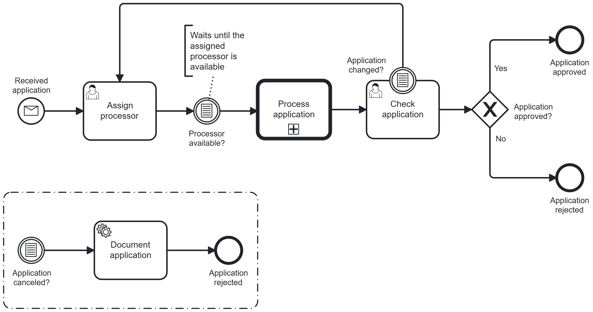

A conditional event triggers when its condition evaluates to `true`. The engine evaluates a FEEL expression over process variables and triggers the event automatically when its scope starts or when relevant variables change.



## Interrupting vs. non-interrupting events

Some conditional events—such as event subprocess start events and boundary events—can be interrupting or non-interrupting.

- **Interrupting**: When triggered, the event stops the current execution path before continuing along the event’s outgoing flow.
- **Non-interrupting**: When triggered, the event starts an additional execution path while the current activity or scope continues.

Conditional events behave differently depending on where they appear in the BPMN model. The following sections describe each supported event type in Camunda 8.

## Types of conditional events in Camunda 8

Camunda 8 supports conditional events in the following positions:

- Root conditional start events (on the process)
- Conditional event subprocess start events (interrupting and non-interrupting)
- Intermediate conditional catch events
- Conditional boundary events (interrupting and non-interrupting)

In all cases, the event triggers when its condition evaluates to `true`.

### Conditional start events

A conditional start event starts a process instance or an event subprocess when its condition becomes `true`.

- **Root conditional start events** start a new process instance.
- **Event subprocess conditional start events** start an event subprocess within an active process instance.

Event subprocess conditional start events can be interrupting or non-interrupting. See [interrupting vs. non-interrupting events](#interrupting-vs-non-interrupting-events).

Typical use cases include:

- Starting an escalation process when a case’s `priority` becomes `"high"`.
- Triggering a monitoring subprocess when a risk score crosses a threshold.

To start processes via conditional start events from external systems, use the Orchestration Cluster REST API. See [Evaluate root-level conditional start events](../../../../apis-tools/orchestration-cluster-api-rest/specifications/evaluate-conditionals.api.mdx) for request and response details.

### Intermediate conditional catch events

An intermediate conditional catch event waits until its condition becomes `true`.

When the process instance enters the event:

- The engine evaluates the condition once.
  - If the condition is already `true`, the event completes immediately.
  - If the condition is `false`, the process instance waits.
- When relevant variables change in scope, the engine re-evaluates the condition. If it becomes `true`, the event completes and the process continues.

Intermediate conditional catch events are always interrupting, as they represent a waiting point in the process flow.

Typical use cases include:

- “Wait until `processorAvailable` becomes `true`, then proceed to `Assign task`.”

### Conditional boundary events

A conditional boundary event is attached to an activity and monitors data while the activity is active.

When the activity is entered, the engine evaluates the boundary event’s condition and continues to monitor relevant variable changes.

Conditional boundary events can be interrupting or non-interrupting. See [interrupting vs. non-interrupting events](#interrupting-vs-non-interrupting-events).

Typical use cases include:

- Interrupting: “If `customerCancelled = true` while `Review application` is running, cancel the review.”
- Non-interrupting: “While waiting for documents, start separate checks whenever `documentReceived = true`.”

## Conditions

### Condition expressions (FEEL)

Conditional events use FEEL expressions in the `bpmn:condition` element. The expression must evaluate to a boolean value (`true` or `false`).

Example:

```xml title="Conditional event definition with FEEL condition"
<bpmn:conditionalEventDefinition id="ConditionalEventDefinition_1">
<bpmn:condition xsi:type="bpmn:tFormalExpression">= x > 1</bpmn:condition>
</bpmn:conditionalEventDefinition>
```

The engine evaluates the FEEL expression using variables available in the event’s scope:

- Expressions follow BPMN scoping rules (for example, process-level or subprocess-level variables).
- On BPMN scope start (such as when a process, subprocess, or activity begins), the condition is evaluated once.
- When a relevant variable changes, the condition is re-evaluated. If it becomes `true`, the event triggers.

### Variable filters

Variable filters restrict when a conditional event is re-evaluated in response to variable changes.

Define a filter by adding a `zeebe:conditionalFilter` extension element:

```xml title="Conditional event with Zeebe variable filter"
<bpmn:conditionalEventDefinition id="ConditionalEventDefinition_1rp6yz6">
<bpmn:condition xsi:type="bpmn:tFormalExpression">= x > 1</bpmn:condition>
<bpmn:extensionElements>
<zeebe:conditionalFilter
variableNames="var1, var2"
variableEvents="create, update" />
</bpmn:extensionElements>
</bpmn:conditionalEventDefinition>
```

The `zeebe:conditionalFilter` extension supports:

- `variableNames`  
  Limits evaluation to changes of specific variables in the relevant scope.

- `variableEvents`  
  Specifies which variable events trigger evaluation. Supported values:
  - `create`
  - `update`
  - `create, update`

If you omit `zeebe:conditionalFilter`, the engine evaluates the condition on any variable change in the scope. This mirrors the default behavior of Camunda 7 conditional events, using FEEL conditions and Zeebe extensions in Camunda 8.

`variableEvents` is only supported for conditional events within a running scope (for example, intermediate conditional catch events, conditional boundary events, and conditional event subprocess start events). It is not supported for root-level conditional start events, as Camunda Modeler prevents or clears it.

### Migration from Camunda 7

In Camunda 7, conditional events use the `camunda:variableName` and `camunda:variableEvents` attributes.

During migration to Camunda 8, these attributes are converted to a `zeebe:conditionalFilter` extension:

- `camunda:variableName` → `zeebe:conditionalFilter variableNames="..."`
- `camunda:variableEvents` → `zeebe:conditionalFilter variableEvents="..."`

This preserves evaluation behavior while ensuring BPMN 2.0–compliant XML.

Only `create` and `update` are supported in Camunda 8. Any use of `delete` in Camunda 7 is mapped to the closest supported behavior during migration.

## Modeling conditional events in Modeler

Camunda Modeler (desktop and web) supports conditional start events, intermediate conditional catch events, and conditional boundary events. Use the properties panel to define the FEEL condition and optional variable filters.

## Runtime and tooling behavior

- The Zeebe engine evaluates conditional events when their BPMN scope starts and when relevant variables change.
- Operate displays conditional events in process instance views and supports instance migration and modification.
- Optimize includes conditional events in BPMN diagrams and makes them available in reports.

## XML representation

### Conditional start event

```xml
<bpmn:startEvent id="ConditionalStart">
  <bpmn:conditionalEventDefinition id="ConditionalEventDefinition_Start">
    <bpmn:condition xsi:type="bpmn:tFormalExpression">= amount > 100</bpmn:condition>
  </bpmn:conditionalEventDefinition>
</bpmn:startEvent>
```

### Intermediate conditional catch event

```<bpmn:intermediateCatchEvent id="WaitForCondition">
<bpmn:conditionalEventDefinition id="ConditionalEventDefinition_Catch">
<bpmn:condition xsi:type="bpmn:tFormalExpression">= processorAvailable</bpmn:condition>
<bpmn:extensionElements>
<zeebe:conditionalFilter variableNames="processorAvailable"
variableEvents="create, update" />
</bpmn:extensionElements>
</bpmn:conditionalEventDefinition>
</bpmn:intermediateCatchEvent>
```

### Conditional boundary event

```<bpmn:boundaryEvent id="CancelReview" attachedToRef="ReviewApplication">
<bpmn:conditionalEventDefinition id="ConditionalEventDefinition_Boundary">
<bpmn:condition xsi:type="bpmn:tFormalExpression">= customerCancelled</bpmn:condition>
</bpmn:conditionalEventDefinition>
</bpmn:boundaryEvent>
```

## Additional resources

- [Evaluate root-level conditional start events](../../../../apis-tools/orchestration-cluster-api-rest/specifications/evaluate-conditionals.api.mdx) for request and response details.
