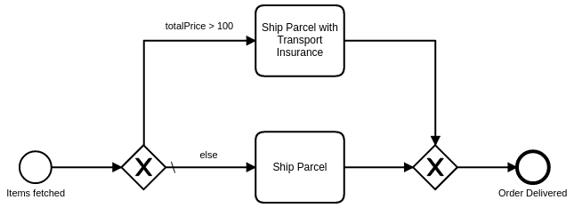

An exclusive gateway (or XOR-gateway) selects one outgoing sequence flow based on data such as process variables.



For an exclusive gateway with multiple outgoing sequence flows:

- All but one sequence flow must have a `conditionExpression`.
- The remaining sequence flow can omit the `conditionExpression`, but the gateway must define it as the default flow.
- Leaving the `conditionExpression` empty does not automatically make a sequence flow the default flow. In Modeler, set the exclusive gateway's default flow in the gateway properties by selecting the outgoing sequence flow to use as the default.
- When a process instance reaches the gateway, the system evaluates the `conditionExpression` values in BPMN XML order and takes the first sequence flow whose condition is fulfilled.
  - If no condition is fulfilled, the process instance takes the **default flow**. The default flow should not have a condition, so the system does not evaluate it.
  - If no condition is fulfilled and the gateway has no default flow, an [incident](/components/concepts/incidents.md) is created.

For example, if one sequence flow uses the condition `= totalPrice > 100`, you can set another outgoing sequence flow as the gateway's default flow to handle all remaining cases where `totalPrice <= 100`.

An exclusive gateway can also join multiple incoming flows to improve BPMN readability. A joining gateway has pass-through semantics and does not merge incoming concurrent flows like a parallel gateway.

## Conditions

A `conditionExpression` defines when a flow is taken. It is a [boolean expression](/components/modeler/feel/language-guide/feel-boolean-expressions.md) that can access the process variables and compare them with literals or other variables. The condition is fulfilled when the expression returns `true`.

Multiple boolean values or comparisons can be combined as disjunction (`or`) or conjunction (`and`).

For example:

```feel
= totalPrice > 100

= order.customer = "Paul"

= orderCount > 15 or totalPrice > 50

= valid and orderCount > 0
```

## Additional resources

### XML representation

An exclusive gateway with two outgoing sequence flows:

```xml
<bpmn:exclusiveGateway id="exclusiveGateway" default="else" />

<bpmn:sequenceFlow id="priceGreaterThan100" name="totalPrice &#62; 100"
  sourceRef="exclusiveGateway" targetRef="shipParcelWithInsurance">
  <bpmn:conditionExpression xsi:type="bpmn:tFormalExpression">
    = totalPrice &gt; 100
  </bpmn:conditionExpression>
</bpmn:sequenceFlow>

<bpmn:sequenceFlow id="else" name="else"
  sourceRef="exclusiveGateway" targetRef="shipParcel" />
```

### References

- [Expressions](/components/concepts/expressions.md)
- [Incidents](/components/concepts/incidents.md)
