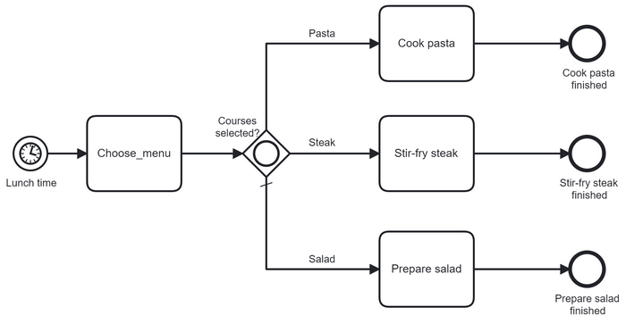
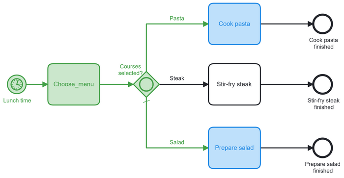
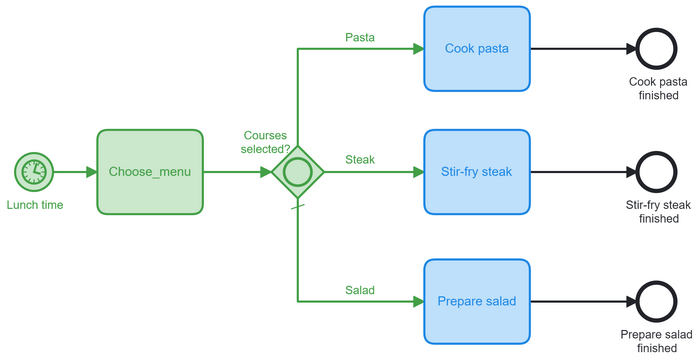
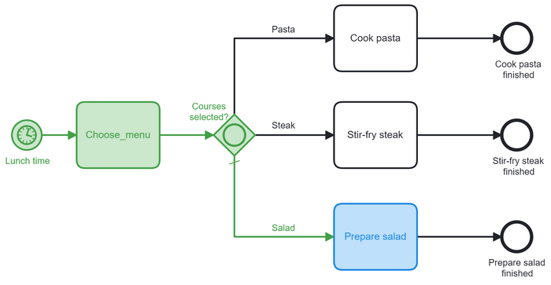

:::note

Currently, Camunda Platform 8 only supports the diverging (i.e. splitting, forking) inclusive gateway. It does not yet support the converging (i.e. merging, joining) inclusive gateway. A combination of parallel and exclusive gateways can be used as an alternative way to merge the flows.

:::

The inclusive gateway (or OR-gateway) allows for making multiple decisions based on data (i.e. on process instance variables).



If an inclusive gateway has multiple outgoing sequence flows, all sequence flows must have a `conditionExpression` to define when the flow is taken. The gateway can have one sequence flow be defined as the default flow.

When an inclusive gateway is entered, the `conditionExpression` is evaluated. The process instance takes all sequence flows where the condition is fulfilled.

For example: Courses selected include `pasta` and `salad`.



For example: Courses selected include `steak`, `pasta` and `salad`.



If no condition is fulfilled, it takes the **default flow** of the gateway. If the gateway has no default flow, an incident is created.

For example: No courses selected then the default flow `Salad` is taken.



If the inclusive gateway only has one outgoing sequence flow, then it does not need to have a condition.

## Conditions

A `conditionExpression` defines when a flow is taken. It is a [boolean expression](/components/concepts/expressions.md#boolean-expressions) that can access the process instance variables and compare them with literals or other variables. The condition is fulfilled when the expression returns `true`.

Multiple boolean values or comparisons can be combined as disjunction (`and`) or conjunction (`or`).

For example:

```feel
= totalPrice > 100

= order.customer = "Paul"

= orderCount > 15 or totalPrice > 50

= valid and orderCount > 0

= contains(courses, "salad")
```

## Additional resources

### XML representation

An inclusive gateway with three outgoing sequence flows and the default sequence flow is `Salad`:

```xml
<bpmn:inclusiveGateway id="Gateway_1dj8ts6" name="Courses selected?" default="Flow_05d0jjq">
      <bpmn:incoming>Flow_0mfam08</bpmn:incoming>
      <bpmn:outgoing>Flow_0d3xogt</bpmn:outgoing>
      <bpmn:outgoing>Flow_1le3l31</bpmn:outgoing>
      <bpmn:outgoing>Flow_05d0jjq</bpmn:outgoing>
</bpmn:inclusiveGateway>
<bpmn:sequenceFlow id="Flow_0d3xogt" name="Pasta"
    sourceRef="Gateway_1dj8ts6" targetRef="Activity_1orhxob">
    <bpmn:conditionExpression xsi:type="bpmn:tFormalExpression">
       = contains(courses, "pasta")
    </bpmn:conditionExpression>
</bpmn:sequenceFlow>
<bpmn:sequenceFlow id="Flow_1le3l31" name="Steak"
    sourceRef="Gateway_1dj8ts6" targetRef="Activity_0rygy6z">
    <bpmn:conditionExpression xsi:type="bpmn:tFormalExpression">
      = contains(courses, "steak")
    </bpmn:conditionExpression>
</bpmn:sequenceFlow>
<bpmn:sequenceFlow id="Flow_05d0jjq" name="Salad"
    sourceRef="Gateway_1dj8ts6" targetRef="Activity_06yrt1e">
    <bpmn:conditionExpression xsi:type="bpmn:tFormalExpression">
      = contains(courses, "salad")
    </bpmn:conditionExpression>
</bpmn:sequenceFlow>
```

### References

- [Conditions](/components/modeler/bpmn/inclusive-gateways/inclusive-gateways.md#conditions)
- [Incidents](/components/concepts/incidents.md)
