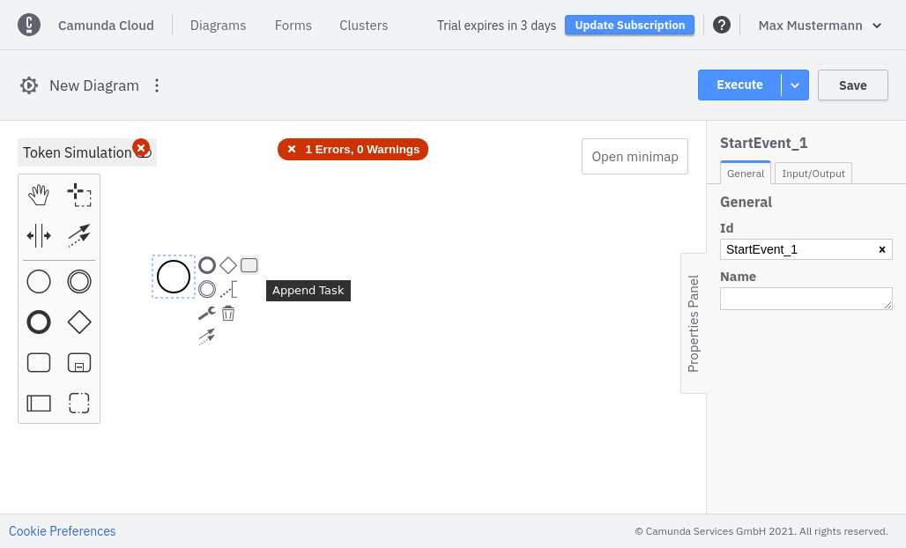
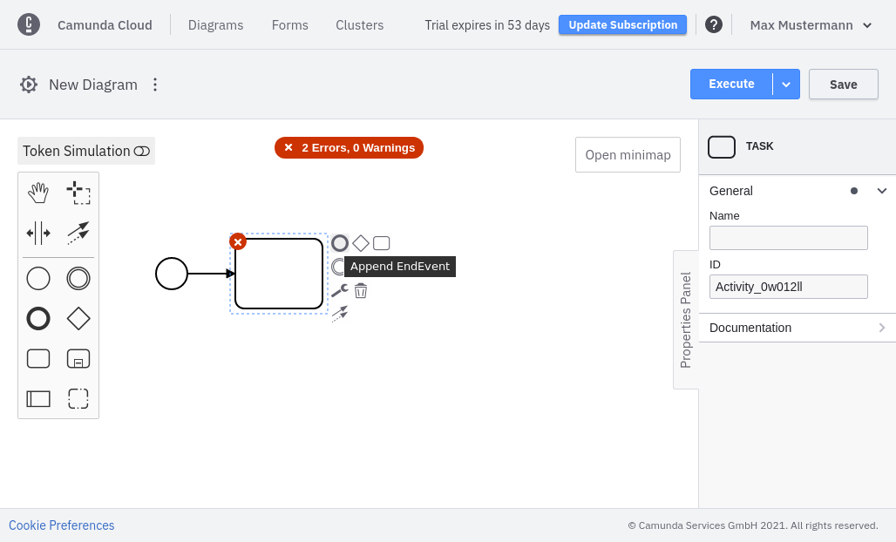

After you've created a BPMN diagram, you can start modeling it.

We've preconfigured a diagram consisting of a start event. To convert it to something meaningful, append a **Task** to it and afterwards append an **EndEvent**:

Each element has adjustable attributes. Use the properties panel on the right side of the page.

Elements supporting different types can be reconfigured by clicking on the corresponding icon. In the following screenshot, a task has been added to the diagram. It can be converted to a service task, for example.

