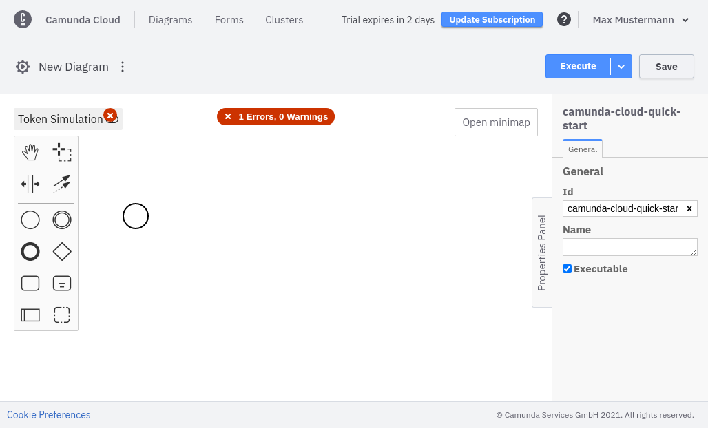
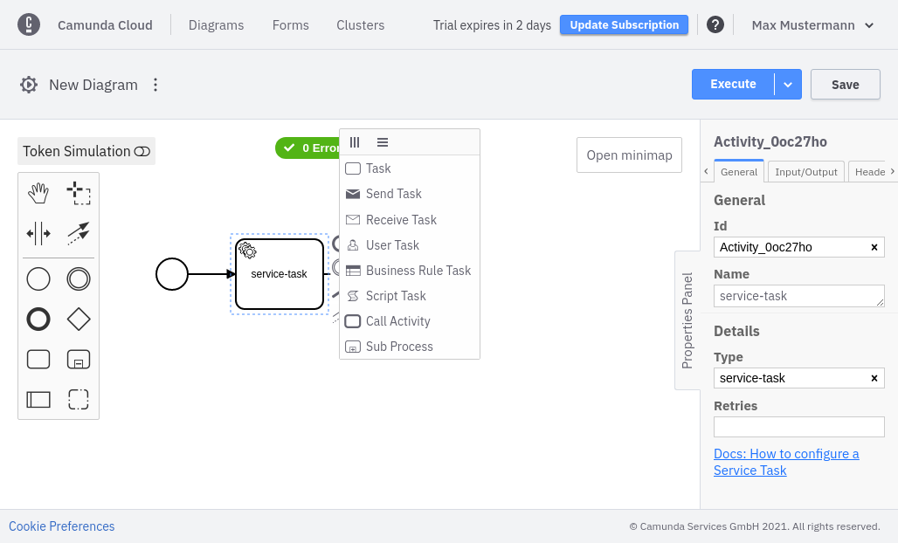

After you create a BPMN diagram, you can start modeling it.

We've preconfigured a simple diagram consisting of a start and end event. Though you don't need to configure the diagram further to deploy, you can add more elements and configure the different events to your liking.

On the left side of the page, you'll find the element palette supported by the engine. You can drag and drop the elements into the diagram.

Each element has adjustable attributes. Use the properties panel on the right side of the page.

Elements supporting different types can be reconfigured by clicking on the corresponding icon. In the following screenshot, a task has been added to the diagram. It can be converted to a service task, for example.

