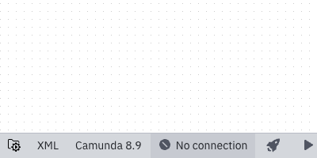
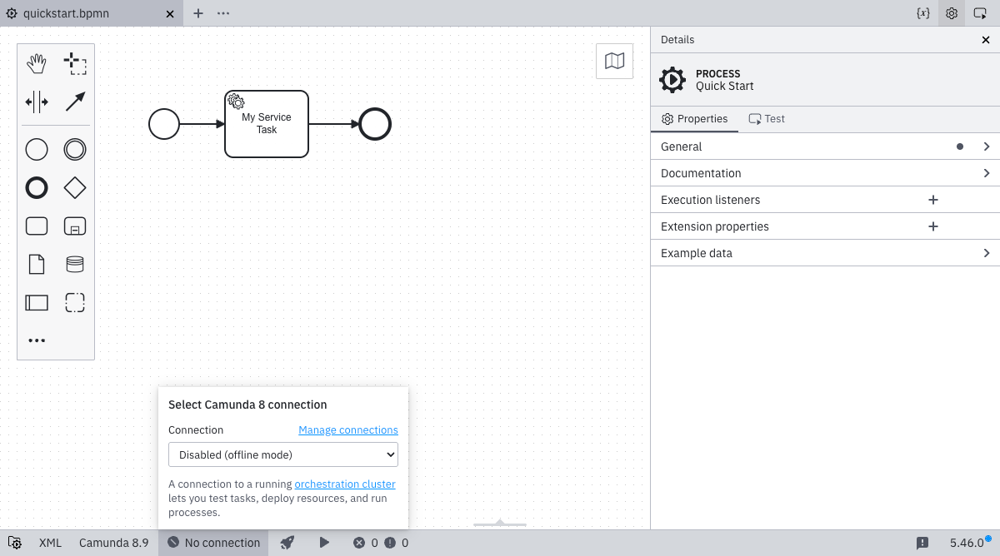
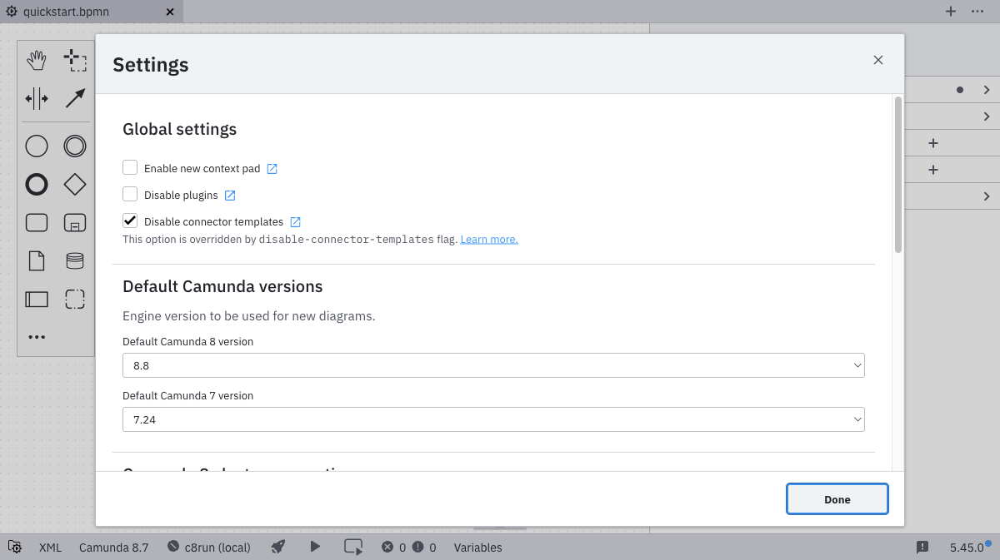
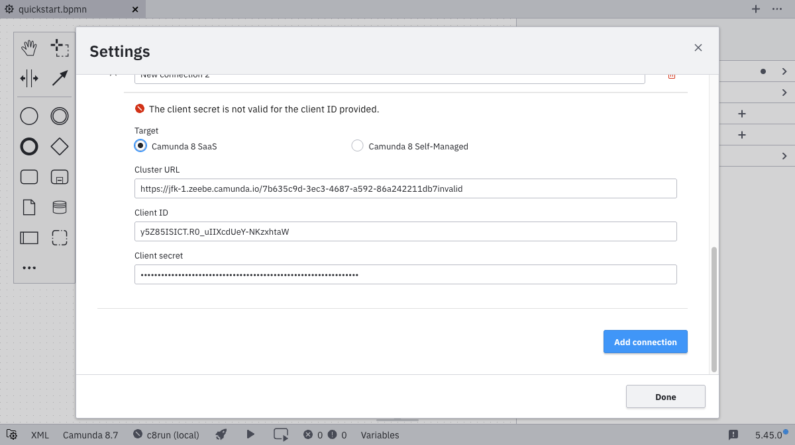
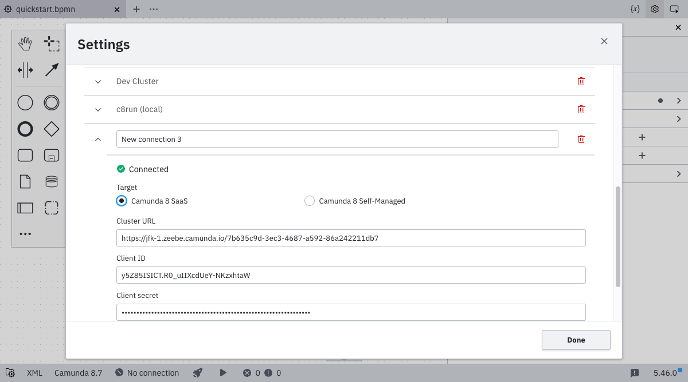
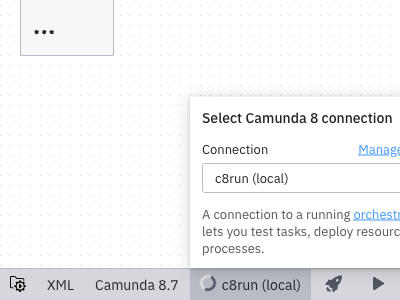

Desktop Modeler can directly connect to Camunda 8 Orchestration Clusters. An active connection is required to deploy a diagram, start a process instance, or test a task. Follow the steps below to connect to **Camunda 8 SaaS**. To connect to a local installation, visit the [Camunda 8 Self-Managed guide](../../../self-managed/components/modeler/desktop-modeler/connect-to-self-managed.md).

1. Click on the connection selector. For new installations, this will show **No connection**. If you have previously selected a connection, it will show the name of that connection.

   

2. To add a new connection, go to settings. You can either click **Manage connections**, or open the settings directly (Cmd/Ctrl + ,).

   

   By default, a local c8run connection is already set up. If you have previously used Desktop Modeler to deploy diagrams, those connections will also be available under **Unnamed Connection**.

3. Click **Add connection**.

   

4. Input a **name**, the **cluster URL**, and the credentials (**client ID** and **client secret**) for your [API client](../../console/manage-clusters/manage-api-clients.md).

   

   The connection is automatically validated.
   If you have issues connecting to the cluster, see the [troubleshooting page](./troubleshooting.md#debug-zeebe-connection-issues).

   

   If the connection is established successfully, you can go back to the connection selection, where your new connection is now available.

   

5. Select the connection you just created to use it for [deployment](./deploy-diagram.md), [starting a new process instance](./start-instance.md), or [task testing](./task-testing.md).

   
   :::note
   As a next step, [deploy your diagram](./deploy-diagram.md).
   :::
