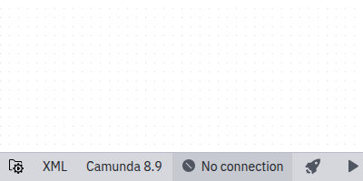
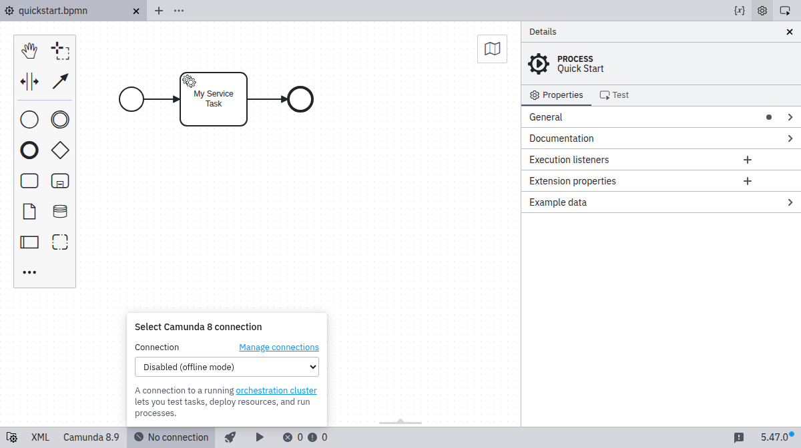
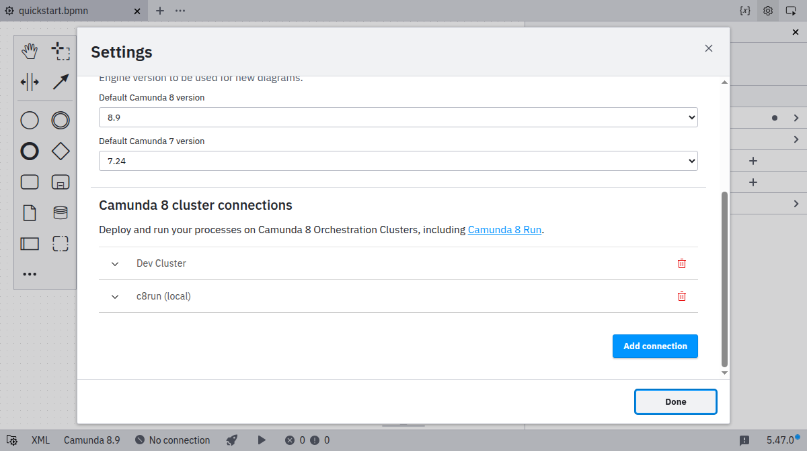
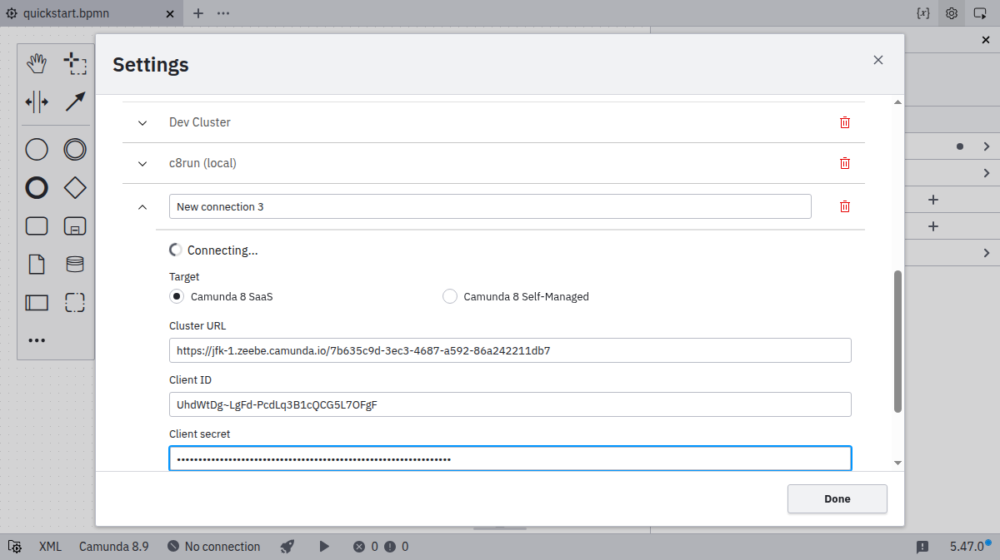
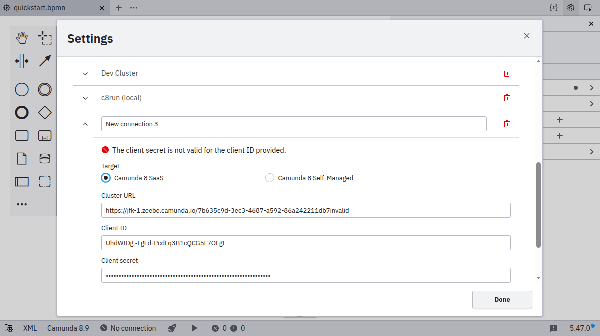
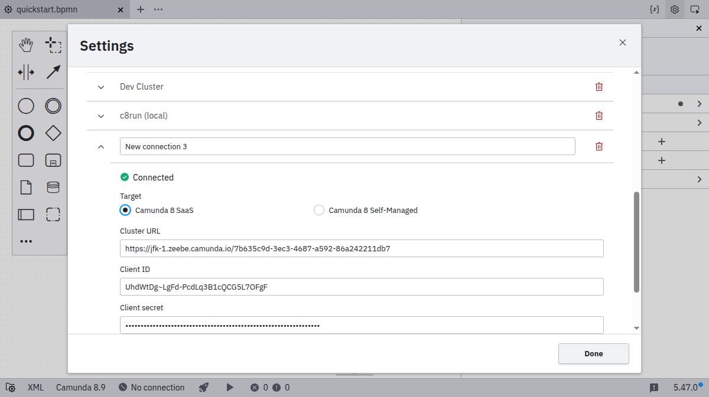
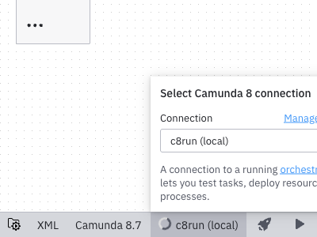

Desktop Modeler can directly connect to Camunda 8 Orchestration Clusters. Follow the steps below to connect to **Camunda 8 SaaS**. To connect to a local installation, visit the [Camunda 8 Self-Managed guide](../../../self-managed/components/modeler/desktop-modeler/connect-to-self-managed.md).

1. Click on the **Connection Selector**. For new installations, this will show `No connection`. If you already selected a connection before, it will show the name of that connection.

   

2. To add a new connection you need to go into settings. You can either click **Manage connections** or open the settings directly (`Cmd/Ctrl + ,`)

   By default a local c8run connection is already setup. If you used Desktop Modeler before to deploy a diagram, that connection will also be available (`Unnamed Connection`).

   

3. Click on **Add connection**

   

4. Input a `name`, the `Cluster URL`, and the credentials (`Client ID`, `Client secret`) of your [API client](../../console/manage-clusters/manage-api-clients.md)

   

   The connection is automatically validated.
   If you have issues connecting to the cluster have a look at the [troubleshooting page](./troubleshooting.md#debug-zeebe-connection-issues).

   

   If the connection is established successfully, you can leave the settings and go back to the **Connection Selector** where your new connection is now available.

   

5. Select the connection you just created to use it for [deployment](./deploy-diagram.md) or other tools like [task testing](./task-testing.md) or [starting a new process instance](./start-instance.md).

   

:::note
As a next step, [deploy your first diagram](./deploy-diagram.md).
:::
