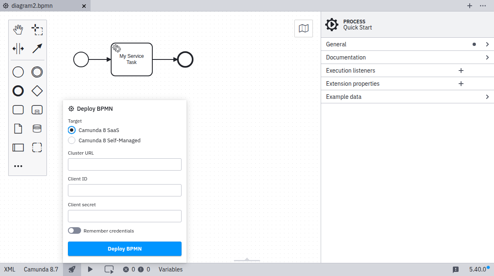
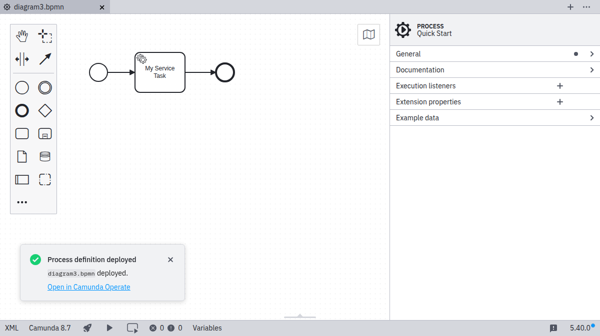

Desktop Modeler can directly deploy diagrams and start process instances in Camunda Cloud. Follow the steps below, to deploy a diagram:

1. Click the deployment icon:

2. Click **Camunda Cloud SaaS**, or alternatively, select **Camunda Cloud Self-Managed** if you for example want to deploy to a [local installation](../../../../self-managed/zeebe-deployment/local/install/):

3. Input the `Cluster URL` and the credentials (`Client ID`, `Client Secret`) of your [API client](../../cloud-console/manage-clusters/manage-api-clients.md):

4. Select the **Remember** checkbox if you want to locally store the connection information.

5. Click **Deploy** to perform the actual deployment.

