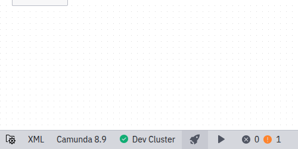
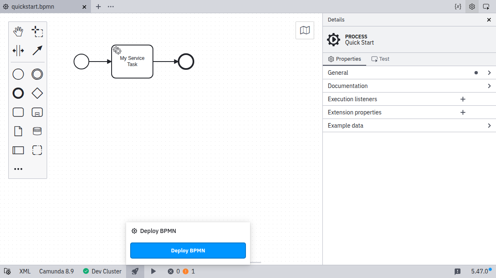
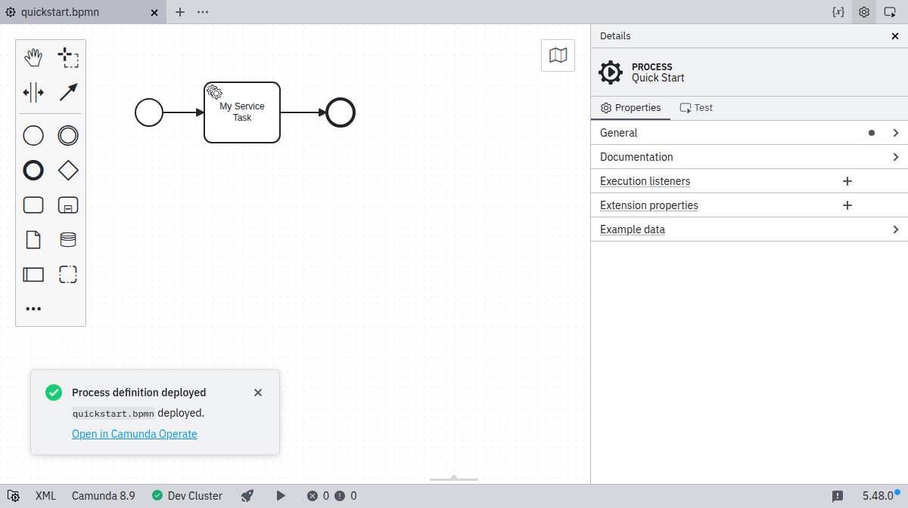

Desktop Modeler can directly deploy diagrams and start process instances in Camunda 8. Follow the steps below to deploy a diagram to Camunda 8 Orchestration Clusters.

1. Ensure you have already setup and selected a connection by following the [Connect to Camunda 8 guide](./connect-to-camunda-8.md).

   

2. Click the rocket-shaped deployment icon:

   

3. Click **Deploy** to perform the actual deployment.

   

4. If the deployment is successful, you will see a confirmation message:

   

:::note
As a next step, [start a new process instance](./start-instance.md).
:::
