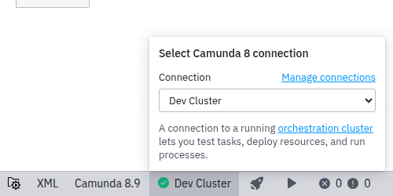
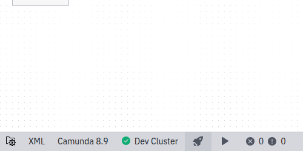
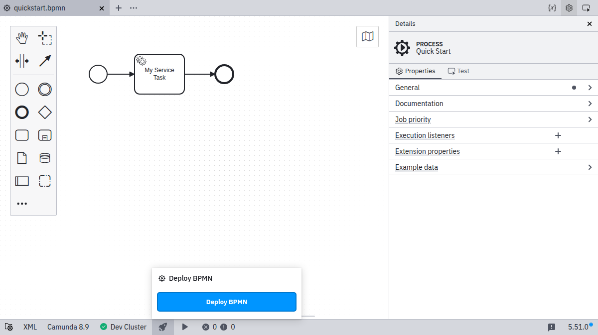
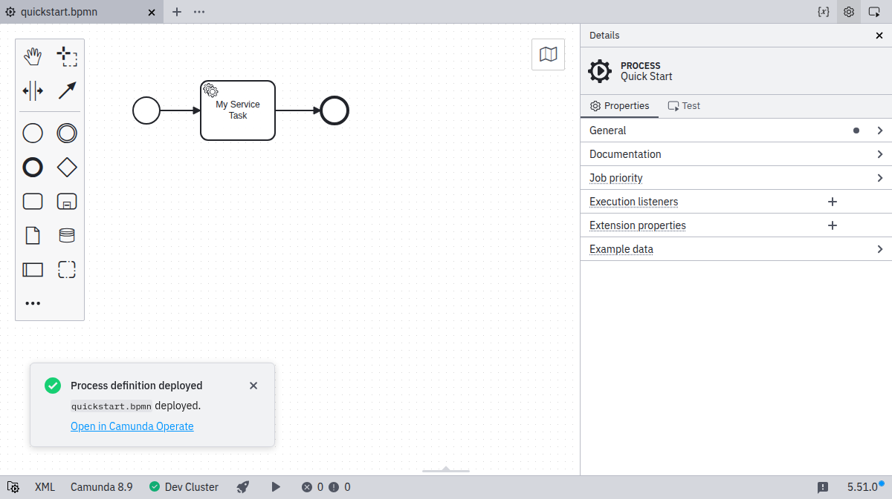

Desktop Modeler can directly deploy diagrams and start process instances in Camunda 8. Follow the steps below to deploy a diagram to Camunda.

1. Set up and select a connection by following [Connect to Camunda 8](./connect-to-camunda-8.md) guide.

   

2. Click the **Deploy** icon:

   

3. Click **Deploy** to perform the actual deployment.

   

4. If the deployment is successful, you will see a confirmation message:

   

:::note
As a next step, [start a new process instance](./start-instance.md).
:::
