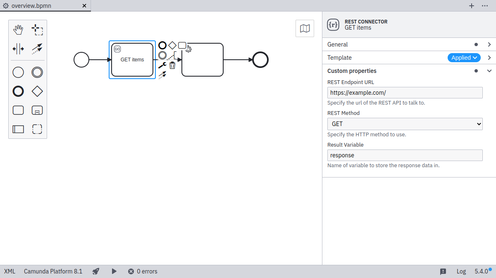

:::note
Element templates are currently available in BPMN diagrams only.
:::

:::note
For Camunda Platform 7 element templates documentation, go to [Camunda 7 docs](https://docs.camunda.org/manual/7.19/modeler/element-templates/).
:::

Element templates are a way to extend the [modeler](https://camunda.org/bpmn/tool/) with domain-specific diagram elements, such as service and user tasks.

Applicable element templates can be assigned to a BPMN element via the properties panel and/or the replace menu.

Applying an element template configures the diagram element with pre-defined values for BPMN properties, input/output mappings, and extension properties.

As seen in the _REST Connector_ example above, it also provides custom editing UI, input validation, and assistance.
