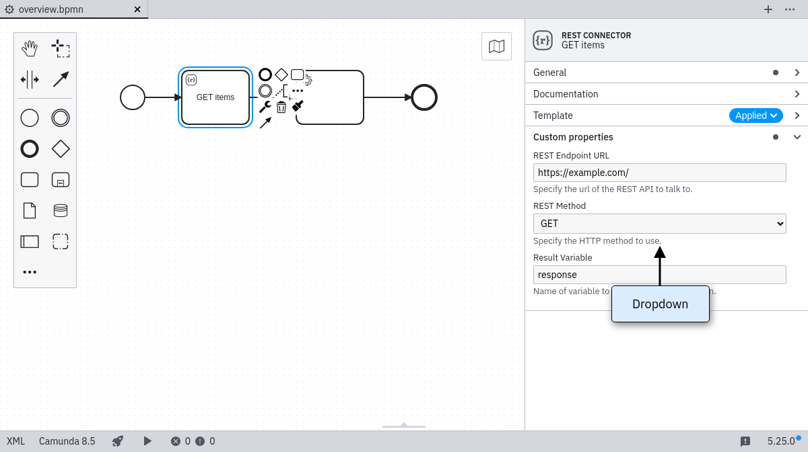
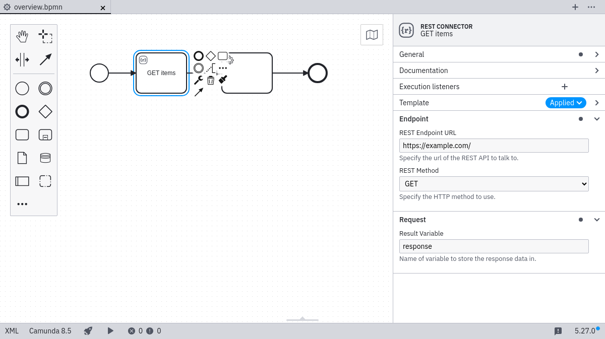
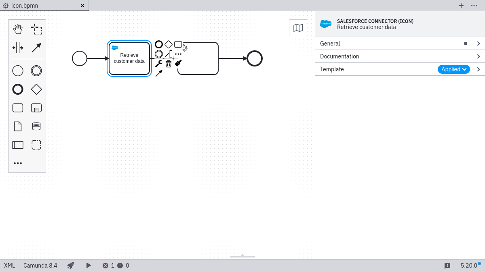
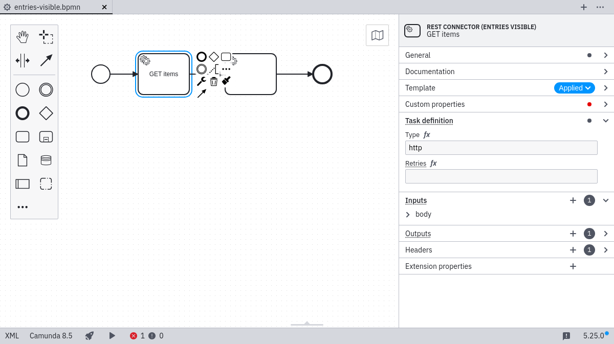

import Tabs from "@theme/Tabs";
import TabItem from "@theme/TabItem";

Templates are defined in template descriptor files as a JSON array:

```json
[
  {
    "$schema": "https://unpkg.com/@camunda/element-templates-json-schema/resources/schema.json",
    "name": "Template 1",
    "id": "sometemplate",
    "description": "some description",
    "version": 1,
    "appliesTo": [
      "bpmn:Task"
    ],
    "elementType": {
      "value": "bpmn:ServiceTask",
    }
    "properties": [
      ...
    ]
  },
  {
    "name": "Template 2",
    ...
  }
]
```

As seen in the code snippet a template consist of a number of important components:

- `$schema : String`: URI pointing towards the [JSON schema](https://json-schema.org/) which defines the structure of the element template `.json` file. Element template schemas are maintained in the [element templates JSON schema](https://github.com/camunda/element-templates-json-schema) repository. Following the [JSON schema](https://json-schema.org/) standard, you may use them for validation or to get assistance (e.g., auto-completion) when working with them in your favorite IDE. Note that the `$schema` attribute is **required** for Camunda Platform 8 element templates.

  Example (Camunda Platform 7)

  ```json
  "$schema": "https://unpkg.com/@camunda/element-templates-json-schema/resources/schema.json"
  ```

  Example (Camunda Platform 8)

  ```json
  "$schema": "https://unpkg.com/@camunda/zeebe-element-templates-json-schema/resources/schema.json"
  ```

- `name : String`: Name of the template. Will be shown in the element template selection modal and in the properties panel (after having applied an element template).
- `id : String`: ID of the template.
- `description : String`: Optional description of the template. Will be shown in the element template selection modal and in the properties panel (after having applied an element template).
- `documentationRef : String`: Optional URL pointing to a template documentation. Will be shown in the properties panel (after having applied an element template).
- `version : Integer`: Optional version of the template. If you add a version to a template it will be considered unique based on its ID and version. Two templates can have the same ID if their version is different.
- `appliesTo : Array<String>`: List of BPMN types the template can be applied to.
- `elementType : Object`: Optional type of the element. If you add an elementType to the template, the element will be replaced with the specified type when you apply the template.
- `properties : Array<Object>`: List of properties of the template.

### JSON schema compatibility

The application uses the `$schema` property to ensure compatibility for a given element template. The latest supported [Camunda element templates JSON Schema versions](https://github.com/camunda/element-templates-json-schema) are

- `v0.10.0` (Camunda Platform 7)
- `v0.5.0` (Camunda Platform 8)

Camunda Modeler will ignore element templates defining a higher `$schema` version and will log a warning message.

For example, given the following `$schema` definition, the application takes `0.9.1` as the JSON Schema version of the element template.

```json
"$schema": "https://unpkg.com/@camunda/element-templates-json-schema@0.9.1/resources/schema.json"
```

The JSON Schema versioning is backward-compatible, meaning that all versions including or below the current one are supported. In case no `$schema` is defined, Camunda Modeler assumes the latest JSON Schema version for Camunda Platform 7 element templates.

Learn more about specifing a `$schema` [here](../defining-templates).

### Supported BPMN types

Currently, element templates may be used on the following BPMN elements:

- `bpmn:Activity` (including tasks, service tasks, and others)
- `bpmn:SequenceFlow` (for maintaining `condition`)
- `bpmn:Process`
- `bpmn:Event`

### Defining template properties

With each template, you define some user-editable fields as well as their mapping to BPMN 2.0 XML as well as Camunda extension elements.

Let us consider the following example that defines a template for a mail sending task:

```json
{
  "$schema": "https://unpkg.com/@camunda/element-templates-json-schema/resources/schema.json",
  "name": "Mail Task",
  "id": "com.camunda.example.MailTask",
  "appliesTo": ["bpmn:ServiceTask"],
  "properties": [
    {
      "label": "Implementation Type",
      "type": "String",
      "value": "com.mycompany.MailTaskImpl",
      "editable": false,
      "binding": {
        "type": "property",
        "name": "camunda:class"
      }
    },
    {
      "label": "Sender",
      "type": "String",
      "binding": {
        "type": "camunda:inputParameter",
        "name": "sender"
      },
      "constraints": {
        "notEmpty": true
      }
    },
    {
      "label": "Receivers",
      "type": "String",
      "binding": {
        "type": "camunda:inputParameter",
        "name": "receivers"
      },
      "constraints": {
        "notEmpty": true
      }
    },
    {
      "label": "Template",
      "description": "By the way, you can use freemarker templates ${...} here",
      "value": "Hello ${firstName}!",
      "type": "Text",
      "binding": {
        "type": "camunda:inputParameter",
        "name": "messageBody",
        "scriptFormat": "freemarker"
      },
      "constraints": {
        "notEmpty": true
      }
    },
    {
      "label": "Result Status",
      "description": "The process variable to which to assign the send result to",
      "type": "String",
      "value": "mailSendResult",
      "binding": {
        "type": "camunda:outputParameter",
        "source": "${ resultStatus }"
      }
    },
    {
      "label": "Async before?",
      "type": "Boolean",
      "binding": {
        "type": "property",
        "name": "camunda:asyncBefore"
      }
    }
  ]
}
```

The example defines five custom fields, each mapped to different technical properties:

- _Implementation Type_ is mapped to the `camunda:class` property in BPMN 2.0 XML
- _Sender_, _Receivers_ and _Template_ properties are mapped to `input parameters`
- _Result Status_ is mapped back from the Java Delegate into a process variable via an `output parameter`

All but the _Implementation Type_ are editable by the user through the properties panel as shown in the following screenshot:


As seen in the example the important attributes in a property definition are:

- `label`: A descriptive text shown with the property
- `type`: Defining the visual appearance in the properties panel (may be any of `String`, `Text`, `Boolean`, `Dropdown` or `Hidden`)
- `value`: An optional default value to be used if the property to be bound is not yet set
- `binding`: Specifying how the property is mapped to BPMN or Camunda extension elements and attributes (may be any of `property`, `camunda:property`, `camunda:inputParameter`, `camunda:outputParameter`, `camunda:in`, `camunda:out`, `camunda:executionListener`, `camunda:field`, `camunda:errorEventDefinition`)
- `constraints`: A list of editing constraints to apply to the template

Camunda Platform 8 also supports these properties:

- `id`: An identifier that can be used to reference the property in conditional properties.
- `condition`: A condition that determines when the property is active.

#### Types

The input types `String`, `Text`, `Boolean`, `Dropdown` and `Hidden` are available. As seen above `String` maps to a single-line input, `Text` maps to a multi-line input.

##### Boolean / checkbox type

The `Boolean` type maps to a checkbox that can be toggled by the user. It renders as shown below:


When checked, it maps to `true` in the respective field (see [bindings](#bindings)). Note that it does not map to `${true}` and can therefore not be used e.g., for mapping a boolean to a process variable.

##### Dropdown type

The `Dropdown` type allows users to select from a number of pre-defined options that are stored in a custom properties `choices` attribute as `{ name, value }` pairs:

```json
...
  "properties": [
    ...
    {
      "label": "Task Priority",
      "type": "Dropdown",
      "value": "50",
      "choices": [
        { "name": "low", "value": "20" },
        { "name": "medium", "value": "50" },
        { "name": "height", "value": "100" }
      ]
    }
  ]
...
```

The resulting properties panel control looks like this:



##### Omitted type

By omitting the `type` configuration the default UI component will be rendered for the respective binding.

For `camunda:inputParameter` and `camunda:outputParameter` bindings an Input / Output Parameter Mapping component will be rendered. The component will include a toggle to enable or disable the `Variable Assignment`. When untoggling, the respective `camunda:inputParameter` or `camunda:outputParameter` element will not be created in the BPMN XML.


Note that the configuration options `editable` and `constraints` will have no effect for the `camunda:inputParameter` and `camunda:outputParameter` default component.

For `camunda:errorEventDefinition` bindings, an Error component will be rendered. The component will include all properties of the referenced `bpmn:Error` element.


Note that the configuration options `editable` and `constraints` will have no effect for the `camunda:errorEventDefinition` default component.

For the `property`, `camunda:property`, `camunda:in`, `camunda:in:businessKey`, `camunda:out` and `camunda:field` bindings, an omitted `type` will lead to rendering the `String` component (single line input).

For the `camunda:executionListener` binding, an omitted `type` will lead to the `Hidden` component (ie. no visible input for the user).

##### Feel

As of Camunda Modeler `v5.0.0`, we support the feel properties `optional` and `required`.
When set, the input field offers visual indications that a feel expression is expected.

```json
  "properties": [
    {
      "label": "Optional Feel Expression",
      "type": "String",
      "feel": "optional"
    },
    {
      "label": "Required Feel Expression",
      "type": "Text",
      "feel": "required"
    }
  ]
```

###### Supported types

Camunda Platform 7

_Feel Inputs are currently not supported for Camunda Platform 7 element templates._

Camunda Platform 8

- `String`
- `Text`

#### Bindings

The following ways exist to map a custom field to the underlying BPMN 2.0 XML. The _"mapping result"_ in the following section will use `[userInput]` to indicate where the input provided by the user in the `Properties Panel` is set in the BPMN XML. As default or if no user input was given, the value specified in `value` will be displayed and used for `[userInput]`. `[]` brackets will be used to indicate where the parameters are mapped to in the XML.

Notice that adherence to the following configuration options is enforced by design. If not adhering, it logs a validation error and ignores the respective element template.

<Tabs groupId="bindings" defaultValue="both" values={
[
{label: 'Bindings for Camunda Platform 7 and 8', value: 'both', },
{label: 'Bindings for Camunda Platform 7', value: 'platform', },
{label: 'Bindings for Camunda Platform 8', value: 'cloud', },
]
}>

<TabItem value='both'>

##### `property`

| **Binding `type`**          | `property`                       |
| --------------------------- | -------------------------------- |
| **Valid property `type`'s** | all property types are supported |
| **Binding parameters**      | `name`: the name of the property |
| **Mapping result**          | `<... [name]=[userInput] ... />` |

The `property` binding is supported both in Camunda Platform 7 and Cloud.

</TabItem>

<TabItem value='platform'>

##### `camunda:property`

| **Binding `type`**          | `camunda:property`                                       |
| --------------------------- | -------------------------------------------------------- |
| **Valid property `type`'s** | `String`<br />`Hidden`<br />`Dropdown`                   |
| **Binding parameters**      | `name`: the name of the extension element property       |
| **Mapping result**          | `<camunda:property name="[name]" value="[userInput]" />` |

##### `camunda:inputParameter`

| **Binding `type`**          | `camunda:inputParameter`                                                                                                                                                                                                                                                                              |
| --------------------------- | ----------------------------------------------------------------------------------------------------------------------------------------------------------------------------------------------------------------------------------------------------------------------------------------------------- |
| **Valid property `type`'s** | `String`<br /> `Text`<br />`Hidden`<br />`Dropdown`                                                                                                                                                                                                                                                   |
| **Binding parameters**      | `name`: the name of the input parameter<br />`scriptFormat`: the format of the script (if script is to be mapped)                                                                                                                                                                                     |
| **Mapping result**          | If `scriptFormat` is not set:<br />`<camunda:inputParameter name="[name]">[userInput]</camunda:inputParameter>`<br /><br />If `scriptFormat` is set:<br />`<camunda:inputParameter name="[name]"><camunda:script scriptFormat="[scriptFormat]">[userInput]</camunda:script></camunda:inputParameter>` |

##### `camunda:outputParameter`

| **Binding `type`**           | `camunda:outputParameter`                                                                                                                                                                                                                                                                                    |
| ---------------------------- | ------------------------------------------------------------------------------------------------------------------------------------------------------------------------------------------------------------------------------------------------------------------------------------------------------------ |
| **Valid property `type`'s**  | `String`<br />`Hidden`<br />`Dropdown`                                                                                                                                                                                                                                                                       |
| **Binding parameters**       | `source`: the source value to be mapped to the `outputParameter`<br />`scriptFormat`: the format of the script (if script is to be mapped)                                                                                                                                                                   |
| **Mapping result (example)** | If `scriptFormat` is not set:<br />`<camunda:outputParameter name="[userInput]">[source]</camunda:inputParameter>`<br /><br />If `scriptFormat` is set:<br />`<camunda:outputParameter name="[userInput]"><camunda:script scriptFormat="[scriptFormat]">[source]</camunda:script></camunda:outputParameter>` |

##### `camunda:in`

| **Binding `type`**          | `camunda:in`                                                                                                                                                                                                                                                                                                                                                                                                                                                                                                                                                                                                                                                                                                                                                                                                                                                                                                                    |
| --------------------------- | ------------------------------------------------------------------------------------------------------------------------------------------------------------------------------------------------------------------------------------------------------------------------------------------------------------------------------------------------------------------------------------------------------------------------------------------------------------------------------------------------------------------------------------------------------------------------------------------------------------------------------------------------------------------------------------------------------------------------------------------------------------------------------------------------------------------------------------------------------------------------------------------------------------------------------- |
| **Valid property `type`'s** | `String`<br />`Hidden`<br />`Dropdown`                                                                                                                                                                                                                                                                                                                                                                                                                                                                                                                                                                                                                                                                                                                                                                                                                                                                                          |
| **Binding parameters**      | `target`: the target value to be mapped to<br />`expression`: `true` indicates that the userInput is an expression<br />`variables`: either `all` or `local` indicating the variable mapping                                                                                                                                                                                                                                                                                                                                                                                                                                                                                                                                                                                                                                                                                                                                    |
| **Mapping result**          | If `target` is set:<br />`<camunda:in source="[userInput]" target="[target]"/>`<br /><br />If `target` is set and `expression` is set to `true`:<br />`<camunda:in sourceExpression="[userInput]" target="[target]" />`<br /><br /> If `variables` is set to `local`:<br />` <camunda:in local="true" variables="all" />` (Notice there is no `[userInput]`, therefore has to use property `type` of value `Hidden`)<br /><br />If `variables` is set to `local` and `target` is set:<br />`<camunda:in local="true" source="[userInput]" target="[target]" />`<br /><br />If `variables` is set to `local`, `target` is set and `expression` is set to `true`:<br />`<camunda:in local="true" sourceExpression="[userInput]" target="[target]" />`<br /><br />If `variables` is set to `all`:<br />`<camunda:in variables="all" />` (Notice there is no `[userInput]`, therefore has to use property `type` of value `Hidden`) |

##### `camunda:in:businessKey`

| **Binding `type`**          | `camunda:in:businessKey`                   |
| --------------------------- | ------------------------------------------ |
| **Valid property `type`'s** | `String`<br />`Hidden`<br />`Dropdown`     |
| **Binding parameters**      |                                            |
| **Mapping result**          | `<camunda:in businessKey="[userInput]" />` |

##### `camunda:out`

| **Binding `type`**          | `camunda:out`                                                                                                                                                                                                                                                                                                                                                                                                                                                                                                                                                                                                                                                                                                                                                                                                                                                                                     |
| --------------------------- | ------------------------------------------------------------------------------------------------------------------------------------------------------------------------------------------------------------------------------------------------------------------------------------------------------------------------------------------------------------------------------------------------------------------------------------------------------------------------------------------------------------------------------------------------------------------------------------------------------------------------------------------------------------------------------------------------------------------------------------------------------------------------------------------------------------------------------------------------------------------------------------------------- |
| **Valid property `type`'s** | `String`<br />`Hidden`<br />`Dropdown`                                                                                                                                                                                                                                                                                                                                                                                                                                                                                                                                                                                                                                                                                                                                                                                                                                                            |
| **Binding parameters**      | `source`: the source value to be mapped<br />`sourceExpression`: a string containing the expression for the source attribute<br />`variables`: either `all` or `local` indicating the variable mapping                                                                                                                                                                                                                                                                                                                                                                                                                                                                                                                                                                                                                                                                                            |
| **Mapping result**          | If `source` is set:<br />`<camunda:out source="[source]" target="[userInput]" />`<br /><br />If `sourceExpression` is set:<br />`<camunda:out sourceExpression="[sourceExpression]" target="[userInput]" />`<br /><br />If `variables` is set to `all`:<br />`<camunda:out variables="all" />` (Notice there is no `[userInput]`, therefore has to use property `type` of value `Hidden`)<br /><br />If `variables` is set to `local` and `source` is set:<br />`<camunda:out local="true" source="[source]" target="[userInput]" />`<br /><br />If `variables` is set to `local` and `sourceExpression` is set:<br />`<camunda:out local="true" sourceExpression="[source]" target="[userInput]" />`<br /><br />If `variables` is set to `local`:<br />`<camunda:out local="true" variables="all" />` (Notice there is no `[userInput]`, therefore has to use property `type` of value `Hidden`) |

##### `camunda:executionListener`

| **Binding `type`**          | `camunda:executionListener`                                                                                                                                                                                                                                                       |
| --------------------------- | --------------------------------------------------------------------------------------------------------------------------------------------------------------------------------------------------------------------------------------------------------------------------------- |
| **Valid property `type`'s** | `Hidden`                                                                                                                                                                                                                                                                          |
| **Binding parameters**      | `event`: value for the `event` attribute<br />`scriptFormat`: value for the `scriptFormat` attribute                                                                                                                                                                              |
| **Mapping result**          | `<camunda:executionListener event="[event]"><camunda:script scriptFormat="[scriptFormat]">[value]</camunda:script></camunda:executionListener>`<br />(Notice that `[value]` needs to be set, since only `Hidden` is allowed as a type hence the user can not set a `[userInput]`) |

##### `camunda:field`

| **Binding `type`**          | `camunda:field`                                                                                                                                                                                                                   |
| --------------------------- | --------------------------------------------------------------------------------------------------------------------------------------------------------------------------------------------------------------------------------- |
| **Valid property `type`'s** | `String`<br /> `Text`<br />`Hidden`<br />`Dropdown`                                                                                                                                                                               |
| **Binding parameters**      | `name`: value for the `name` attribute<br />`expression`: `true` that an expression is passed                                                                                                                                     |
| **Mapping result**          | `<camunda:field name="[name]"><camunda:string>[userInput]</camunda:string></camunda:field>`<br /><br />If `expression` is set to `true`:<br />`<camunda:field name="[name]"><camunda:expression>[userInput]</camunda:expression>` |

##### `camunda:errorEventDefinition`

| **Binding `type`**          | `camunda:errorEventDefinition`                                                                                                                                                                                                                       |
| --------------------------- | ---------------------------------------------------------------------------------------------------------------------------------------------------------------------------------------------------------------------------------------------------- |
| **Valid property `type`'s** | `String`<br />`Hidden`<br />`Dropdown`                                                                                                                                                                                                               |
| **Binding parameters**      | `errorRef`: reference to a scoped `bpmn:Error` binding, generates the `errorRef` attribute as unique id <br />                                                                                                                                       |
| **Mapping result**          | `<camunda:errorEventDefinition id="[unique element id]" expression="[userInput]" errorRef="Error_[errorRef]_[unique suffix]" />` <br /><br /> For the referenced scoped `bpmn:Error` binding: `<bpmn:Error id="Error_[errorRef]_[unique suffix]" />` |

</TabItem>

<TabItem value='cloud'>

##### `zeebe:input`

| **Binding `type`**          | `zeebe:input`                                         |
| --------------------------- | ----------------------------------------------------- |
| **Valid property `type`'s** | `String`<br /> `Text`<br />`Hidden`<br />`Dropdown`   |
| **Binding parameters**      | `name`: the name of the input parameter               |
| **Mapping result**          | `<zeebe:input target="[name]" source="[userInput] />` |

##### `zeebe:output`

| **Binding `type`**          | `zeebe:output`                                           |
| --------------------------- | -------------------------------------------------------- |
| **Valid property `type`'s** | `String`<br /> `Text`<br />`Hidden`<br />`Dropdown`      |
| **Binding parameters**      | `source`: the source of the output parameter             |
| **Mapping result**          | `<zeebe:output target="[userInput]" source="[source] />` |

##### `zeebe:taskHeader`

| **Binding `type`**          | `zeebe:taskHeader`                                  |
| --------------------------- | --------------------------------------------------- |
| **Valid property `type`'s** | `String`<br /> `Text`<br />`Hidden`<br />`Dropdown` |
| **Binding parameters**      | `key`: the key of the task header                   |
| **Mapping result**          | `<zeebe:header key="[key]" value="[userInput] />`   |

##### `zeebe:taskDefinition:type`

| **Binding `type`**          | `zeebe:taskDefinition:type`                         |
| --------------------------- | --------------------------------------------------- |
| **Valid property `type`'s** | `String`<br /> `Text`<br />`Hidden`<br />`Dropdown` |
| **Binding parameters**      |                                                     |
| **Mapping result**          | `<zeebe:taskDefinition type="[userInput]" />`       |

##### `zeebe:property`

| **Binding `type`**          | `zeebe:property`                                      |
| --------------------------- | ----------------------------------------------------- |
| **Valid property `type`'s** | `String`<br />`Text`<br />`Hidden`<br />`Dropdown`    |
| **Binding parameters**      | `name`: the name of the property                      |
| **Mapping result**          | `<zeebe:property name="[name]" value="[userInput] />` |

The `zeebe:property` binding allows you to set any arbitrary property for an outside system. It does not impact execution of the Zeebe engine.

</TabItem>
</Tabs>

#### Optional bindings

As of Camunda Modeler `v5.0.0`, we support optional bindings that do not persist empty values in the underlying BPMN 2.0 XML.

If a user removes the value in the configured control, it will also remove the mapped element.

```json
[
  {
    "$schema": "https://unpkg.com/@camunda/zeebe-element-templates-json-schema/resources/schema.json",
    "name": "Task example",
    "id": "some-template",
    "appliesTo": ["bpmn:ServiceTask"],
    "properties": [
      {
        "label": "Request",
        "type": "String",
        "optional": true,
        "binding": {
          "type": "zeebe:input",
          "name": "reuqest"
        }
      },
      {
        "label": "Response",
        "type": "Text",
        "optional": true,
        "binding": {
          "type": "zeebe:output",
          "source": "response"
        }
      }
    ]
  }
]
```

**Supported Bindings**

Camunda Platform 7

_Optional bindings are currently not supported for Camunda Platform 7 element templates._

Camunda Platform 8

- `zeebe:input`
- `zeebe:output`

#### Scoped bindings

Scoped bindings allow you to configure nested elements, such as [Camunda Platform 7 Connectors](https://docs.camunda.org/manual/latest/user-guide/process-engine/connectors/#use-connectors).

```json
{
  "name": "ConnectorGetTask",
  "id": "my.connector.http.get.Task",
  "appliesTo": [
    "bpmn:Task"
  ],
  "properties": [],
  "scopes": [
    {
      "type": "camunda:Connector",
      "properties": [
        {
          "label": "ConnectorId",
          "type": "String",
          "value": "My Connector HTTP - GET",
          "binding": {
            "type": "property",
            "name": "connectorId"
          }
        },
        ...
      ]
    }
  ]
}
```

The example shows how a Connector is configured as part of the task.
On task creation, the Connector is created with it and the Connector bindings are
exposed to the user in a separate custom fields section.


**Supported Scopes**

<Tabs groupId="scopes" defaultValue="platformScopes" values={
[
{label: 'Scoped bindings for Camunda Platform 7', value: 'platformScopes', },
{label: 'Scoped bindings for Camunda Platform 8', value: 'cloudScopes', }
]
}>

<TabItem value='platformScopes'>

| Name                | Target                                                                                     | Supported by       |
| ------------------- | ------------------------------------------------------------------------------------------ | ------------------ |
| `camunda:Connector` | [Connectors](https://docs.camunda.org/manual/latest/user-guide/process-engine/connectors/) | Camunda Platform 7 |
| `bpmn:Error`        | Global BPMN Error Element                                                                  | Camunda Platform 7 |

</TabItem>

<TabItem value='cloudScopes'>

Currently none.

</TabItem>
</Tabs>

#### Groups

As of Camunda Modeler `v5.0.0,` it is possible to define `groups` and order custom fields together.

```json
{
  "$schema": "https://unpkg.com/@camunda/zeebe-element-templates-json-schema/resources/schema.json",
  "name": "Groups",
  "id": "group-example",
  "appliesTo": [
    "bpmn:ServiceTask"
  ],
    "groups": [
    {
      "id": "definition",
      "label": "Task definition"
    },
    {
      "id": "request",
      "label": "Request payload"
    },
    {
      "id": "result",
      "label": "Result mapping"
    }
  ],
  "properties": [
    ...
  ]
}
```

Custom fields may use the defined group ids. The order of the custom fields also determines the groups' order in the properties panel.

```json
{
  ...
  "properties": [
    {
      "label": "Implementation Type",
      "type": "String",
      "group": "definition",
      "binding": {
        "type": "property",
        "name": "camunda:class"
      }
    },
    ...
  ],
  ...
}
```



#### Constraints

Custom Fields may have a number of constraints associated with them:

- `notEmpty`: Input must be non-empty
- `minLength`: Minimal length for the input
- `maxLength`: Maximal length for the input
- `pattern`: Regular expression to match the input against

##### Regular expression

Together with the `pattern` constraint, you may define your custom error messages:

```json
...
  "properties": [
    {
      "label": "Web service URL",
      "type": "String",
      "binding": { ... },
      "constraints": {
        "notEmpty": true,
        "pattern": {
          "value": "https://.*",
          "message": "Must be https URL"
        }
      }
    }
  ]
```

#### Icons

As of Camunda Modeler `v5.0.0,` it is possible to define custom icons to update the visual appearance of elements after applying an element template.

```json
[
  {
    "name": "Template 1",
    "id": "sometemplate",
    "appliesTo": [
      "bpmn:ServiceTask"
    ],
    "icon": {
      "contents": "data:image/svg+xml,%3Csvg xmlns='http://www.w3.org/2000/svg' width='22' height='22' viewBox='0 0 22 22' fill='none'%3E%3Ccircle cx='11' cy='11' r='9' fill='black'/%3E%3Ctext x='6.9' y='14.9' fill='white' style='font-family: Arial; font-size: 10px;'%3EM%3C/text%3E%3C/svg%3E"
    },
    "properties": [
      ...
    ]
  }
]
```



The icon contents must be a valid [data](https://developer.mozilla.org/en-US/docs/Web/HTTP/Basics_of_HTTP/Data_URIs) or HTTP(s) URL. We recommend using square icons as they get rendered 18x18 pixels on the canvas and 32x32 pixels in the properties panel.

This feature is currently only supported for Camunda Platform 8 element templates.

#### Display all entries

Per default, the element template defines the visible entries of the properties panel. All other property controls are hidden. If you want to bring all the default entries back, it is possible to use the `entriesVisible` property.

```json
[
  {
    "name": "Template 1",
    "id": "sometemplate",
    "entriesVisible": true,
    "appliesTo": [
      "bpmn:ServiceTask"
    ],
    "properties": [
      ...
    ]
  }
]
```



### Defining conditional properties

Properties may have a condition which determines when they should be active, depending on the value of another property. When property is **active**, it is displayed in the properties panel, and its value is serialized in the XML. If a property is **not active**, it is not displayed, and its value is removed from the XML.

For a property value to be used in a condition, the property needs to have an `id` that can be referenced by the conditional property.

A property can depend on one or more conditions. If there are multiple conditions, they can be defined using `allMatch`. All of the conditions must be met for the property to be active.

There are two possible comparison operators:

- `equals`: Checks if the value is equal to the value defined in the condition.
- `oneOf`: Checks if the value is in the list of values defined in the condition.

```json
...
  "properties": [
    {
      "id": "httpMethod",
      "label": "HTTP Method",
      "type": "Dropdown",
      "choices": [
        { "name": "get", "value": "GET" },
        { "name": "patch", "value": "PATCH" },
        { "name": "post", "value": "POST" },
        { "name": "delete", "value": "DELETE" }
      ],
      "binding": { ... },
    },
    {
      "label": "Request Body",
      "type": "String",
      "binding": { ... },
      "condition": {
        "property": "httpMethod",
        "oneOf": ["patch", "post", "delete"]
      }
    },
    {
      "id": "authenticationType",
      "label": "Authentication Type",
      "type": "Dropdown",
      "choices": [
        {
          "name": "None",
          "value": ""
        },
        {
          "name": "Basic",
          "value": "basic"
        }
      ],
      "binding": { ... }
    },
    {
      "label": "Username",
      "type": "String",
      "binding": { ... },
      "condition": {
       "allMatch": [
          {
            "property": "httpMethod",
            "oneOf": ["patch", "post", "delete"]
          },
          {
            "property": "authenticationType",
            "equals": "basic"
          }
        ]
      }
    },
    {
      "label": "Password",
      "type": "String",
      "binding": { ... },
      "condition": {
        "allMatch": [
          {
            "property": "httpMethod",
            "oneOf": ["patch", "post", "delete"]
          },
          {
            "property": "authenticationType",
            "equals": "basic"
          }
        ]
      }
    },
  ]
```
