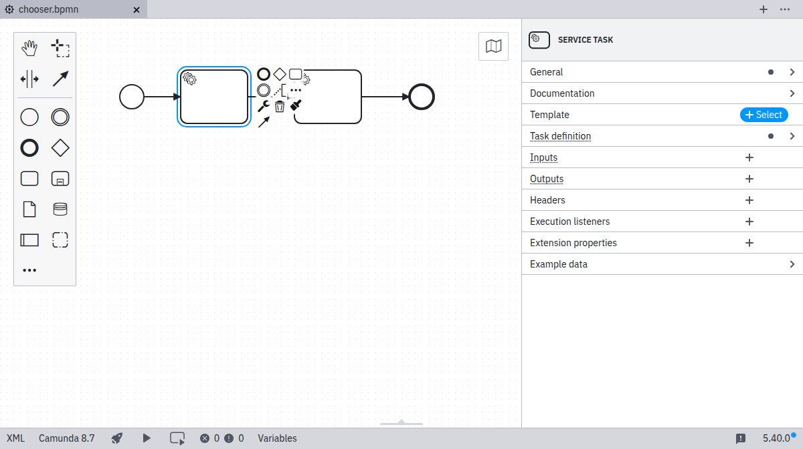
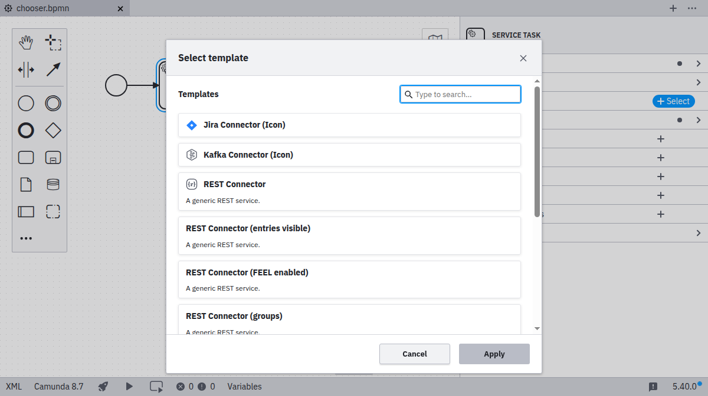
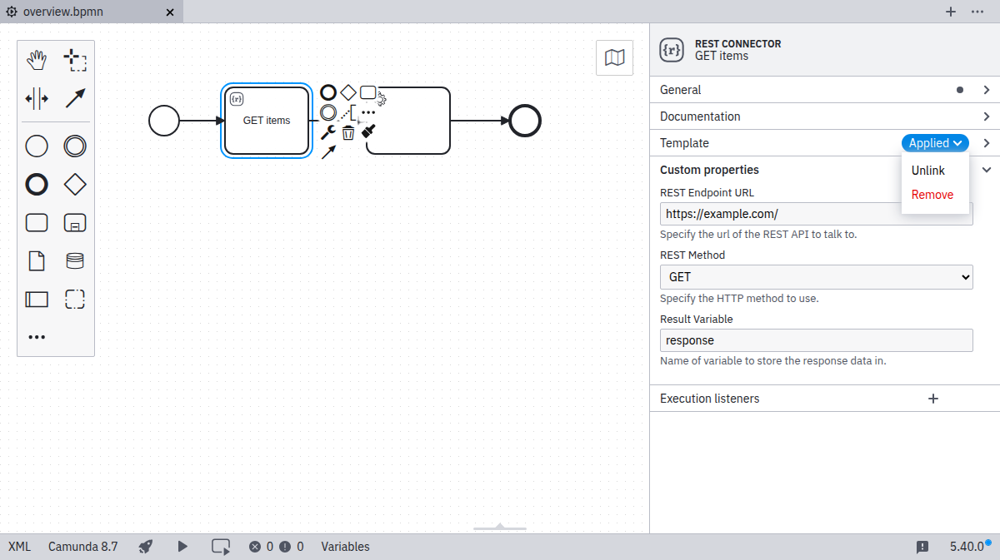

### Applying Templates

If a template matches a selected diagram element, the template catalog button will be shown in the properties panel.



Clicking the `Catalog` button will bring up a modal menu allowing to browse and search available templates for the
selected element.



Applying a template will store it via the `modelerTemplate` property and the optional `modelerTemplateVersion` property
on the selected element:

Camunda Platform 7

```xml

<bpmn:serviceTask id="MailTask"
                  camunda:modelerTemplate="com.mycompany.MailTask"
                  camunda:modelerTemplateVesion="1"/>
```

Camunda Platform 8

```xml

<bpmn:serviceTask id="MailTask"
                  zeebe:modelerTemplate="com.mycompany.MailTask"
                  zeebe:modelerTemplateVesion="1"/>
```

It will also setup custom fields on the diagram element and make these available to the user for inspection and editing.
Properties which were not configured in the element template using custom fields, will not be available for editing for
the user.

### Removing Templates

To remove an applied template from an element, either the _Unlink_ or _Remove_ function can be used:

- _Remove_: Remove the element template from the `modelerTemplate` property and also reset all properties of the
  respective element.
- _Unlink_: Remove the element template from the `modelerTemplate` property but keep the properties which were set.



### Updating Templates

If a template is applied and a new version of the template is found you can _update_ the template.


Templates are updated according to the following rules:

1. If property is set in new template it will override unless property was set by old template and changed afterwards
2. If property is not defined in new template it will unset
3. Sub-properties of complex properties (e.g. camunda:In, camunda:Out, camunda:ExecutionListener) will be handled
   according to these rules if they can be identified

### Replacing Templates

If a template has been deprecated with a new element template, and you want to keep the same input values as in the
deprecated template, you can:

- _Unlink_: Remove the current template that is deprecated from the modelerTemplate property but keep the properties
  which
  were set.
- _Select_ and apply the new element template.

### Missing Templates

If a template is applied to an element but the respective template cannot be found on the system, the editing of the
element will be disabled. _Unlinking_ or _removing_ the template for the element or adding the element template config
will enable the editing again.


