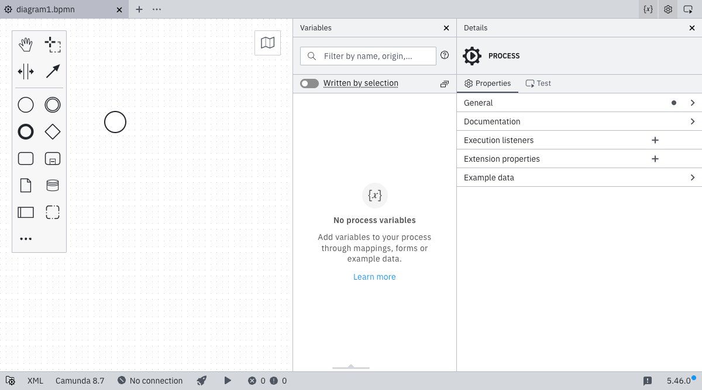

Camunda 7 and 8

Desktop Modeler is a desktop application for modeling BPMN, DMN, and Forms. As part of the Camunda implementation toolkit, it helps you create executable diagrams while working alongside your preferred IDE, integrated into your professional software development environment.

## Features

- Design [BPMN](../bpmn/bpmn.md), [DMN](../dmn/dmn.md), and [Forms](../forms/camunda-forms-reference.md)
- Implement process applications for Camunda 7 and 8
- Deploy and run processes directly from the application
- Validate your diagrams using [configurable lint rules](https://github.com/camunda/camunda-modeler-custom-linter-rules-plugin)
- [Customize](./flags/flags.md) and [extend](./plugins/plugins.md) the application
- Work against the local file system

## Download

Download the app for Windows, Linux, or macOS from the [Camunda downloads page](https://camunda.com/download/modeler/).

> On Windows and Linux you can carry out [additional steps](./install-the-modeler#wire-file-associations) to register Modeler as the default editor for BPMN, DMN, and Form files.

## Get started

Learn how to [develop your first process](./model-your-first-diagram.md) and [deploy it](./connect-to-camunda-8.md) to Camunda 8.

## Resources

- [Report an issue](https://github.com/camunda/camunda-modeler/issues)
- [Source code](https://github.com/camunda/camunda-modeler)
- [Troubleshooting](/self-managed/components-upgrade/troubleshooting/troubleshooting.md)
