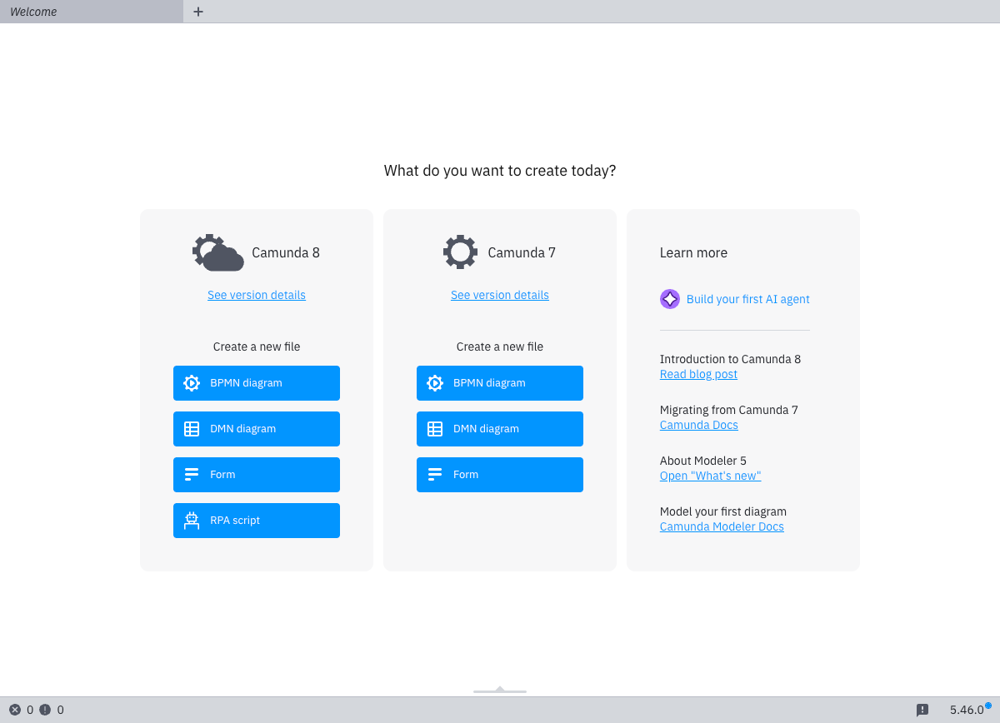
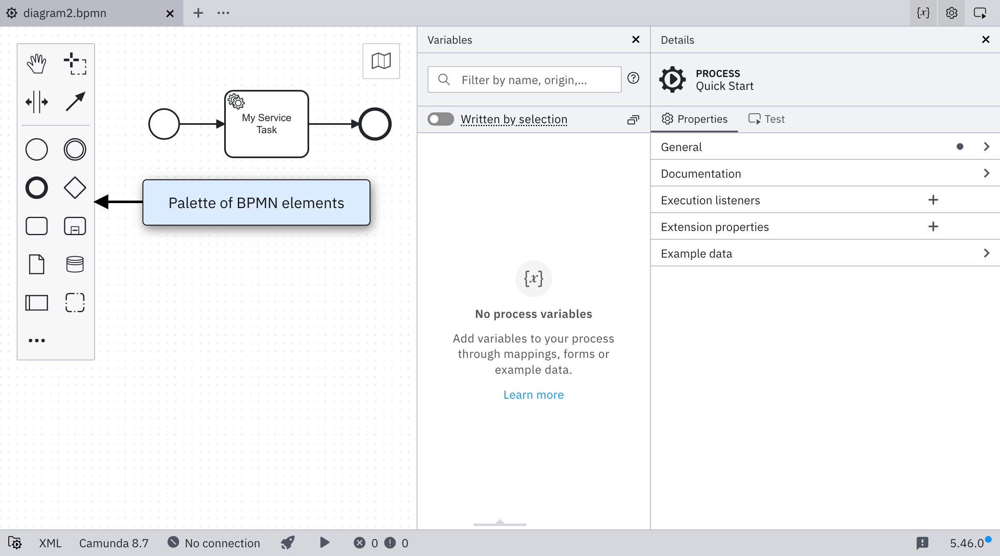
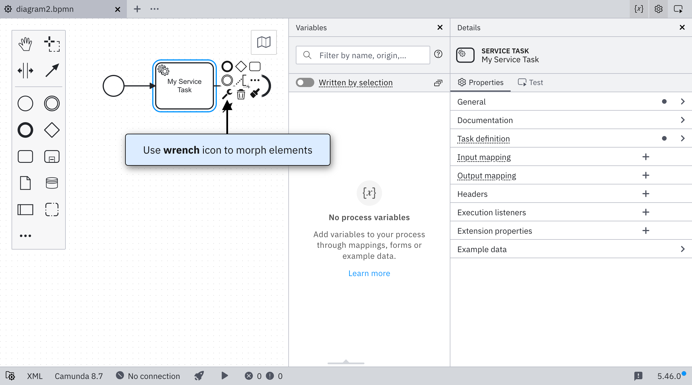
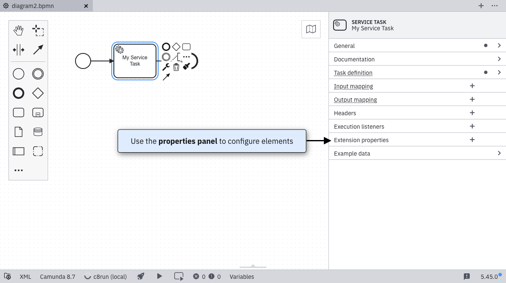

After starting [Desktop Modeler](./index.md), you can model your first BPMN diagram. Follow the steps below:

1. Create a [BPMN](../bpmn/bpmn.md) diagram by selecting **BPMN diagram**:

The BPMN diagram will now open with a start event. [Events](/components/modeler/bpmn/events.md) in BPMN represent things that happen. A process can react to events and emit events, for example:

2. The basic elements of BPMN processes are [tasks](/components/modeler/bpmn/tasks.md), or atomic units of work composed to create a meaningful result. Click on the start event and select the rectangular task element. This creates a task directly following the start event, connected by an arrow. Next, double-click the task and type in a name for the element. For example, `My Service Task`.

3. Click on the task and select the dark circle in the top left. This attaches an end event directly to the task. On the left side of the screen you will find the element palette, where you can also drag and drop elements onto the canvas.

Above, you can see that elements that support different types can be reconfigured by clicking on the corresponding icon. In this case, the task can be converted to a [service task](../bpmn/service-tasks/service-tasks.md), for example, by clicking on the task and the wrench-shaped icon.

You might also [orchestrate human tasks](/guides/getting-started-orchestrate-human-tasks.md). Review the [complete list of supported BPMN elements](/components/modeler/bpmn/bpmn-coverage.md)

4. Open the properties panel by selecting the light gray arrow on the right side of the page halfway down the canvas. Here, you can edit the properties of the currently selected element:

For example, you might name your element and give it an ID under the **General** section.

5. Once you finish modeling and configuring your diagram, you can deploy it to a [Camunda 8 cluster](./connect-to-camunda-8.md).
