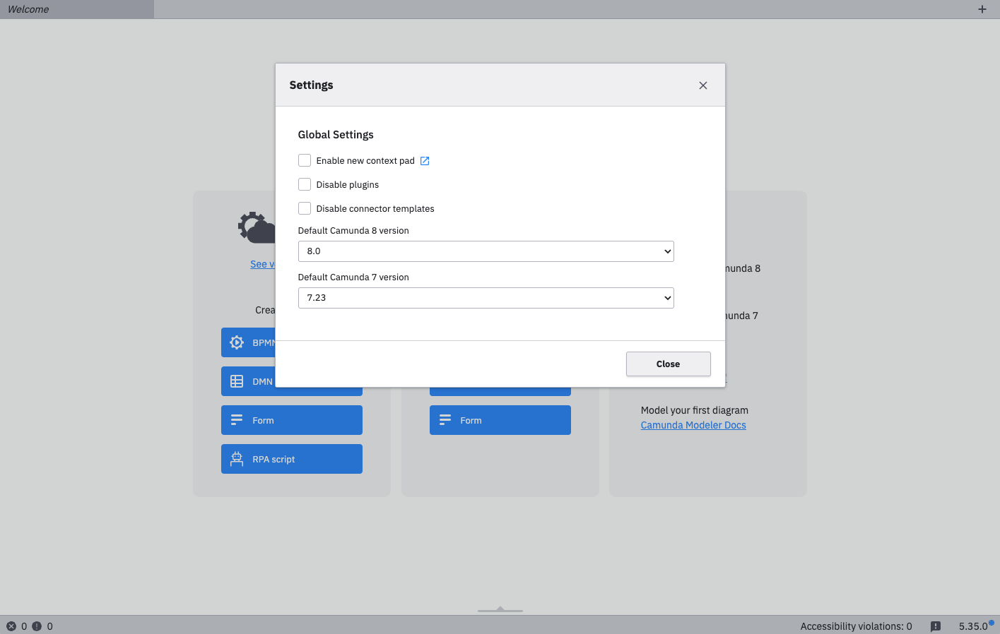

Use the Settings window to configure the application and its plugins in one central place, making it easy to manage preferences and defaults.

## Usage

Open the settings window from the application menu or using the `Cmd/Ctrl + ,` keyboard shortcut.

Changes are saved automatically. If a restart is required to apply them, a warning will be displayed.

If external documentation is available for a setting, you can access it by clicking the blue icon next to the setting name.

## Settings JSON file

Your settings are saved in `settings.json` file in the [user data directory](../search-paths/search-paths.md#user-data-directory).

Only the settings which have been modified are stored in this file.

You can edit this file directly or transfer it between modeler instances. If you modify it, a restart is required for the changes to take effect.