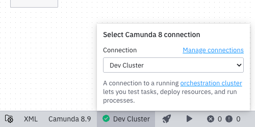
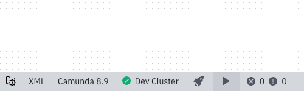
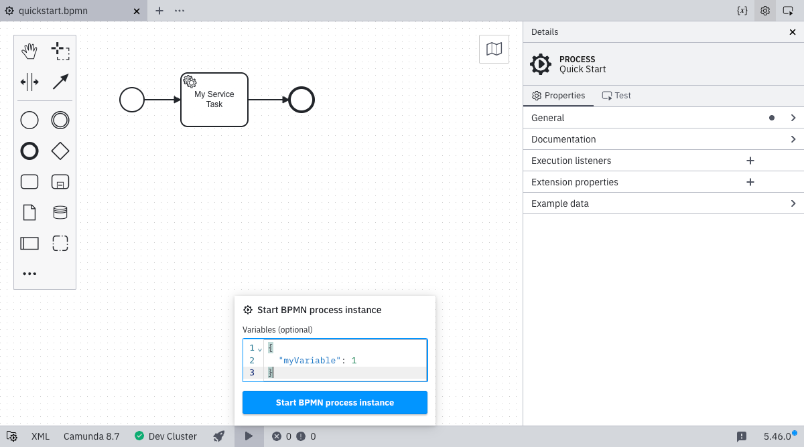
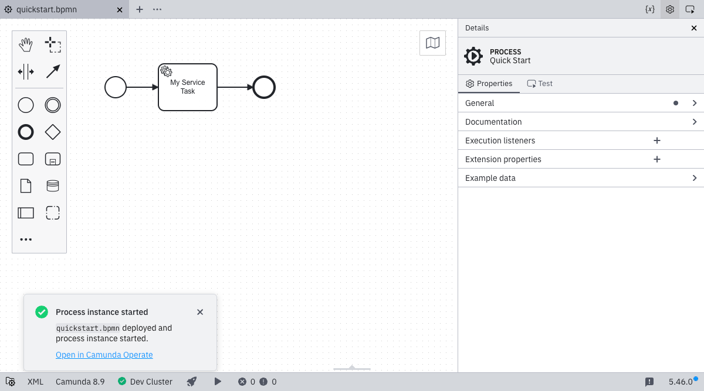

1. Ensure you have already set up and selected a connection by following the [Connect to Camunda 8](./connect-to-camunda-8.md) guide.

   

2. You can start a new instance of this process by clicking the play icon.

   

3. Enter optional variables for starting the process instance. Click **Start BPMN process instance** to deploy and start the instance.

   
   After the instance is started successfully, a confirmation message is displayed.

   
