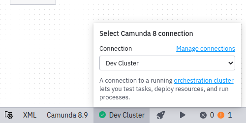
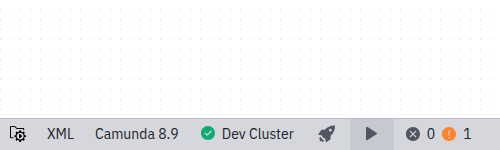
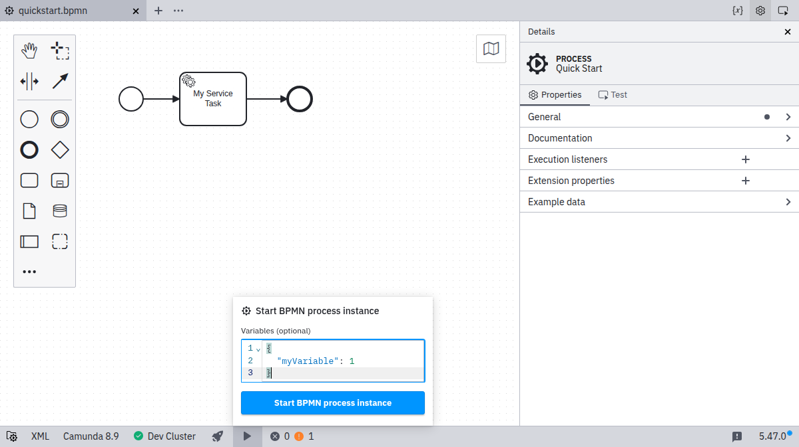
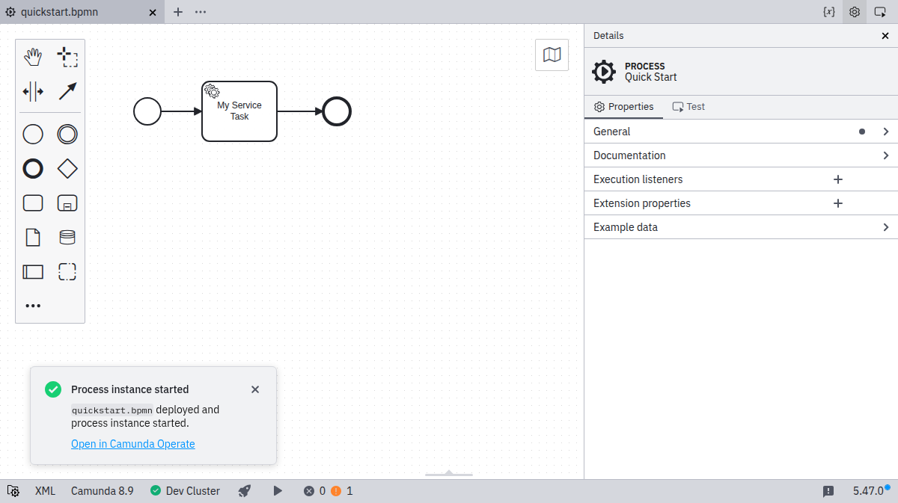

1. Ensure you have already setup and selected a connection by following the [Connect to Camunda 8 guide](./connect-to-camunda-8.md):

   

2. You can start a new instance of this process via the play icon:

   

3. Start the process instance with optional variables.

   
   After the instance was started successfully, a corresponding message is displayed.

   
