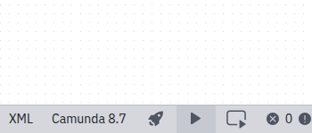

After you have [deployed your process to Camunda Cloud](./connect-to-camunda-cloud.md), you can start a new instance of this process via the play icon:

After the instance was started successfully, a corresponding message is displayed:

