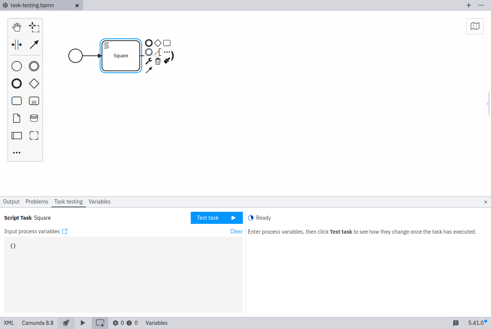
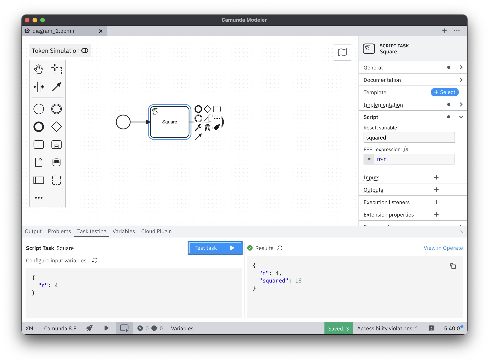
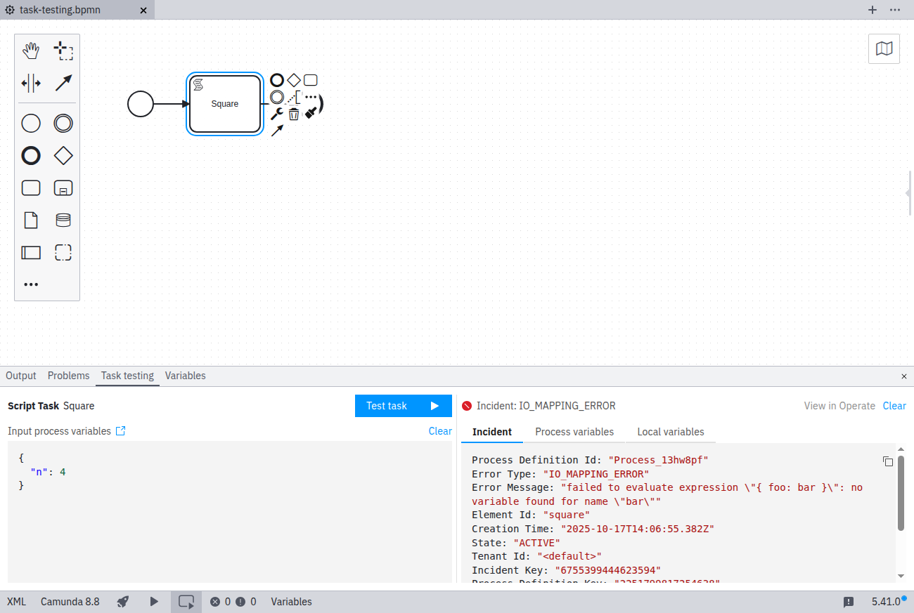

[Test a single task](../../concepts/task-testing.md) in Desktop Modeler to quickly verify task logic, variable mappings, and configuration—without running the entire process.

## Prerequisites

Task testing requires a **REST connection** to a Camunda 8.8 or higher cluster.  
gRPC connections are not supported.

When configuring a connection, make sure to **remember credentials**; otherwise, task testing won’t be able to deploy the process.

## Testing a single activity

1. Select the task you want to test.
2. Open the **Task testing** tab in the bottom panel.

### Process variables

In the left pane, define the [process variables](../../concepts/variables.md) that the process instance will start with.

As you type, the editor provides autocompletion for variables available in scope, including those generated by previous task testing runs.

**Tips for setting variables:**

- Use realistic test data that reflects real-world cases.
- Ensure variable names and types match the task’s expected input.
- Verify that your task’s input mappings reference the correct variables.

### Task execution

Click **Test task** to execute the selected activity.

Your BPMN diagram will be saved, deployed, and a process instance will start automatically.

:::note
If you're working in a [process application](./process-applications.md), all its resources will be deployed along with the process.
:::

Once the process instance starts, a link to view it in Operate is provided.  
Task testing waits for the task to complete or for an incident to occur.

## Test results

After running a task, one of the following outcomes appears:

### Successful execution

When the task completes successfully, the results panel displays the process variables used during execution.

### Task incident

If an incident occurs during execution, you’ll see its details along with the process variables.

### Error

If the task execution fails due to an error, the response message is displayed.

## Troubleshooting common issues

### Task fails with incident

- Check that variable mappings match expected input types.
- Verify that all required variables are provided.
- Review task configuration, including connectors or scripts.

### Deployment fails

- Ensure the cluster connection is active.
- Confirm your deployment permissions.
- Check for BPMN validation errors.

### Variables don’t appear

- Confirm that variable mappings are configured on the task.
- Check that variable names and types match what the task expects.

## Related

- [Test a task in Web Modeler](/components/modeler/web-modeler/task-testing.md)
- [Learn about task testing concepts](../../concepts/task-testing.md)
