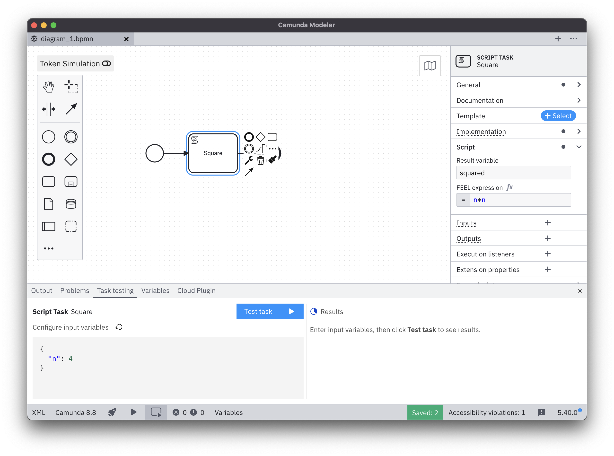
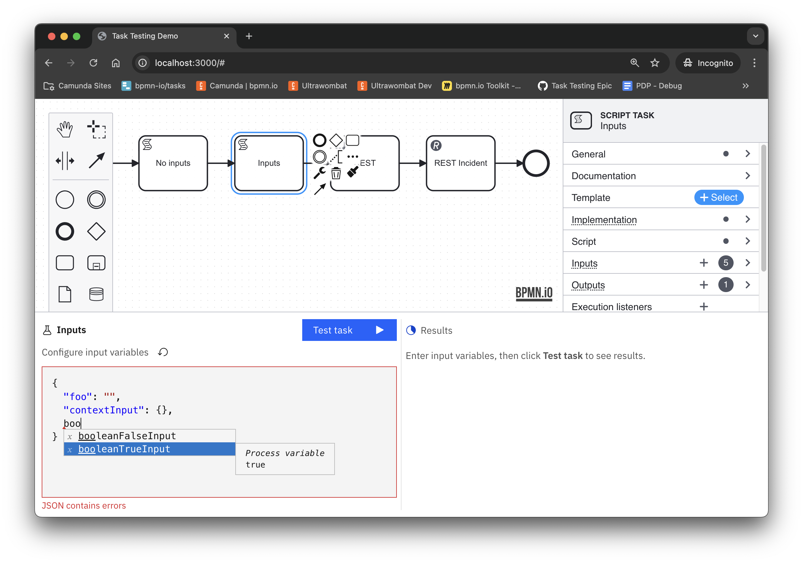
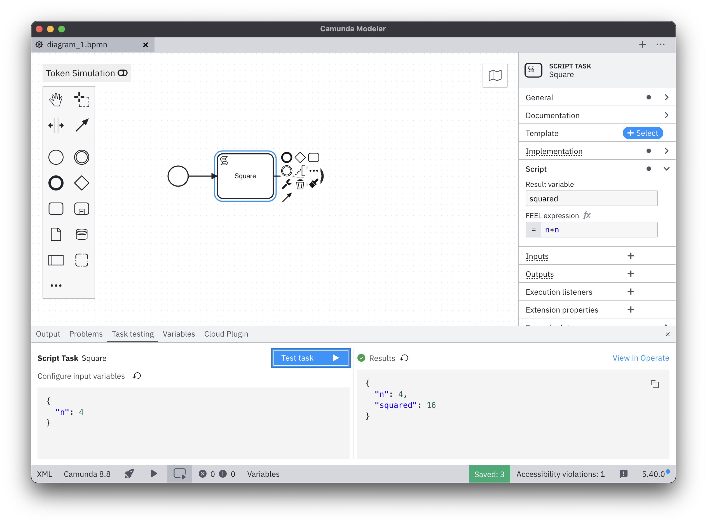
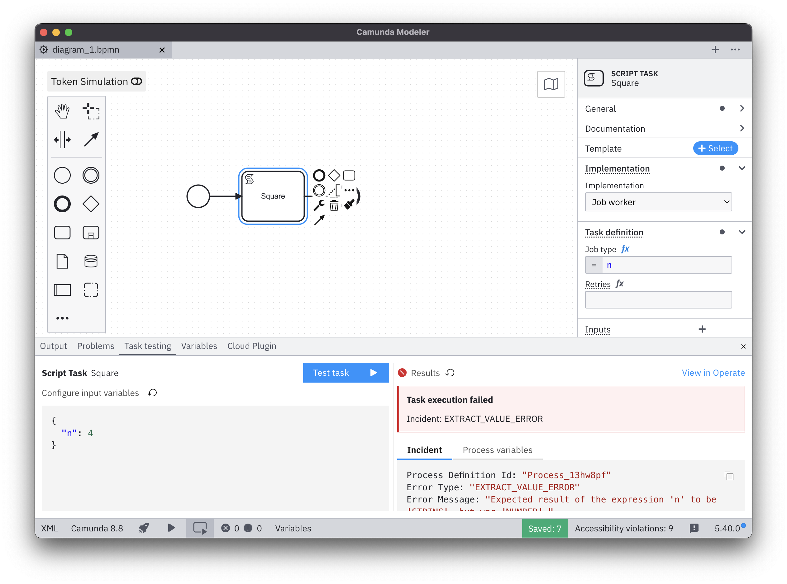

[Test a single task](../../concepts/testing.md) in Desktop Modeler.

## Prerequisites

Task testing requires a REST connection to Camunda 8.8+ cluster. gRPC connections are not supported.

When configuring a connection, make sure to **Remember credentials** or task testing won't be able to deploy the process.

## Testing a single activity

Select a task that you want to test, then go to the Test tab in the bottom panel.

Configure the [input variables](../../concepts/variables.md). The initial values are based on the task's [input mappings](../../concepts/variables.md#input-mappings). 

As you type, the editor provides autocompletion for all the variables available in the scope, as well as the output variables from the tasks you previously executed.

Click the **Test Task** button to execute the selected activity. 

## Test results

After running a task, you'll see one of the following outcomes:

### Successful execution

When the task completes successfully, the results panel displays the process variables the task executed with.

### Task incident

If an incident occurs during the execution, you will see its details as well as the process variables.

### Error

If the task execution fails due to an error, you will see the response message.

