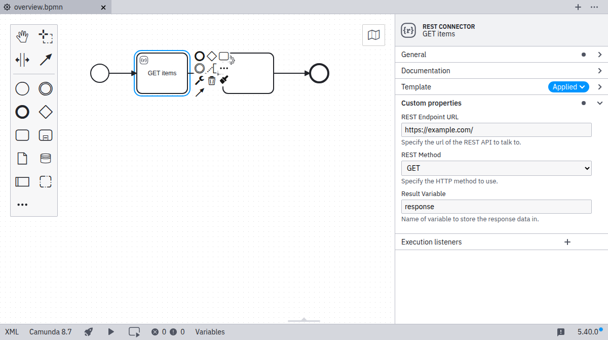

This page shows a complete element template example and explains how each field is mapped to BPMN XML and Camunda extension elements.

## REST connector template example

The following JSON defines a simple template that configures a service task to call a REST API:

```json
{
  "$schema": "https://unpkg.com/@camunda/zeebe-element-templates-json-schema/resources/schema.json",
  "name": "REST connector",
  "id": "io.camunda.examples.RestConnector",
  "description": "A REST API invocation task.",
  "appliesTo": ["bpmn:ServiceTask"],
  "properties": [
    {
      "type": "Hidden",
      "value": "http",
      "binding": {
        "type": "zeebe:taskDefinition",
        "property": "type"
      }
    },
    {
      "label": "REST endpoint URL",
      "description": "Specify the URL of the REST API.",
      "type": "String",
      "binding": {
        "type": "zeebe:taskHeader",
        "key": "url"
      },
      "constraints": {
        "notEmpty": true,
        "pattern": {
          "value": "^https?://.*",
          "message": "Must be an http(s) URL."
        }
      }
    },
    {
      "label": "REST method",
      "description": "Specify the HTTP method to use.",
      "type": "Dropdown",
      "value": "get",
      "choices": [
        { "name": "GET", "value": "get" },
        { "name": "POST", "value": "post" },
        { "name": "PATCH", "value": "patch" },
        { "name": "DELETE", "value": "delete" }
      ],
      "binding": {
        "type": "zeebe:taskHeader",
        "key": "method"
      }
    },
    {
      "label": "Request body",
      "description": "Data to send to the endpoint.",
      "value": "",
      "type": "String",
      "optional": true,
      "binding": {
        "type": "zeebe:input",
        "name": "body"
      }
    },
    {
      "label": "Result variable",
      "description": "Name of variable to store the response data in.",
      "value": "response",
      "type": "String",
      "optional": true,
      "binding": {
        "type": "zeebe:output",
        "source": "= body"
      }
    }
  ]
}
```

## How this example works

This template defines five fields and maps each one to a specific BPMN or Zeebe extension:

- **Task type**: A hidden property that sets the `zeebe:taskDefinition type` to `http`. This prevents users from altering the required job type.
- **REST endpoint URL**: Mapped to a task header named `url`, with validation to ensure it begins with `http://` or `https://`.
- **REST method**: Mapped to a task header named `method`, using a dropdown to limit available HTTP verbs.
- **Request body**: Mapped to a `zeebe:input` parameter named `body`. Because the field is marked as optional, nothing is persisted if left empty.
- **Result variable**: Mapped to a `zeebe:output` parameter so the response body is captured in a process variable.

## Visual result

When this template is applied to a service task, Modeler hides the technical configuration and surfaces only the user-editable fields.



## Key concepts demonstrated

This example highlights several core template techniques:

- Hidden properties for technical configuration
- Validation constraints for user input
- Dropdown choices for structured input
- Optional fields that omit empty values in XML
- Input and output mappings for variable handling

## When to use this example

Use this example as a baseline when you need to:

- Standardize how REST-based service tasks are configured
- Expose only safe, user-friendly fields to process designers
- Learn how UI fields translate into BPMN and Zeebe XML bindings

## Next steps

- Learn about [template metadata](./template-metadata.md).
- Explore how [properties work](./template-properties.md).
- [Understand dependencies](./element-templates-with-dependencies.md).
- Return to the [overview](../about-templates.md).
