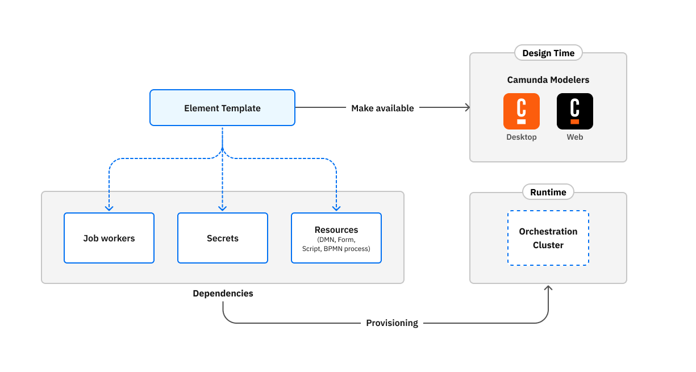

When creating element templates, you may want to link to particular resource like a [form](/components/modeler/forms/camunda-forms-reference.md), or pre populate a [secret](/components/connectors/use-connectors/index.md#using-secrets) expression. Your template might require a particular [job worker](/components/concepts/job-workers.md) to execute a particular action. These are all different type of dependencies.

An element template can depend on:

- [Camunda forms](/components/modeler/forms/camunda-forms-reference.md): used in user tasks.
- [RPA scripts](/components/rpa/overview.md): Used in service tasks.
- [BPMN tasks](/components/modeler/bpmn/bpmn.md): used in call activities.
- [Call activities](/components/modeler/bpmn/call-activities/call-activities.md): this may introduce nested dependencies, i.e. a called process may depend on other processes and/or dependencies.
- [DMN decisions](/components/modeler/dmn/dmn.md): used in business rule tasks
- [Job workers](/components/concepts/job-workers.md): used to provide behavior for a particular service task like flow-node in a BPMN diagram: A message send event, a send task, a service task, a business rule task, a custom connector runtime.
- Secrets: used in elements to access sensitive values (see [connector secrets](/self-managed/components/connectors/connectors-configuration.md#secrets) and [cluster secrets](/components/console/manage-clusters/manage-secrets.md)).

Using a template involves addressing two main components:

- The provisioning of dependencies at runtime: This involves making the dependencies available in the clusters that needed it. Depending on the depency type, this
- Make the template available at design time: This is done by making the template available in Web Modeler or Desktop modeler so you can use them in your projects.

## Next

- [Defining element templates](./defining-templates.md)
- [Using element templates in Web Modeler](/components/modeler/web-modeler/element-templates/using-templates.md)
- [Using element templates in Desktop Modeler](/components/modeler/desktop-modeler/element-templates/using-templates.md)
