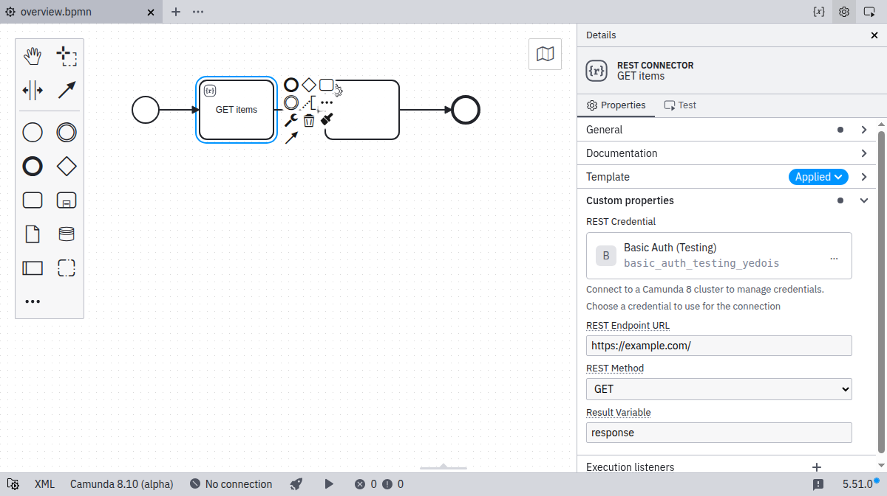

This page provides a complete example of an element template that demonstrates how to define user-editable fields and their mapping to BPMN 2.0 XML and Camunda extension elements.

## REST connector template

Let us consider the following example that defines a template for invoking a REST API via a service task:

```json
{
  "$schema": "https://unpkg.com/@camunda/zeebe-element-templates-json-schema/resources/schema.json",
  "name": "REST connector",
  "id": "io.camunda.examples.RestConnector",
  "description": "A REST API invocation task.",
  "appliesTo": ["bpmn:ServiceTask"],
  "properties": [
    {
      "type": "Hidden",
      "value": "http",
      "binding": {
        "type": "zeebe:taskDefinition",
        "property": "type"
      }
    },
    {
      "label": "REST Endpoint URL",
      "description": "Specify the url of the REST API to talk to.",
      "type": "String",
      "binding": {
        "type": "zeebe:taskHeader",
        "key": "url"
      },
      "constraints": {
        "notEmpty": true,
        "pattern": {
          "value": "^https?://.*",
          "message": "Must be http(s) URL."
        }
      }
    },
    {
      "label": "REST Method",
      "description": "Specify the HTTP method to use.",
      "type": "Dropdown",
      "value": "get",
      "choices": [
        { "name": "GET", "value": "get" },
        { "name": "POST", "value": "post" },
        { "name": "PATCH", "value": "patch" },
        { "name": "DELETE", "value": "delete" }
      ],
      "binding": {
        "type": "zeebe:taskHeader",
        "key": "method"
      }
    },
    {
      "label": "Request Body",
      "description": "Data to send to the endpoint.",
      "value": "",
      "type": "String",
      "optional": true,
      "binding": {
        "type": "zeebe:input",
        "name": "body"
      }
    },
    {
      "label": "Result Variable",
      "description": "Name of variable to store the response data in.",
      "value": "response",
      "type": "String",
      "optional": true,
      "binding": {
        "type": "zeebe:output",
        "source": "= body"
      }
    },
    {
      "label": "Connection",
      "description": "Select or create a connection. Its value is injected as the connection job variable.",
      "type": "Configuration",
      "configurationTemplate": "io.camunda.examples:connection:1",
      "binding": {
        "type": "zeebe:input",
        "name": "connection"
      }
    }
  ],
  "configurationTemplates": [
    {
      "id": "io.camunda.examples:connection:1",
      "name": "Connection",
      "version": 1,
      "kind": "CREDENTIAL",
      "properties": [
        {
          "id": "connectionProperty",
          "label": "Connection property",
          "description": "A single connection value, for example an endpoint or token.",
          "type": "String",
          "binding": { "type": "property", "name": "connectionProperty" },
          "constraints": { "notEmpty": true }
        }
      ]
    }
  ]
}
```

## How the example works

The example defines six custom fields, each mapped to different technical properties:

- **Task type**: The value `http` is mapped to the `type` property of a `zeebe:taskDefinition` element in BPMN 2.0 XML. This field is hidden from users since it's a technical requirement.
- **REST Endpoint URL**: Mapped to a `task header` with the key `url`. This field includes validation to ensure it's a valid HTTP(S) URL.
- **REST Method**: Mapped to a `task header` with the key `method`. Uses a dropdown to provide predefined HTTP method options.
- **Request Body**: Mapped to a local variable via an `input parameter` named `body`. This field is optional, so it won't appear in the XML if left empty.
- **Result Variable**: Mapped into a process variable via an `output parameter`. The response data will be stored in the specified variable name.
- **Connection**: A [`Configuration`](./template-properties.md#configuration-input-type) property that lets users select or create a connection, locked to the embedded `io.camunda.examples:connection:1` configuration template. The chosen configuration is injected as the `connection` job variable. The referenced configuration template is embedded under the top-level [`configurationTemplates`](./template-metadata.md#embedding-configurations-configurationtemplates) key.

## Visual result

The task type is hidden to the user, as it is a technical implementation detail.
The other properties specified in the template can be edited through the properties panel after the user has applied the template as shown in the following screenshot:



## Key concepts demonstrated

This example showcases several important template features:

- **Hidden properties**: Setting technical values that users shouldn't modify.
- **Input validation**: Using constraints to ensure valid URLs.
- **Dropdown choices**: Providing predefined options for user selection.
- **Optional bindings**: Fields that don't persist empty values in the XML.
- **Variable mapping**: How to map data between the process and external systems.
- **Configuration references**: Selecting a reusable configuration through an embedded configuration template.

You can use this example as a starting point for creating your own element templates.
