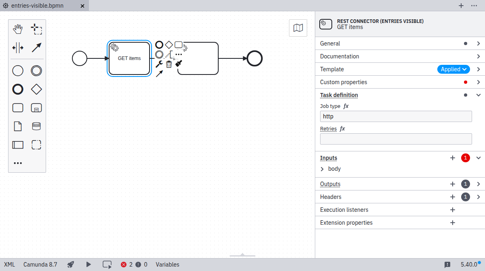

The `properties` array is where you define what properties should be applied to the BPMN element and how the properties panel will present these properties to the user when the template is applied.
The underlying concept is very simple:

1. You will create one property object for each property that should be defined by the template.
2. Each property object contains keys to define how the property is presented and how its value can be changed by the user.
3. Each property object contains one `binding` object that specifies how the property is mapped to BPMN 2.0 XML.

Element templates can only set properties that can be described by bindings supported by the element template schema.
You can find the full list of supported bindings in the [bindings](#binding-an-input-to-a-bpmn-or-camunda-element-property-binding) section.

When the user applies a template, the properties panel hides all BPMN 2.0 XML and Camunda extension elements properties that can be defined by bindings in an element template.
The template author must explicitly make the properties user configurable to show them in the properties panel once the user has applied the template.
For example, if a template does not contain a property object for with the binding type `zeebe:input`,
the template user will not be able to define an input mapping for an element once the template is applied.

:::note
Some properties, such as, execution listeners, task listeners, element documentation, and multi-instance configurations cannot be set by element templates.
They are situational and require knowledge of the process context to be used.
As they are never part of any element template, users can configure them independently of the applied template.
:::

## What is part of a property?

You build your template by adding property objects to the `properties` array.
The property fields are divided into required and optional fields:

### Required keys

- [`binding : Object`](#binding-an-input-to-a-bpmn-or-camunda-element-property-binding): An object specifying how the property is mapped to BPMN or Camunda extensions (cf. [bindings](#bindings)).

### Optional keys

- [`type : "String" | "Text" | "Boolean" | "Dropdown" | "Hidden"`](#setting-the-input-type-type): Defining the input type in the properties panel.
- `label : String`: A label text above the property input.
- [`value : String | Number | Boolean`](#setting-a-default-value-value): A default value to be used if the property to be bound is not yet set by the user or if the type is `Hidden`.
- `description : String`: A description text below the property input.
- `tooltip : String`: A tooltip text shown when hovering over the label.
- [`feel : "required" | "optional" | "static"`](#adding-feel-editor-support-feel): Defines whether the property supports [FEEL](#feel) expressions.
- [`generatedValue : Object`](#generating-a-value-generatedvalue): A configuration to generate a value when the property is applied to an element.
- [`placeholder : String`](#setting-a-text-placeholder-placeholder): A placeholder text shown in the input field when it is empty.
- [`optional : Boolean`](#preventing-persisting-empty-values-optional): Optional bindings do not persist empty values in the underlying BPMN 2.0 XML.
- [`constraints : Object`](#validating-user-input-constraints): A list of editing constraints to apply to the value of the binding.
- [`group : String`](#grouping-fields-group): The group that the property belongs to.
- [`condition : Object`](#showing-properties-conditionally-condition): A condition that determines when [the property is active](#defining-conditional-properties).
- `id : String`: An identifier that can be used to reference the property in conditional properties.

Not all keys and values are compatible with each other, some keys or values require other keys to be set, even if they are marked as optional above.
For more information see the documentation below.
If your editor supports JSON schema, these incompatibilities or missing keys are highlighted while you edit your template.
For most purposes, `binding`, `label`, `type`, and `value` are sufficient to define a property.

All property objects are defined inside the `properties` array:

```json
{
  "schema": "https://unpkg.com/@camunda/zeebe-element-templates-json-schema/resources/schema.json",
  ...,
  "properties": [
    {
      "label": "Some property",
      "type": "String",
      "binding": {
        ...
      }
    },
    {
      "label": "Some other property",
      "type": "Number",
      "binding": {
        ...
      }
    },
    ...
  ]
}
```

For a comprehensive example showing how to create a REST connector template with all the concepts covered in this documentation, see the [complete template example](./template-example.md) page.

The keys of the property object are explained in the following sections.

## Setting a default value: `value`

The `value` attribute defines a static default value for a property.
It is used when the property is applied to an element and no user input has been provided yet.
The value must match the `type` of the property.

```json
{
  "value": "4",
  "type": "Hidden",
  "binding": {
    "type": "zeebe:taskDefinition",
    "property": "retries"
  }
}
```

## Generating a value: `generatedValue`

As an alternative to static `value`, you can use a generated value. The value is generated when a property is applied to an element. Currently, the generated value can be a UUID:

```json
{
  "generatedValue": {
    "type": "uuid"
  },
  "type": "Hidden",
  "binding": {
    "type": "zeebe:property",
    "name": "id"
  }
}
```

## Setting a text placeholder: `placeholder`

The following property types support the `placeholder` attribute:

- `String`
- `Text`

The placeholder is displayed when a field is empty:

```json
{
  "label": "Web service URL",
  "type": "String",
  "binding": {
    ...
  },
  "placeholder": "https://example.com"
}
```

## Setting the input type: `type`

The input types `String`, `Text`, `Number`, `Boolean`, `Dropdown`, and `Hidden` are available. As seen above, `String` maps to a single-line input, while `Text` maps to a multi-line input.

### String input type

The `String` type maps to a single-line input field. By default, this will be persisted as a string in the BPMN. Refer to the [FEEL](#feel) section to use `Strings` as expressions.

### Text input type

The `Text` type maps to a multi-line text area. By default, this will be persisted as a string in the BPMN. Refer to the [FEEL](#feel) section to use `Text` as expressions.

### Hidden input type

The `Hidden` type is not shown in the properties panel. It is used to set [static](#value) or [generated](#generated-value) values that should not be changed by the user.

### Number input type

The `Number` type maps to a number input field. By default, this will be persisted as a string in the BPMN. Refer to the [FEEL](#feel) section to use `Numbers` as expressions.

### Boolean / checkbox input type

The `Boolean` type maps to a checkbox that can be toggled by the user.

When checked, it maps to `true` in the respective field (refer to [bindings](#bindings)). Additionally, refer to the [FEEL](#feel) section to use `Booleans` as expressions.

### Dropdown input type

The `Dropdown` type allows users to select from a number of pre-defined options that are stored in a custom properties `choices` attribute as `{ name, value }` pairs:

```json
{
  "label": "REST Method",
  "description": "Specify the HTTP method to use.",
  "type": "Dropdown",
  "value": "get",
  "choices": [
    {
      "name": "GET",
      "value": "get"
    },
    {
      "name": "POST",
      "value": "post"
    },
    {
      "name": "PATCH",
      "value": "patch"
    },
    {
      "name": "DELETE",
      "value": "delete"
    }
  ],
  "binding": {
    "type": "zeebe:taskHeader",
    "key": "method"
  }
}
```

The resulting properties panel control looks like this:


## Adding FEEL editor support: `feel`

The following input types support the `feel` property:

- `String`
- `Text`
- `Number`
- `Boolean`

### FEEL required

The field will be displayed as a FEEL editor and a visual indication that a FEEL expression is required will be shown:

```json
{
  "label": "Required FEEL Expression",
  "type": "String",
  "feel": "required",
  ...
}
```

### FEEL optional

An indicator to switch to a FEEL expression is shown. When activated, the field will be displayed as a FEEL editor:

```json
    {
  "label": "Optional FEEL Expression",
  "type": "String",
  "feel": "optional",
  ...
}
```

For `Boolean` and `Number` fields, the value will always be persisted as a FEEL expression. This ensures that the value will not be interpreted as a string when evaluated in the engine.

### FEEL static

The value of `feel: static` is only valid for `Boolean` and `Number` fields. Similar to [FEEL optional](#feel-optional), the value of the field will be persisted as a FEEL expression. However, there is no toggle to switch to a FEEL editor and ensures only a static value can be entered:

```json
{
  "label": "Static FEEL value",
  "type": "Number",
  "feel": "static",
  ...
}
```

For binding types `zeebe:input` and `zeebe:output`, `feel: static` is the value used in case of missing `feel` property.

## Binding an input to a BPMN or Camunda element property: `binding`

The following ways exist to map a custom field to the underlying BPMN 2.0 XML.
The **mapping result** in the following section uses `[userInput]` to indicate where the input provided by the user in the `Properties Panel` is set in the BPMN XML.
As default or if no user input was given, the value specified in `value` is displayed and used for `[userInput]`.
`[]` brackets are used to indicate where the parameters are mapped to in the XML.

The `binding` is an object with a mandatory `type` key and optional additional parameters depending on the binding type.
`binding.type` defines what kind of BPMN or Camunda element is targeted by the binding.
The additional property sets defines the target for the `value` or user input.

Notice that adherence to the following configuration options is enforced by design.
If not adhering, the tooling logs a validation error and ignores the respective element template.

To fully grasp the concept of bindings, it is helpful to have a good understanding of BPMN 2.0 XML and Camunda extensions.
If you want to learn more about a certain BPMN element and its properties, you can read through the BPMN section on [Tasks](/components/modeler/bpmn/tasks.md), [Events](/components/modeler/bpmn/events.md), and [Subprocesses](/components/modeler/bpmn/subprocesses.md).
Each page on an element contains a description of its properties and an example XML representation.

:::note
If you add multiple properties with equal `binding` objects, the behavior is undefined.
:::

### Input mapping: `zeebe:input`

| **Binding `type`**          | `zeebe:input`                                                                    |
| --------------------------- | -------------------------------------------------------------------------------- |
| **Valid property `type`'s** | `String`<br /> `Text`<br />`Hidden`<br />`Dropdown`<br />`Boolean`<br />`Number` |
| **Binding parameters**      | `name`: The name of the input parameter                                          |
| **Mapping result**          | `<zeebe:input target="[name]" source="[userInput] />`                            |

Configures an [input mapping](../../../concepts/variables/#input-mappings).

```json
{
  ...,
  "value": "aProcessVariableName",
  "binding": {
    "type": "zeebe:input",
    "name": "aTaskVariableName"
  }
}
```

### Output mapping: `zeebe:output`

| **Binding `type`**          | `zeebe:output`                                                                   |
| --------------------------- | -------------------------------------------------------------------------------- |
| **Valid property `type`'s** | `String`<br /> `Text`<br />`Hidden`<br />`Dropdown`<br />`Boolean`<br />`Number` |
| **Binding parameters**      | `source`: The source of the output parameter                                     |
| **Mapping result**          | `<zeebe:output target="[userInput]" source="[source] />`                         |

Configures an [output mapping](../../../concepts/variables/#output-mappings).

```json
{
  ...,
  "value": "aProcessVariableName",
  "binding": {
    "type": "zeebe:output",
    "source": "aTaskVariableName"
  }
}
```

### Header: `zeebe:taskHeader`

| **Binding `type`**          | `zeebe:taskHeader`                                  |
| --------------------------- | --------------------------------------------------- |
| **Valid property `type`'s** | `String`<br /> `Text`<br />`Hidden`<br />`Dropdown` |
| **Binding parameters**      | `key`: The key of the task header                   |
| **Mapping result**          | `<zeebe:header key="[key]" value="[userInput] />`   |

Configures a [task header](../../bpmn/service-tasks/#task-headers)

```json
{
  ...,
  "value": "aHeaderValue",
  "binding": {
    "type": "zeebe:taskHeader",
    "key": "aHeaderKey"
  }
}
```

### Task definition: `zeebe:taskDefinition`

| **Binding `type`**          | `zeebe:taskDefinition`                                                            |
| --------------------------- | --------------------------------------------------------------------------------- |
| **Valid property `type`'s** | `String`<br /> `Text`<br />`Hidden`<br />`Dropdown`                               |
| **Binding parameters**      | `property`: The name of the task definition property. Can be `type` or `retries`. |
| **Mapping result**          | `<zeebe:taskDefinition [property]="[userInput]" />`                               |

Configures the [task](../../bpmn/service-tasks/#task-definition) for a service or user task.

```json
[
  {
    ...,
    "value": "aTaskType",
    "binding": {
      "type": "zeebe:taskDefinition",
      "property": "type"
    }
  },
  {
    ...,
    "value": "3",
    "binding": {
      "type": "zeebe:taskDefinition",
      "property": "retries"
    }
  },
  ...
]
```

### Task definition: `zeebe:taskDefinition:type` (deprecated)

:::danger
`zeebe:taskDefinition:type` is a deprecated binding. Instead, use `zeebe:taskDefinition` with `property=type`.
:::

| **Binding `type`**          | `zeebe:taskDefinition:type`                         |
| --------------------------- | --------------------------------------------------- |
| **Valid property `type`'s** | `String`<br /> `Text`<br />`Hidden`<br />`Dropdown` |
| **Binding parameters**      |                                                     |
| **Mapping result**          | `<zeebe:taskDefinition type="[userInput]" />`       |

Configures the [task type](../../bpmn/service-tasks/#task-definition) for a service or user task.

```json
{
  ...,
  "value": "aTaskType",
  "binding": {
    "type": "zeebe:taskDefinition:type"
  }
}
```

### Extension properties: `zeebe:property`

| **Binding `type`**          | `zeebe:property`                                      |
| --------------------------- | ----------------------------------------------------- |
| **Valid property `type`'s** | `String`<br />`Text`<br />`Hidden`<br />`Dropdown`    |
| **Binding parameters**      | `name`: The name of the property                      |
| **Mapping result**          | `<zeebe:property name="[name]" value="[userInput] />` |

The `zeebe:property` binding allows you to set any arbitrary property for an outside system. It does not impact execution of the Zeebe engine.

```json
{
  ...,
  "value": "{\"outputVar\": 5}",
  "binding": {
    "type": "zeebe:property",
    "name": "camundaModeler:exampleOutputJson"
  }
}
```

### Primitive BPMN properties: `property`

| **Binding `type`**          | `property`                       |
| --------------------------- | -------------------------------- |
| **Valid property `type`'s** | All property types are supported |
| **Binding parameters**      | `name`: The name of the property |
| **Mapping result**          | `<... [name]=[userInput] ... />` |

Configures generic BPMN element properties that are text, boolean, and numeric types.
Additionally, expression types `completionCondition` and `conditionExpression` are supported.
Other properties, such as references and complex property types are currently NOT supported and will lead to runtime errors when modeling.

```json
[
  {
    ...,
    "value": "= someValue >= 1",
    "binding": {
      "type": "property",
      "name": "completionCondition"
    }
  },
  {
    ...,
    "value": "customPropertyValue",
    "binding": {
      "type": "property",
      "name": "mynamespace:customProperty"
    }
  },
  ...
]
```

### Message name: `bpmn:Message#property`

| **Binding `type`**          | `bpmn:Message#property`                            |
| --------------------------- | -------------------------------------------------- |
| **Valid property `type`'s** | `String`<br />`Text`<br />`Hidden`<br />`Dropdown` |
| **Binding parameters**      | `name`: The name of the property                   |
| **Mapping result**          | `<bpmn:message [name]="[userInput]" />`            |

The `bpmn:Message#property` binding allows you to set properties of a `bpmn:Message` referred to by the templated element. This binding is only valid for templates of events with `bpmn:MessageEventDefinition`, receive tasks, and send tasks.

```json
{
  ...,
  "generatedValue": {
    "type": "uuid"
  },
  "binding": {
    "type": "bpmn:Message#property",
    "name": "name"
  }
}
```

:::note
When designing a template for a message receive task or event, it sufficient to define the binding for the message [name](#bpmn:Message#property) and the [correlation key](#bpmn:Message#zeebe:subscription#property).
The message ID is automatically generated when the template is applied. The `messageRef` [property](#property) does not have to be defined.

Remember that the message [name and correlation key](/components/concepts/messages.md#message-subscriptions) define the correlation characteristics of a message and can be shared by [multiple process definitions](/components/concepts/messages.md#message-cardinality).
:::

### Message correlation key: `bpmn:Message#zeebe:subscription#property`

| **Binding `type`**          | `bpmn:Message#zeebe:subscription#property`         |
| --------------------------- | -------------------------------------------------- |
| **Valid property `type`'s** | `String`<br />`Text`<br />`Hidden`<br />`Dropdown` |
| **Binding parameters**      | `name`: The name of the property                   |
| **Mapping result**          | `<zeebe:subscription [name]="[userInput]" />`      |

The `bpmn:Message#zeebe:subscription#property` binding allows you to set properties of a `zeebe:subscription` set within `bpmn:Message` referred to by the templated element. This binding is only valid for templates of events with `bpmn:MessageEventDefinition`, and receive tasks.

```json
{
  ...,
  "value": "=aCorrelationKey",
  "binding": {
    "type": "bpmn:Message#zeebe:subscription#property",
    "name": "correlationKey"
  }
}
```

:::note

The binding name of `correlationKey` is not applicable to message start events on a process. In such cases, the property is automatically hidden.

:::

### Called element: `zeebe:calledElement`

| **Binding `type`**          | `zeebe:calledElement`                                                                                          |
| --------------------------- | -------------------------------------------------------------------------------------------------------------- |
| **Valid property `type`'s** | `String`<br />`Text`<br />`Hidden`<br />`Dropdown`                                                             |
| **Binding parameters**      | `property`: The name of the property.<br/> Supported properties: `processId`, `bindingType`, and `versionTag`. |
| **Mapping result**          | `<zeebe:calledElement [property]="[userInput]" />`                                                             |

The `zeebe:calledElement` binding allows you to configure process called by a call activity.

You can set the value of the property `bindingType` to control the [resource binding type](../../../best-practices/modeling/choosing-the-resource-binding-type).
We recommend setting the property `bindingType` to the value `"versionTag"` and setting property `versionTag`
to the value of the version tag of the process you want to call.

```json
[
  {
    ...,
    "value": "aProcessId",
    "binding": {
      "type": "zeebe:calledElement",
      "property": "processId"
    }
  },
  {
    ...,
    "value": "versionTag",
    "binding": {
      "type": "zeebe:calledElement",
      "property": "bindingType"
    }
  },
  {
    ...,
    "value": "v1",
    "binding": {
      "type": "zeebe:calledElement",
      "property": "versionTag"
    }
  },
  ...
]
```

:::note

For `zeebe:calledElement` bindings, variable propagation is not supported. To provide or retrieve variables, use `zeebe:input` and `zeebe:output` bindings.

:::

### User task implementation: `zeebe:userTask`

| **Binding `type`**          | `zeebe:userTask`                                                                                                      |
| --------------------------- | --------------------------------------------------------------------------------------------------------------------- |
| **Valid property `type`'s** | `Hidden`                                                                                                              |
| **Binding parameters**      | This is a flag-like binding, so it has no parameters and only applies to templates with element type `bpmn:UserTask`. |
| **Mapping result**          | `<zeebe:userTask />`                                                                                                  |

The `zeebe:userTask` binding allows you to configure the implementation type for a templated `bpmn:UserTask`. When present, it sets the task as a Camunda user task; when omitted, the task defaults to a job worker.

```json
{
  "type": "Hidden",
  "binding": {
    "type": "zeebe:userTask"
  }
}
```

### Form: `zeebe:formDefinition`

| **Binding `type`**          | `zeebe:formDefinition`                                                                                                            |
| --------------------------- | --------------------------------------------------------------------------------------------------------------------------------- |
| **Valid property `type`'s** | `String`<br />`Text`<br />`Hidden`<br />`Dropdown`                                                                                |
| **Binding parameters**      | `property`: The name of the property. <br/> Supported properties: `formId`, `externalReference`, `bindingType`, and `versionTag`. |
| **Mapping result**          | `<zeebe:formDefinition [property]="[userInput]" />`                                                                               |

The `zeebe:formDefinition` binding allows you to configure the [user task form](../../bpmn/user-tasks/#user-task-forms) used by a user task.

When setting the `formId` property, you can set the value of the property `bindingType` to control the [resource binding type](../../../best-practices/modeling/choosing-the-resource-binding-type).
We recommend setting the property `bindingType` to the value `"versionTag"` and setting property `versionTag`
to the value of the version tag of the form you want to link.

```json
[
  {
    ...,
    "value": "aFormId",
    "binding": {
      "type": "zeebe:formDefinition",
      "property": "formId"
    }
  },
  {
    ...,
    "value": "versionTag",
    "binding": {
      "type": "zeebe:formDefinition",
      "property": "bindingType"
    }
  },
  {
    ...,
    "value": "v1",
    "binding": {
      "type": "zeebe:formDefinition",
      "property": "versionTag"
    }
  },
  ...
]
```

:::note

When `zeebe:formDefinition` is used, [`zeebe:userTask`](#zeebeusertask) must be set on the same element.
Properties `formId` and `externalReference` are mutually exclusive, meaning that only one of them can be set at a time.
The property `externalReference` cannot be used together with `bindingType`.

:::

### User task assignment: `zeebe:assignmentDefinition`

| **Binding `type`**          | `zeebe:assignmentDefinition`                                                                                           |
| --------------------------- | ---------------------------------------------------------------------------------------------------------------------- |
| **Valid property `type`'s** | `String`<br />`Text`<br />`Hidden`<br />`Dropdown`                                                                     |
| **Binding parameters**      | `property`: The name of the property. <br/> Supported properties: `assignee`, `candidateGroups`, and `candidateUsers`. |
| **Mapping result**          | `<zeebe:assignmentDefinition [property]="[userInput]" />`                                                              |

The `zeebe:assignmentDefinition` binding allows you to configure the [user task assignment](../../bpmn/user-tasks/#assignments).

```json
[
  {
    ...,
    "value": "=manager",
    "binding": {
      "type": "zeebe:assignmentDefinition",
      "property": "assignee"
    }
  },
  {
    ...,
    "value": "group1,group2",
    "binding": {
      "type": "zeebe:assignmentDefinition",
      "property": "candidateGroups"
    }
  },
  {
    ...,
    "value": "user1,user2,user3",
    "binding": {
      "type": "zeebe:assignmentDefinition",
      "property": "candidateUsers"
    }
  },
  ...
]
```

:::note

When `zeebe:assignmentDefinition` is used, [`zeebe:userTask`](#zeebeusertask) must be set on the same element.

:::

### User task schedule: `zeebe:taskSchedule`

| **Binding type**         | `zeebe:taskSchedule`                                                                       |
| ------------------------ | ------------------------------------------------------------------------------------------ |
| **Valid property types** | `String`<br/>`Text`<br/>`Hidden`<br/>`Dropdown`                                            |
| **Binding parameters**   | `property`: The name of the property.<br/>Supported properties: `dueDate`, `followUpDate`. |
| **Mapping result**       | `<zeebe:taskSchedule [property]="[userInput]" />`                                          |

The `zeebe:taskSchedule` binding allows you to configure [user task scheduling](../../bpmn/user-tasks/#scheduling).

```json
[
  {
    ...,
    "value": "=dueDateVariable",
    "binding": {
      "type": "zeebe:taskSchedule",
      "property": "dueDate"
    }
  },
  {
    ...,
    "value": "2025-10-14T12:00:00Z",
    "binding": {
      "type": "zeebe:taskSchedule",
      "property": "followUpDate"
    }
  },
  ...
]
```

:::note
When `zeebe:taskSchedule` is used, `zeebe:userTask` must be set on the same element.  
If the template sets a static `value` for any property, it must be defined as an ISO 8601 combined date and time representation.
:::

### User task priority: `zeebe:priorityDefinition`

| **Binding type**         | `zeebe:priorityDefinition`                                                                                                             |
| ------------------------ | -------------------------------------------------------------------------------------------------------------------------------------- |
| **Valid property types** | `Number`<br/>`String` (only with `feel` set to `required`)<br/>`Text` (only with `feel` set to `required`)<br/>`Hidden`<br/>`Dropdown` |
| **Binding parameters**   | `property`: The name of the property.<br/>Supported property: `priority`.                                                              |
| **Mapping result**       | `<zeebe:priorityDefinition [property]="[userInput]" />`                                                                                |

The `zeebe:priorityDefinition` binding allows you to configure [user task priority](../../bpmn/user-tasks/#define-user-task-priority).

```json

{
  ...,
  "value": 42,
  "binding": {
    "type": "zeebe:priorityDefinition",
    "property": "priority"
  }
}

```

:::note
When `zeebe:priorityDefinition` is used, [`zeebe:userTask`](#zeebeusertask) must be set on the same element.

If the template sets a static `value` for `priority`, it must be between 0 and 100.
:::

### Called decision: `zeebe:calledDecision`

| **Binding `type`**          | `zeebe:calledDecision`                                                                                                            |
| --------------------------- | --------------------------------------------------------------------------------------------------------------------------------- |
| **Valid property `type`'s** | `String`<br />`Text`<br />`Hidden`<br />`Dropdown`                                                                                |
| **Binding parameters**      | `property`: The name of the property.<br/> Supported properties: `decisionId`, `resultVariable`, `bindingType`, and `versionTag`. |
| **Mapping result**          | `<zeebe:calledDecision [property]="[userInput]" />`                                                                               |

The `zeebe:calledDecision` binding allows you to configure the [called decision](../../bpmn/business-rule-tasks/#defining-a-task) used by a business rule task.

You can set the value of the property `bindingType` to control the [resource binding type](../../../best-practices/modeling/choosing-the-resource-binding-type).
We recommend setting the property `bindingType` to the value `"versionTag"` and setting property `versionTag`
to the value of the version tag of the decision you want to call.

```json
[
  {
    ...,
    "value": "aDecisionId",
    "binding": {
      "type": "zeebe:calledDecision",
      "property": "decisionId"
    }
  },
  {
    ...,
    "value": "aResultVariable",
    "binding": {
      "type": "zeebe:calledDecision",
      "property": "resultVariable"
    }
  },
  {
    ...,
    "value": "versionTag",
    "binding": {
      "type": "zeebe:calledDecision",
      "property": "bindingType"
    }
  },
  {
    ...,
    "value": "v1",
    "binding": {
      "type": "zeebe:calledDecision",
      "property": "versionTag"
    }
  },
  ...
]
```

:::note
When `zeebe:calledDecision` is used, `zeebe:taskDefinition` cannot be used on the same element.
:::

### Script: `zeebe:script`

| **Binding `type`**          | `zeebe:script`                                                                         |
| --------------------------- | -------------------------------------------------------------------------------------- |
| **Valid property `type`'s** | `String`<br />`Text`<br />`Hidden`<br />`Dropdown`                                     |
| **Binding parameters**      | `property`: The name of the property. `expression` and `resultVariable` are supported. |
| **Mapping result**          | `<zeebe:script [property]="[userInput]" />`                                            |

The `zeebe:script` binding allows you to configure the [FEEL expression](../../bpmn/script-tasks/#defining-a-task) used by a script task.

```json
[
  {
    ...,
    "value": "= a + b",
    "binding": {
      "type": "zeebe:script",
      "property": "expression"
    }
  },
  {
    ...,
    "value": "result",
    "binding": {
      "type": "zeebe:script",
      "property": "resultVariable"
    }
  },
  ...
]
```

:::note
When `zeebe:script` is used, `zeebe:taskDefinition` cannot be used on the same element.
:::

## Setting a task implementation

The following tasks support multiple implementation types:

- User task: [`zeebe:userTask`](#user-task-implementation-zeebeuserTask) and [`zeebe:taskDefinition`](#task-definition-zeebetaskdefinition) (most related properties, for example, [Assignment](#user-task-assignment-zeebeassignmentdefinition), [Task schedule](#user-task-schedule-zeebetaskschedule), and [Priority](#user-task-priority-zeebeprioritydefinition), are only supported when `zeebe:userTask` is set)
- Business rule task: [`zeebe:calledDecision`](#called-decision-zeebecalleddecision) and [`zeebe:taskDefinition`](#task-definition-zeebetaskdefinition)
- Script task: [`zeebe:script`](#script-zeebescript) and [`zeebe:taskDefinition`](#task-definition-zeebetaskdefinition)

You pick an implementation type by adding the respective binding with the respective type to your properties array.

## Setting a resource binding type

Some tasks with the respective bindings support different [resource binding types](/components/best-practices/modeling/choosing-the-resource-binding-type.md):

- Call activity: [`zeebe:calledElement`](#called-element-zeebecalledelement)
- User task form: [`zeebe:formDefinition`](#form-zeebeformdefinition)
- Business rule task: [`zeebe:calledDecision`](#called-decision-zeebecalleddecision)

Setting a resource binding type helps you define what version of a resource (process, form, or decision) should be used during process execution.
Camunda generally recommends using `versionTag` as the resource binding type. This helps to ensure that only resources with a matching version tag are used during process execution.
By default, the binding type is `latest`, meaning that the latest deployed version of a resource is used.
This bears the risk that a resource is changed in an incompatible way making invocations with old templates fail.

The binding type can be set like so:

```json
{
  "properties": [
    ...,
    {
      "type": "Hidden",
      "value": "versionTag", // set binding type to versionTag
      "binding": {
        "type": "zeebe:calledElement", // or zeebe:formDefinition or zeebe:calledDecision
        "property": "bindingType"
      }
    },
    {
      "type": "Hidden",
      "value": "v1", // set the version tag to use
      "binding": {
        "type": "zeebe:calledElement",
        "property": "versionTag"
      }
    }
  ]
}
```

As you can see in the example above, the properties `bindingType` and `versionTag` are of type `Hidden`.
This is because these properties should generally not be changed by the user, unless the template author has very good reasons to allow this.
Should an update to the resource be necessary, you can create a new version of the template that uses a different version tag.

For further information you can read the section on [element templates with dependencies](./element-template-with-dependencies.md).

## Preventing persisting empty values: `optional`

We support optional bindings that do not persist empty values in the underlying BPMN 2.0 XML.

If a user removes the value in the configured control, it will also remove the mapped element.
The following binding types can be `optional`:

- [`zeebe:input`](#zeebeinput)
- [`zeebe:output`](#zeebeoutput)
- [`zeebe:taskHeader`](#zeebetaskheader)
- [`zeebe:property`](#zeebeproperty)

Example:

```json
{
  "label": "Request",
  "type": "String",
  "optional": true,
  "binding": {
    "type": "zeebe:input",
    "name": "request"
  }
}
```

## Grouping fields: `group`

Associate a field with a group (ID) via the fields `group` key:

```json
{
  ...,
  "groups": [
    {
      "id": "definition",
      "label": "Task definition",
      "openByDefault": true
    }
  ],
  "properties": [
    {
      "group": "definition",
      "label": "Task type",
      "type": "String",
      "value": "http",
      "binding": {
        "type": "zeebe:taskDefinition:type"
      }
    },
    ...
  ]
}
```

## Validating user input: `constraints`

Custom fields may have a number of constraints associated with them:

- `notEmpty : Boolean`: Input must be non-empty
- `minLength : Integer`: Minimal length for the input
- `maxLength : Integer`: Maximal length for the input
- `pattern : Object`: Regular expression to match the input against

### Validating against a regex: `pattern`

Set `pattern` to a regular expression to ensure the user's input matches the pattern.
Together with the `pattern` constraint, you can define your custom error message:

```json
{
  "label": "Web service URL",
  "type": "String",
  "binding": {
    ...
  },
  "constraints": {
    "notEmpty": true,
    "pattern": {
      "value": "https://.*",
      "message": "Must be https URL"
    }
  }
}
```

:::warning
When a template exposes a property to a user, the template is responsible to show all validation errors in the properties panel.
That includes missing compliance with BPMN and Zeebe schema constraints. Thus, you should use `notEmpty` where necessary.

The Modeler's problems panel will show errors for invalid properties, regardless of a template being applied or not.
:::

## Showing properties conditionally: `condition`

Properties may have a condition which determines when they should be active, depending on the value of another property. When property is **active**, it is displayed in the properties panel, and its value is serialized in the XML. If a property is **not active**, it is not displayed, and its value is removed from the XML.

For a property value to be used in a condition, the property needs to have an `id` that can be referenced by the conditional property.

A property can depend on one or more conditions. If there are multiple conditions, they can be defined using `allMatch`. All of the conditions must be met for the property to be active.

There are three possible comparison operators:

- `equals`: Checks if the value is equal to the value defined in the condition.
- `oneOf`: Checks if the value is in the list of values defined in the condition.
- `isActive`: Checks if the referenced property is currently active and not hidden by other conditions.

```json
[
  {
    "id": "httpMethod",
    "label": "HTTP Method",
    "type": "Dropdown",
    "choices": [
      {
        "name": "get",
        "value": "GET"
      },
      {
        "name": "patch",
        "value": "PATCH"
      },
      {
        "name": "post",
        "value": "POST"
      }
    ],
    "binding": {
      ...
    }
  },
  {
    "label": "Request Body",
    "type": "String",
    "binding": {
      ...
    },
    "condition": {
      "allMatch": [
        {
          "property": "httpMethod",
          "oneOf": [
            "patch",
            "post"
          ]
        },
        {
          "property": "...",
          "isActive": "true"
        },
        {
          "property": "...",
          "equals": "someValue"
        }
      ]
    }
  },
  ...
]
```



## Preventing edits: `editable`

By default, all properties defined in an element template that do not have type `Hidden` are editable.
You can prevent edits by setting the `editable` property to `false`. The property will be displayed in the properties panel but cannot be changed.

```json
{
  "label": "Task type",
  "type": "String",
  "value": "http-job-type",
  "editable": false,
  "binding": {
    "type": "zeebe:taskDefinition",
    "property": "type"
  }
}
```

## Displaying all entries: `entriesVisible`

Per default, the element template defines the visible entries of the properties panel. All other property controls are hidden. If you want to bring all the default entries back, it is possible to use the `entriesVisible` property.

```json
[
  {
    "name": "Template 1",
    "id": "sometemplate",
    "entriesVisible": true,
    "appliesTo": [
      "bpmn:ServiceTask"
    ],
    "properties": [
      ...
    ]
  }
]
```
