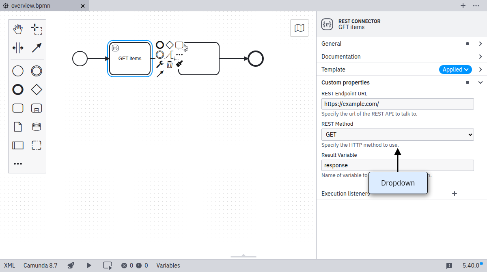
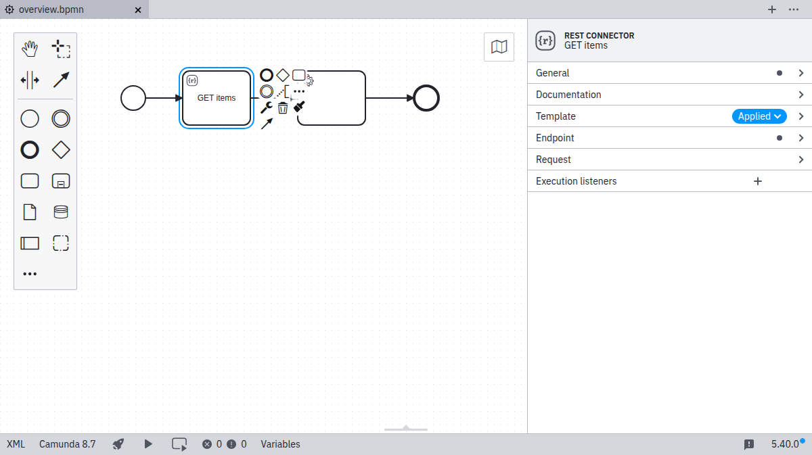
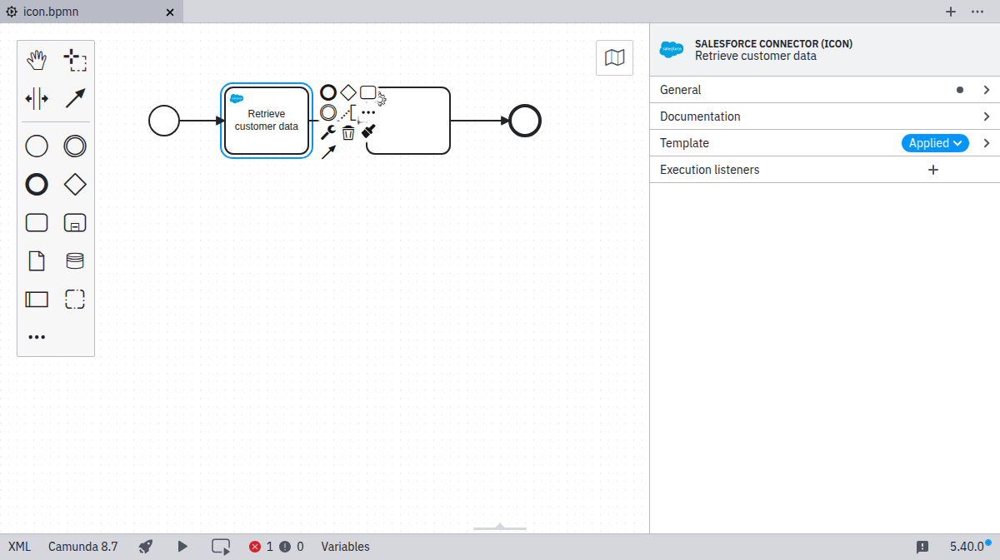

The `properties` array is where you define what properties should be applied to the BPMN element and how these properties should be shown and validated in the properties panel.
Element templates use `bindings` to map properties to BPMN 2.0 XML and Camunda extension elements.
Only bindings that are supported by the element template schema can be set by an element template. You can find the full list of supported bindings in the [bindings](#bindings) section.
All BPMN 2.0 XML and Camunda extension elements properties that the element template schema can define bindings for are hidden by default.
The template author must explicitly make them user configurable to show them in the properties panel once the user has applied the template.

:::note
Some properties, such as, execution listeners, task listeners, element documentation, and multi-instance configurations cannot be set by element templates.
They are situational and require knowledge of the process context to be used.
As they are never part of any element template, users can configure them independently of the applied template.
:::

## What is part of a property?

You build your template by adding property objects to the `properties` array. The important keys in a property definition are:

- `label : string`: A descriptive text shown with the property.
- `type : String | Text | Boolean | Dropdown | Hidden`: Defining the input type in the properties panel.
- `feel : required | optional | static`: Defines whether the property supports [FEEL](#feel) expressions.
- `value : string | number | boolean`: An optional default value to be used if the property to be bound is not yet set by the user or if the type is `Hidden`.
- `generatedValue : object`: An optional configuration to generate a value when the property is applied to an element.
- `placeholder : string`: An optional placeholder text shown in the input field when it is empty.
- `binding : object`: An object specifying how the property is mapped to BPMN or Camunda extensions (cf. [bindings](#bindings)).
- `optional : boolean`: Optional bindings do not persist empty values in the underlying BPMN 2.0 XML.
- `constraints : object`: A list of editing constraints to apply to the value of the binding.
- `group : string`: The group that the property belongs to. Todo link to groups section
- `id : string`: An identifier that can be used to reference the property in conditional properties
- `condition : object`: A condition that determines when [the property is active](#defining-conditional-properties)

Not all keys and values are compatible with each other. For more information see the documentation below.
Additionally, if your editor supports JSON schema, these incompatibilities are highlighted while you edit your template.

:::note
If you add multiple properties with equal `binding` objects, the behavior is undefined.
:::

## Example

With each template, you define some user-editable fields as well as their mapping to BPMN 2.0 XML, and Camunda extension elements.

Let us consider the following example that defines a template for invoking a REST API via a service task:

```json
{
  "$schema": "https://unpkg.com/@camunda/zeebe-element-templates-json-schema/resources/schema.json",
  "name": "REST connector",
  "id": "io.camunda.examples.RestConnector",
  "description": "A REST API invocation task.",
  "appliesTo": ["bpmn:ServiceTask"],
  "properties": [
    {
      "type": "Hidden",
      "value": "http",
      "binding": {
        "type": "zeebe:taskDefinition",
        "property": "type"
      }
    },
    {
      "label": "REST Endpoint URL",
      "description": "Specify the url of the REST API to talk to.",
      "type": "String",
      "binding": {
        "type": "zeebe:taskHeader",
        "key": "url"
      },
      "constraints": {
        "notEmpty": true,
        "pattern": {
          "value": "^https?://.*",
          "message": "Must be http(s) URL."
        }
      }
    },
    {
      "label": "REST Method",
      "description": "Specify the HTTP method to use.",
      "type": "Dropdown",
      "value": "get",
      "choices": [
        { "name": "GET", "value": "get" },
        { "name": "POST", "value": "post" },
        { "name": "PATCH", "value": "patch" },
        { "name": "DELETE", "value": "delete" }
      ],
      "binding": {
        "type": "zeebe:taskHeader",
        "key": "method"
      }
    },
    {
      "label": "Request Body",
      "description": "Data to send to the endpoint.",
      "value": "",
      "type": "String",
      "optional": true,
      "binding": {
        "type": "zeebe:input",
        "name": "body"
      }
    },
    {
      "label": "Result Variable",
      "description": "Name of variable to store the response data in.",
      "value": "response",
      "type": "String",
      "optional": true,
      "binding": {
        "type": "zeebe:output",
        "source": "= body"
      }
    }
  ]
}
```

The example defines five custom fields, each mapped to different technical properties:

- The task type `http` is mapped to the `type` property of a `zeebe:taskDefinition` element in BPMN 2.0 XML.
- The `REST Endpoint URL` and `REST Method` are mapped to `task headers`.
- The `Request Body` is mapped to a local variable via an `input parameter`.
- The `Result Variable` is mapped into a process variable via an `output parameter`.

The task type is hidden to the user. Properties specified in the template can be edited through the properties panel as shown in the following screenshot:


### Generated value

As an alternative to static `value`, you can use a generated value. The value is generated when a property is applied to an element. Currently, the generated value can be a UUID:

```json
{
  "type": "Hidden",
  "generatedValue": {
    "type": "uuid"
  },
  "binding": {
    "type": "zeebe:property",
    "name": "id"
  }
}
```

### Types

The input types `String`, `Text`, `Number`, `Boolean`, `Dropdown`, and `Hidden` are available. As seen above, `String` maps to a single-line input, while `Text` maps to a multi-line input.

#### Number type

The `Number` type maps to a number input field. By default, this will be persisted as a string in the BPMN. Refer to the [FEEL](#feel) section to use `Numbers` as expressions.

#### Boolean / checkbox type

The `Boolean` type maps to a checkbox that can be toggled by the user.

When checked, it maps to `true` in the respective field (refer to [bindings](#bindings)). Additionally, refer to the [FEEL](#feel) section to use `Booleans` as expressions.

#### Dropdown type

The `Dropdown` type allows users to select from a number of pre-defined options that are stored in a custom properties `choices` attribute as `{ name, value }` pairs:

```json
...
  "properties": [
    ...
    {
      "label": "REST Method",
      "description": "Specify the HTTP method to use.",
      "type": "Dropdown",
      "value": "get",
      "choices": [
        { "name": "GET", "value": "get" },
        { "name": "POST", "value": "post" },
        { "name": "PATCH", "value": "patch" },
        { "name": "DELETE", "value": "delete" }
      ],
      "binding": {
        "type": "zeebe:taskHeader",
        "key": "method"
      }
    }
  ]
...
```

The resulting properties panel control looks like this:



#### FEEL

The following input types support the `feel` property:

- `String`
- `Text`
- `Number`
- `Boolean`

##### FEEL required

The field will be displayed as a FEEL editor and a visual indication that a FEEL expression is required will be shown:

```json
  "properties": [
    {
      "label": "Required FEEL Expression",
      "type": "String",
      "feel": "required"
    }
  ]
```

##### FEEL optional

An indicator to switch to a FEEL expression is shown. When activated, the field will be displayed as a FEEL editor:

```json
  "properties": [
    {
      "label": "Optional FEEL Expression",
      "type": "String",
      "feel": "optional"
    }
  ]
```

For `Boolean` and `Number` fields, the value will always be persisted as a FEEL expression. This ensures that the value will not be interpreted as a string when evaluated in the engine.

##### FEEL static

The value of `feel: static` is only valid for `Boolean` and `Number` fields. Similar to [FEEL optional](#feel-optional), the value of the field will be persisted as a FEEL expression. However, there is no toggle to switch to a FEEL editor and ensures only a static value can be entered:

```json
  "properties": [
    {
      "label": "Static FEEL value",
      "type": "Number",
      "feel": "static"
    }
  ]
```

For binding types `zeebe:input` and `zeebe:output`, `feel: static` is the value used in case of missing `feel` property.

### Bindings

The following ways exist to map a custom field to the underlying BPMN 2.0 XML. The **mapping result** in the following section uses `[userInput]` to indicate where the input provided by the user in the `Properties Panel` is set in the BPMN XML. As default or if no user input was given, the value specified in `value` is displayed and used for `[userInput]`. `[]` brackets are used to indicate where the parameters are mapped to in the XML.

Notice that adherence to the following configuration options is enforced by design. If not adhering, it logs a validation error and ignores the respective element template.

#### `property`

| **Binding `type`**          | `property`                       |
| --------------------------- | -------------------------------- |
| **Valid property `type`'s** | All property types are supported |
| **Binding parameters**      | `name`: The name of the property |
| **Mapping result**          | `<... [name]=[userInput] ... />` |

Configures a generic BPMN element property.

#### `zeebe:input`

| **Binding `type`**          | `zeebe:input`                                                                    |
| --------------------------- | -------------------------------------------------------------------------------- |
| **Valid property `type`'s** | `String`<br /> `Text`<br />`Hidden`<br />`Dropdown`<br />`Boolean`<br />`Number` |
| **Binding parameters**      | `name`: The name of the input parameter                                          |
| **Mapping result**          | `<zeebe:input target="[name]" source="[userInput] />`                            |

Configures an [input mapping](../../../concepts/variables/#input-mappings).

#### `zeebe:output`

| **Binding `type`**          | `zeebe:output`                                                                   |
| --------------------------- | -------------------------------------------------------------------------------- |
| **Valid property `type`'s** | `String`<br /> `Text`<br />`Hidden`<br />`Dropdown`<br />`Boolean`<br />`Number` |
| **Binding parameters**      | `source`: The source of the output parameter                                     |
| **Mapping result**          | `<zeebe:output target="[userInput]" source="[source] />`                         |

Configures an [output mapping](../../../concepts/variables/#output-mappings).

#### `zeebe:taskHeader`

| **Binding `type`**          | `zeebe:taskHeader`                                  |
| --------------------------- | --------------------------------------------------- |
| **Valid property `type`'s** | `String`<br /> `Text`<br />`Hidden`<br />`Dropdown` |
| **Binding parameters**      | `key`: The key of the task header                   |
| **Mapping result**          | `<zeebe:header key="[key]" value="[userInput] />`   |

Configures a [task header](../../bpmn/service-tasks/#task-headers).

#### `zeebe:taskDefinition`

| **Binding `type`**          | `zeebe:taskDefinition`                                                            |
| --------------------------- | --------------------------------------------------------------------------------- |
| **Valid property `type`'s** | `String`<br /> `Text`<br />`Hidden`<br />`Dropdown`                               |
| **Binding parameters**      | `property`: The name of the task definition property. Can be `type` or `retries`. |
| **Mapping result**          | `<zeebe:taskDefinition [property]="[userInput]" />`                               |

Configures the [task](../../bpmn/service-tasks/#task-definition) for a service or user task.

#### `zeebe:taskDefinition:type`

:::danger
`zeebe:taskDefinition:type` is a deprecated binding. Instead, use `zeebe:taskDefinition` with `property=type`.
:::

| **Binding `type`**          | `zeebe:taskDefinition:type`                         |
| --------------------------- | --------------------------------------------------- |
| **Valid property `type`'s** | `String`<br /> `Text`<br />`Hidden`<br />`Dropdown` |
| **Binding parameters**      |                                                     |
| **Mapping result**          | `<zeebe:taskDefinition type="[userInput]" />`       |

Configures the [task type](../../bpmn/service-tasks/#task-definition) for a service or user task.

#### `zeebe:property`

| **Binding `type`**          | `zeebe:property`                                      |
| --------------------------- | ----------------------------------------------------- |
| **Valid property `type`'s** | `String`<br />`Text`<br />`Hidden`<br />`Dropdown`    |
| **Binding parameters**      | `name`: The name of the property                      |
| **Mapping result**          | `<zeebe:property name="[name]" value="[userInput] />` |

The `zeebe:property` binding allows you to set any arbitrary property for an outside system. It does not impact execution of the Zeebe engine.

#### `bpmn:Message#property`

| **Binding `type`**          | `bpmn:Message#property`                            |
| --------------------------- | -------------------------------------------------- |
| **Valid property `type`'s** | `String`<br />`Text`<br />`Hidden`<br />`Dropdown` |
| **Binding parameters**      | `name`: The name of the property                   |
| **Mapping result**          | `<bpmn:message [name]="[userInput]" />`            |

The `bpmn:Message#property` binding allows you to set properties of a `bpmn:Message` referred to by the templated element. This binding is only valid for templates of events with `bpmn:MessageEventDefinition`, receive tasks, and send tasks.

#### `bpmn:Message#zeebe:subscription#property`

| **Binding `type`**          | `bpmn:Message#property`                            |
| --------------------------- | -------------------------------------------------- |
| **Valid property `type`'s** | `String`<br />`Text`<br />`Hidden`<br />`Dropdown` |
| **Binding parameters**      | `name`: The name of the property                   |
| **Mapping result**          | `<zeebe:subscription [name]="[userInput]" />`      |

The `bpmn:Message#zeebe:subscription#property` binding allows you to set properties of a `zeebe:subscription` set within `bpmn:Message` referred to by the templated element. This binding is only valid for templates of events with `bpmn:MessageEventDefinition`, and receive tasks.

:::note

The binding name of `correlationKey` is not applicable to message start events on a process. In such cases, the property is automatically hidden.

:::

#### `zeebe:calledElement`

| **Binding `type`**          | `zeebe:calledElement`                                                                                          |
| --------------------------- | -------------------------------------------------------------------------------------------------------------- |
| **Valid property `type`'s** | `String`<br />`Text`<br />`Hidden`<br />`Dropdown`                                                             |
| **Binding parameters**      | `property`: The name of the property.<br/> Supported properties: `processId`, `bindingType`, and `versionTag`. |
| **Mapping result**          | `<zeebe:calledElement [property]="[userInput]" />`                                                             |

The `zeebe:calledElement` binding allows you to configure process called by a call activity.

You can set the value of the property `bindingType` to control the [resource binding type](../../../best-practices/modeling/choosing-the-resource-binding-type).
We recommend setting the property `bindingType` to the value `"versionTag"` and setting property `versionTag`
to the value of the version tag of the process you want to call.

:::note

For `zeebe:calledElement` bindings, variable propagation is not supported. To provide or retrieve variables, use `zeebe:input` and `zeebe:output` bindings.

:::

#### `zeebe:userTask`

| **Binding `type`**          | `zeebe:userTask`                                                                                                      |
| --------------------------- | --------------------------------------------------------------------------------------------------------------------- |
| **Valid property `type`'s** | `Hidden`                                                                                                              |
| **Binding parameters**      | This is a flag-like binding, so it has no parameters and only applies to templates with element type `bpmn:UserTask`. |
| **Mapping result**          | `<zeebe:userTask />`                                                                                                  |

The `zeebe:userTask` binding allows you to configure the implementation type for a templated `bpmn:UserTask`. When present, it sets the task as a Camunda user task; when omitted, the task defaults to a job worker.

#### `zeebe:formDefinition`

| **Binding `type`**          | `zeebe:formDefinition`                                                                                                            |
| --------------------------- | --------------------------------------------------------------------------------------------------------------------------------- |
| **Valid property `type`'s** | `String`<br />`Text`<br />`Hidden`<br />`Dropdown`                                                                                |
| **Binding parameters**      | `property`: The name of the property. <br/> Supported properties: `formId`, `externalReference`, `bindingType`, and `versionTag`. |
| **Mapping result**          | `<zeebe:formDefinition [property]="[userInput]" />`                                                                               |

The `zeebe:formDefinition` binding allows you to configure the [user task form](../../bpmn/user-tasks/#user-task-forms) used by a user task.

When setting the `formId` property, you can set the value of the property `bindingType` to control the [resource binding type](../../../best-practices/modeling/choosing-the-resource-binding-type).
We recommend setting the property `bindingType` to the value `"versionTag"` and setting property `versionTag`
to the value of the version tag of the form you want to link.

:::note

When `zeebe:formDefinition` is used, `zeebe:userTask` must be set on the same element.
Properties `formId` and `externalReference` are mutually exclusive, meaning that only one of them can be set at a time.

:::

#### `zeebe:assignmentDefinition`

| **Binding `type`**          | `zeebe:assignmentDefinition`                                                                                           |
| --------------------------- | ---------------------------------------------------------------------------------------------------------------------- |
| **Valid property `type`'s** | `String`<br />`Text`<br />`Hidden`<br />`Dropdown`                                                                     |
| **Binding parameters**      | `property`: The name of the property. <br/> Supported properties: `assignee`, `candidateGroups`, and `candidateUsers`. |
| **Mapping result**          | `<zeebe:assignmentDefinition [property]="[userInput]" />`                                                              |

The `zeebe:assignmentDefinition` binding allows you to configure the [user task assignment](../../bpmn/user-tasks/#assignments).

:::note

When `zeebe:assignmentDefinition` is used, `zeebe:userTask` must be set on the same element.

:::

#### `zeebe:taskSchedule`

| **Binding type**         | `zeebe:taskSchedule`                                                                       |
| ------------------------ | ------------------------------------------------------------------------------------------ |
| **Valid property types** | `String`<br/>`Text`<br/>`Hidden`<br/>`Dropdown`                                            |
| **Binding parameters**   | `property`: The name of the property.<br/>Supported properties: `dueDate`, `followUpDate`. |
| **Mapping result**       | `<zeebe:taskSchedule [property]="[userInput]" />`                                          |

The `zeebe:taskSchedule` binding allows you to configure [user task scheduling](../../bpmn/user-tasks/#scheduling).

:::note
When `zeebe:taskSchedule` is used, `zeebe:userTask` must be set on the same element.  
If the template sets a static `value` for any property, it must be defined as an ISO 8601 combined date and time representation.
:::

#### `zeebe:priorityDefinition`

| **Binding type**         | `zeebe:priorityDefinition`                                                                                                             |
| ------------------------ | -------------------------------------------------------------------------------------------------------------------------------------- |
| **Valid property types** | `Number`<br/>`String` (only with `feel` set to `required`)<br/>`Text` (only with `feel` set to `required`)<br/>`Hidden`<br/>`Dropdown` |
| **Binding parameters**   | `property`: The name of the property.<br/>Supported property: `priority`.                                                              |
| **Mapping result**       | `<zeebe:priorityDefinition [property]="[userInput]" />`                                                                                |

The `zeebe:priorityDefinition` binding allows you to configure [user task priority](../../bpmn/user-tasks/#define-user-task-priority).

:::note
When `zeebe:priorityDefinition` is used, `zeebe:userTask` must be set on the same element.  
If the template sets a static `value` for `priority`, it must be between 0 and 100.
:::

#### `zeebe:calledDecision`

| **Binding `type`**          | `zeebe:calledDecision`                                                                                                            |
| --------------------------- | --------------------------------------------------------------------------------------------------------------------------------- |
| **Valid property `type`'s** | `String`<br />`Text`<br />`Hidden`<br />`Dropdown`                                                                                |
| **Binding parameters**      | `property`: The name of the property.<br/> Supported properties: `decisionId`, `resultVariable`, `bindingType`, and `versionTag`. |
| **Mapping result**          | `<zeebe:calledDecision [property]="[userInput]" />`                                                                               |

The `zeebe:calledDecision` binding allows you to configure the [called decision](../../bpmn/business-rule-tasks/#defining-a-task) used by a business rule task.

You can set the value of the property `bindingType` to control the [resource binding type](../../../best-practices/modeling/choosing-the-resource-binding-type).
We recommend setting the property `bindingType` to the value `"versionTag"` and setting property `versionTag`
to the value of the version tag of the decision you want to call.

:::note

When `zeebe:calledDecision` is used, `zeebe:taskDefinition` cannot be used on the same element.

:::

#### `zeebe:script`

| **Binding `type`**          | `zeebe:script`                                                                         |
| --------------------------- | -------------------------------------------------------------------------------------- |
| **Valid property `type`'s** | `String`<br />`Text`<br />`Hidden`<br />`Dropdown`                                     |
| **Binding parameters**      | `property`: The name of the property. `expression` and `resultVariable` are supported. |
| **Mapping result**          | `<zeebe:script [property]="[userInput]" />`                                            |

The `zeebe:script` binding allows you to configure the [FEEL expression](../../bpmn/script-tasks/#defining-a-task) used by a script task.

:::note

When `zeebe:script` is used, `zeebe:taskDefinition` cannot be used on the same element.

:::

### Optional bindings

We support optional bindings that do not persist empty values in the underlying BPMN 2.0 XML.

If a user removes the value in the configured control, it will also remove the mapped element.

```json
[
  {
    "$schema": "https://unpkg.com/@camunda/zeebe-element-templates-json-schema/resources/schema.json",
    "name": "Task example",
    "id": "some-template",
    "appliesTo": ["bpmn:ServiceTask"],
    "properties": [
      {
        "label": "Request",
        "type": "String",
        "optional": true,
        "binding": {
          "type": "zeebe:input",
          "name": "request"
        }
      },
      {
        "label": "Response",
        "type": "Text",
        "optional": true,
        "binding": {
          "type": "zeebe:output",
          "source": "response"
        }
      }
    ]
  }
]
```

#### Supported Bindings

The following binding types can be `optional`:

- `zeebe:input`
- `zeebe:output`
- `zeebe:taskHeader`
- `zeebe:property`

### Groups

You can define `groups` to organize custom fields into:

```json
{
  "$schema": "https://unpkg.com/@camunda/zeebe-element-templates-json-schema/resources/schema.json",
  "name": "Groups",
  "id": "group-example",
  "appliesTo": [
    "bpmn:ServiceTask"
  ],
  "groups": [
    {
      "id": "definition",
      "label": "Task definition",
      "openByDefault": true
    },
    {
      "id": "request",
      "label": "Request payload"
    },
    {
      "id": "result",
      "label": "Result mapping"
    },
    {
      "id": "authentication",
      "label": "Authentication",
      "tooltip": "Optional authentication settings"
    }
  ],
  "properties": [
    ...
  ]
}
```

Groups can have the following attributes:

- `id`: Unique identifier of the group
- `label`: Label of the group
- `tooltip`: Tooltip for the group (optional)
- `openByDefault`: Whether the group will be expanded in the properties panel (optional, default: `false`)

Associate a field with a group (ID) via the fields `group` key:

```json
{
  ...
  "properties": [
    {
      "group": "definition",
      "label": "Task type",
      "type": "String",
      "value": "http",
      "binding": {
        "type": "zeebe:taskDefinition:type"
      }
    },
    ...
  ],
  ...
}
```



### Constraints

Custom fields may have a number of constraints associated with them:

- `notEmpty`: Input must be non-empty
- `minLength`: Minimal length for the input
- `maxLength`: Maximal length for the input
- `pattern`: Regular expression to match the input against

#### Regular expression

Together with the `pattern` constraint, you can define your custom error messages:

```json
...
  "properties": [
    {
      "label": "Web service URL",
      "type": "String",
      "binding": { ... },
      "constraints": {
        "notEmpty": true,
        "pattern": {
          "value": "https://.*",
          "message": "Must be https URL"
        }
      }
    }
  ]
```

### Placeholder

The following property types support the `placeholder` attribute:

- `String`
- `Text`

The placeholder is displayed when a field is empty:

```json
...
  "properties": [
    {
      "label": "Web service URL",
      "type": "String",
      "binding": { ... },
      "placeholder": "https://example.com"
    }
  ]
```

### Category

You can define a category to group templates in the element template selection list. The category is defined as an object with `id` and `name` properties.

```json
[
  {
    "name": "REST connector",
    "id": "io.camunda.examples.RestConnector",
    "description": "A REST API invocation task.",
    "appliesTo": ["bpmn:ServiceTask"],
    "category": {
      "id": "connectors",
      "name": "Connectors"
    },
    "properties": [
      ...
    ]
  }
]
```

:::note
The category is optional. If not defined, the template will be displayed in the **Templates** section.
:::

### Icons

It is possible to define custom icons to update the visual appearance of elements after applying an element template.

```json
[
  {
    "name": "Template 1",
    "id": "sometemplate",
    "appliesTo": [
      "bpmn:ServiceTask"
    ],
    "icon": {
      "contents": "data:image/svg+xml,%3Csvg xmlns='http://www.w3.org/2000/svg' width='22' height='22' viewBox='0 0 22 22' fill='none'%3E%3Ccircle cx='11' cy='11' r='9' fill='black'/%3E%3Ctext x='6.9' y='14.9' fill='white' style='font-family: Arial; font-size: 10px;'%3EM%3C/text%3E%3C/svg%3E"
    },
    "properties": [
      ...
    ]
  }
]
```



:::tip
The icon contents must be a valid [data](https://developer.mozilla.org/en-US/docs/Web/HTTP/Basics_of_HTTP/Data_URIs) or HTTP(s) URL. We recommend using square icons as they get rendered 18x18 pixels on the canvas and 32x32 pixels in the properties panel.
:::

### Display all entries

Per default, the element template defines the visible entries of the properties panel. All other property controls are hidden. If you want to bring all the default entries back, it is possible to use the `entriesVisible` property.

```json
[
  {
    "name": "Template 1",
    "id": "sometemplate",
    "entriesVisible": true,
    "appliesTo": [
      "bpmn:ServiceTask"
    ],
    "properties": [
      ...
    ]
  }
]
```


## Defining conditional properties

Properties may have a condition which determines when they should be active, depending on the value of another property. When property is **active**, it is displayed in the properties panel, and its value is serialized in the XML. If a property is **not active**, it is not displayed, and its value is removed from the XML.

For a property value to be used in a condition, the property needs to have an `id` that can be referenced by the conditional property.

A property can depend on one or more conditions. If there are multiple conditions, they can be defined using `allMatch`. All of the conditions must be met for the property to be active.

There are three possible comparison operators:

- `equals`: Checks if the value is equal to the value defined in the condition.
- `oneOf`: Checks if the value is in the list of values defined in the condition.
- `isActive`: Checks if the referenced property is currently active and not hidden by other conditions.

```json
...
  "properties": [
    {
      "id": "httpMethod",
      "label": "HTTP Method",
      "type": "Dropdown",
      "choices": [
        { "name": "get", "value": "GET" },
        { "name": "patch", "value": "PATCH" },
        { "name": "post", "value": "POST" },
        { "name": "delete", "value": "DELETE" }
      ],
      "binding": { ... },
    },
    {
      "label": "Request Body",
      "type": "String",
      "binding": { ... },
      "condition": {
        "property": "httpMethod",
        "oneOf": ["patch", "post", "delete"]
      }
    },
    {
      "id": "authenticationType",
      "label": "Authentication Type",
      "type": "Dropdown",
      "choices": [
        {
          "name": "None",
          "value": ""
        },
        {
          "name": "Basic",
          "value": "basic"
        }
      ],
      "binding": { ... }
    },
    {
      "label": "Username",
      "type": "String",
      "binding": { ... },
      "condition": {
       "allMatch": [
          {
            "property": "httpMethod",
            "oneOf": ["patch", "post", "delete"]
          },
          {
            "property": "authenticationType",
            "equals": "basic"
          }
        ]
      }
    },
    {
      "label": "Password",
      "type": "String",
      "binding": { ... },
      "condition": {
        "allMatch": [
          {
            "property": "httpMethod",
            "oneOf": ["patch", "post", "delete"]
          },
          {
            "property": "authenticationType",
            "equals": "basic"
          }
        ]
      }
    },
  ]
```
