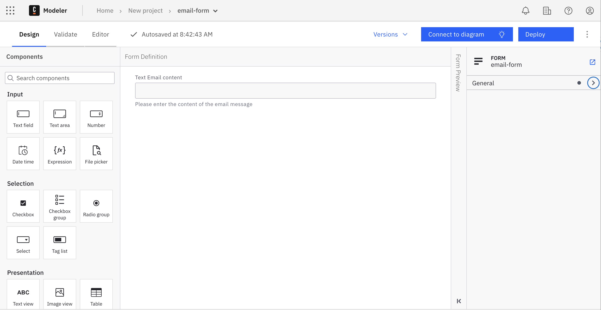
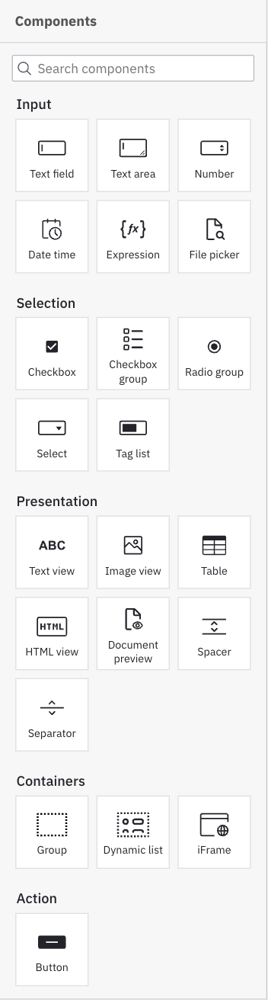
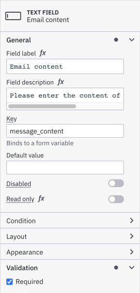

Beginner
Time estimate: 15 minutes

## Overview

The Camunda Forms feature allows you to easily design and configure forms. Once configured, they can be connected to a user task or start event to implement a task form in your application.

After deploying a diagram with a linked form, Tasklist imports this form schema and uses it to render the form on every task assigned to it.

## Quickstart

### Create new form

To start building a form, log in to your [Camunda 8](https://camunda.io) account or open [Desktop Modeler](/components/modeler/about-modeler.md) and take the following steps:

1. Navigate to Web Modeler or alternatively open the **File** menu in Desktop Modeler.
2. Open any project from your Web Modeler home view.
3. Click **Create new** and choose **Form**.

### Build your form

Now you can start to build your form by dragging elements from the palette to the canvas, or by using the AI Form Generator at the bottom of the palette. For the purpose of this guide, we'll build a form from scratch.

Right after creating your form, you can name it by replacing the **New Form** text with the name of your choice. In this example, we'll build a form to help with a task in obtaining an email message.

Add your desired elements from the palette on the left side by dragging and dropping them onto the canvas.

Within Forms, we have the option to add text fields, numerical values, checkboxes, radio elements, selection menus, text components, and buttons.

In the properties panel on the right side of the page, view and edit attributes that apply to the selected form element. For example, apply a minimum or maximum length to a text field, or require a minimum or maximum value within a number element. In this case, we have labeled the field, described the field, and required an input for our email message.

Refer to the [camunda forms reference](/components/modeler/forms/camunda-forms-reference.md) to explore all form elements and configuration options in detail.

### Save your form

To save your form in Camunda 8, you don't have to do anything. Web Modeler will autosave every change you make.

### Link your form to a BPMN diagram {#connect-your-form-to-a-bpmn-diagram}

Next, let's implement a task form into a diagram. In tandem, we can link your form to a user task or start event.

Navigate to Modeler and open any project from your Web Modeler home view.

Take the following steps:

1. Select the diagram where you'd like to apply your form.
2. Select the user task requiring the help of a form.
3. On the right side of the selected user task, select the overlay with the link icon to open the navigation menu.
4. Navigate to the form you want to link and click the **Link** button.
5. When a user task has a linked form, the overlay will always stay visible on the right side of the task.

:::note
When using Camunda Forms, any submit button present in the form schema is hidden so we can control when a user can complete a task.
:::

:::tip Linked Camunda Forms must be explicitly deployed.
With Camunda 8.9, linked Camunda Forms are no longer auto-deployed. This change provides greater control over what is deployed and when, enabling more precise management of changes and updates across environments.
:::

## Deploy a linked form

To deploy your latest form changes, click the **Deploy** button.

## Deploy your diagram and start an instance

To execute your process diagram, click the **Deploy** button.

To avoid incidents:

- When deploying a process application, if the links between resources are configured with the 'deployment' binding, the BPMN diagrams and their forms must be deployed together.
- When deploying a BPMN file separately, and linking resources using the 'latest' binding, ensure the forms are deployed beforehand.

Then start a new process instance.

Click the **Run** button.
You can now monitor your instances in [Operate](/components/operate/operate-introduction.md).

:::info
When deploying a BPMN diagram, Web Modeler will not automatically deploy linked forms. This gives you full control over when and which version of a form is deployed.
As linked forms are resolved to their latest version (unless you change the [binding type](/components/modeler/web-modeler/modeling/advanced-modeling/form-linking.md#camunda-form-linked)), make sure that the intended form version is available in the target cluster and that the binding resolves to that version.

When deploying to a Camunda 8 cluster running a version earlier than 8.4, forms linked to user tasks or none start events will be automatically embedded into the user task to guarantee backwards compatibility.
Read more about the different ways to reference Camunda Forms in the [user task forms reference](/components/modeler/bpmn/user-tasks/user-tasks.md#user-task-forms).
:::

To [complete a user task](/guides/getting-started-orchestrate-human-tasks.md), navigate to [Tasklist](/components/tasklist/introduction-to-tasklist.md).

## Additional resources

- [Desktop and Web Modeler](/components/modeler/about-modeler.md)
- [User task reference](/components/modeler/bpmn/user-tasks/user-tasks.md)

## Next steps

When building a form for a process, you can also use the [Filepicker form component](/components/modeler/forms/form-element-library/forms-element-library-filepicker.md) to allow users to upload files. Learn more in [building a form for document upload](/components/document-handling/upload-document-to-bpmn-process.md#build-a-form-for-document-upload).

You can also use the [document preview component](/components/modeler/forms/form-element-library/forms-element-library-document-preview.md) to display and allow document download with your form. Learn more in [building a form for document preview and download](/components/document-handling/display-and-download-document.md#build-a-form-for-document-preview-and-downloading).

Additionally, review the Camunda Academy course on [using the AI-assisted form builder](https://academy.camunda.com/c8-h2-ai-form-builder).
