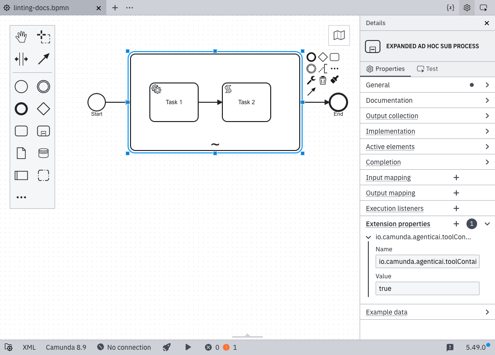

## Declare a sub-process as agentic

This rule applies only within an ad-hoc sub-process recognized as a tool container. Camunda’s provided AI Agent element templates are compatible with this rule, regardless of the template version. An ad-hoc sub-process is recognized as a tool container in either of the following ways:

- Its `zeebe:modelerTemplate` attribute is set to `io.camunda.connectors.agenticai.aiagent.jobworker.v1`, which identifies the AI Agent job worker template. Any version of this template is supported.
- It has a `zeebe:property` named `io.camunda.agenticai.toolContainer` with the value `true`, regardless of whether its tools are invoked by an AI Agent task in the same process or in a separate process. Starting with Camunda `8.10.0-alpha4`, the out-of-the-box AI Agent element templates add this property automatically. This property is the supported long-term approach.

If you are not using an out-of-the-box template, or if your template version predates this change, add the property manually. Select the ad-hoc sub-process, open the **Extension properties** section in the properties panel, and add a property named `io.camunda.agenticai.toolContainer` with the value `true`. The property appears as a standard extension property rather than as a dedicated control:



In the XML, the property appears as follows:

```xml
<bpmn:adHocSubProcess id="Tools">
  <bpmn:extensionElements>
    <zeebe:properties>
      <zeebe:property name="io.camunda.agenticai.toolContainer" value="true" />
    </zeebe:properties>
  </bpmn:extensionElements>
</bpmn:adHocSubProcess>
```
