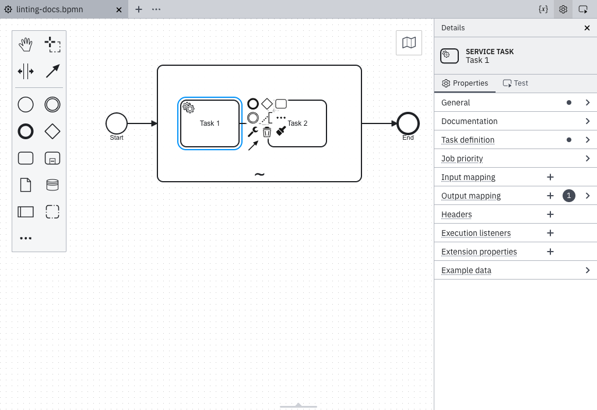

import MarkerGuideline from "@site/src/mdx/MarkerGuideline";
import DeclaringAgenticSubprocess from "./\_declaring-agentic-subprocess.md";

Tools within an [AI Agent sub-process](/components/connectors/out-of-the-box-connectors/agentic-ai-aiagent-subprocess.md) require a documentation entry, which the AI agent uses to select tools.

Missing documentation does not cause an outright failure, but an undocumented tool might degrade the AI agent's performance. To fix this, select the tool's entry element, open the **Documentation** section in the properties panel, and describe what the tool does and when the agent should use it.

The rule checks the tool's entry element, the activity with no incoming sequence flow. Activities reached through a sequence flow are part of the tool's internal flow and do not require their own documentation. Event sub-processes are also skipped because they are triggered by events rather than called by the agent:

## <MarkerGuideline.Invalid /> No documentation

The tool's entry activity has no documentation text or contains only whitespace. The agent sees only the element name (for example, `Fetch URL`) and must guess what the tool does, which inputs matter, and when to use it.

## <MarkerGuideline.Valid /> Documentation provided

The tool's entry activity has a documentation entry such as:

> Fetches the contents of a web page. Use this when the user provides or asks about a URL. Returns the raw response body.

A good tool description covers three things: what the tool does, when the agent should use it, and what it returns.

<DeclaringAgenticSubprocess />

## See also

- [Agentic orchestration](../../../../agentic-orchestration/agentic-orchestration-overview.md)
- [AI Agent tool definitions](../../../../connectors/out-of-the-box-connectors/agentic-ai-aiagent-tool-definitions.md)
- [Rule source](https://github.com/camunda/bpmnlint-plugin-camunda-compat/blob/main/rules/camunda-cloud/agent-tool-documentation.js)
