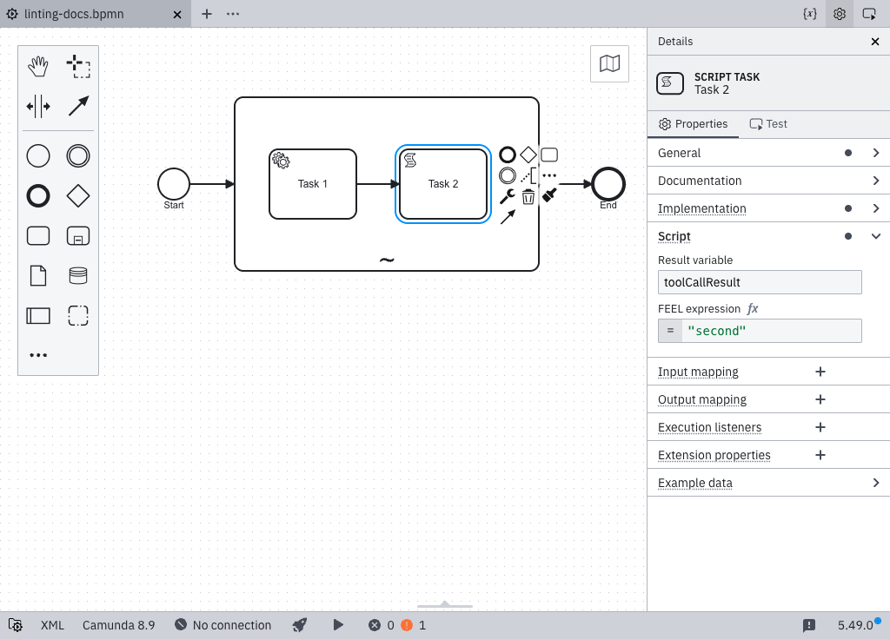

import MarkerGuideline from "@site/src/mdx/MarkerGuideline";
import DeclaringAgenticSubprocess from "./_declaring-agentic-subprocess.md";

Tools inside an [AI agent sub-process](../../../../agentic-orchestration/agentic-orchestration-overview.md) return their result to the agent through the `toolCallResult` variable. The rule warns once per tool, on the tool's entry element, in two situations:

1. **Misdirected result**: the tool writes result variables, but none of them is `toolCallResult` (e.g. a typo like `toolCalResult`).
2. **No result at all**: no element in the tool's flow sets a result variable. Even a fire-and-forget tool should note completion, e.g. `= "Email sent."`.

## How a tool can set `toolCallResult`

The result can be set anywhere in the tool's flow, through several channels:

- **Output mapping**: targeting `toolCallResult`, or a part of it such as `toolCallResult.statusCode`.
- **Connectors**: via their **Result variable** or **Result expression** field, e.g. `= { toolCallResult: response.body }`. This is their only channel; connectors can't read process variables.
- **Script tasks and business rule tasks**: set the **Result variable** to `toolCallResult`.

### Avoid overwrites when several elements contribute

Assigning `toolCallResult` twice overwrites the first value:



To append instead, use `context put()` in an output mapping:

```feel
= context put(toolCallResult, "confirmation", sendResult)
```

This only works for elements that run in the workflow engine. Connector result expressions can't read the current value of `toolCallResult`, so a connector tool must build its full result in one expression.

### What the rule cannot see

Results written from arbitrary FEEL expressions elsewhere (e.g. a variable set by a called process) aren't statically detectable. Ignore the warning, or make the wiring explicit with an output mapping.

### The result variable name

This rule always checks for `toolCallResult`, the AI Agent connector's default. An AI Agent Task's multi-instance ad-hoc sub-process can rename it by changing the multi-instance **Output element** value; if you do, ignore the warning for that tool.

## <MarkerGuideline.Invalid /> Result never reaches the agent

The tool maps its output to `result` instead of `toolCallResult`, or no element in its flow sets a result at all.

## <MarkerGuideline.Valid /> `toolCallResult` set on some element of the tool flow

An output mapping targets `toolCallResult` (or a part like `toolCallResult.statusCode`), a connector result expression contains a `toolCallResult` key, or a script task's result variable is `toolCallResult`.

<DeclaringAgenticSubprocess />

## References

- [AI Agent tool definitions](../../../../connectors/out-of-the-box-connectors/agentic-ai-aiagent-tool-definitions.md)
- [Rule source](https://github.com/camunda/bpmnlint-plugin-camunda-compat/blob/main/rules/camunda-cloud/agent-tool-output-key.js)
