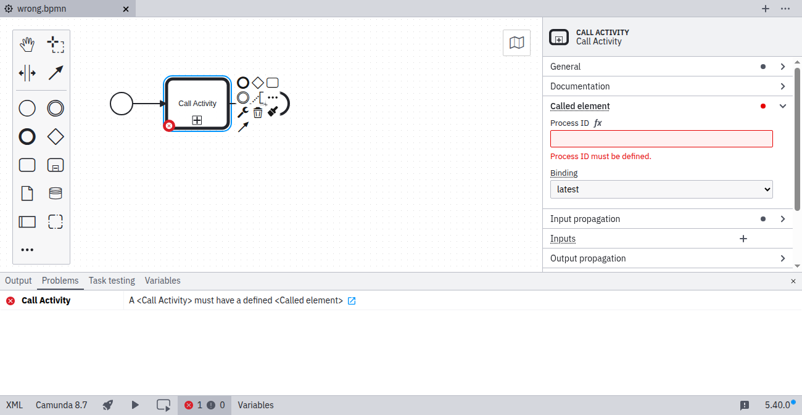
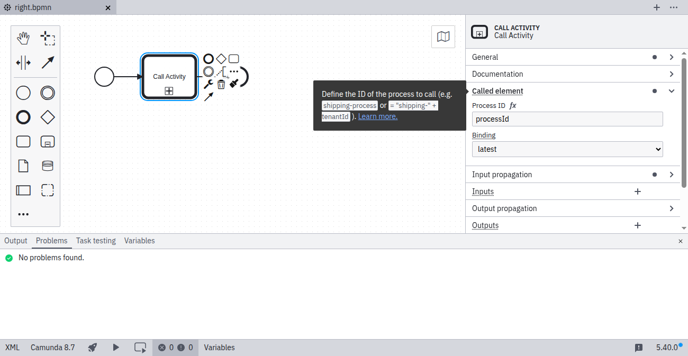

Call activities must specify the [process ID of the called process](../../../../bpmn/call-activities/#defining-the-called-process). To fix this problem, open the **Called element** group in the properties panel and specify the process ID of the called process.

## No process ID specified

## Process ID specified

## References

- [Call Activities](../../../../bpmn/call-activities/)
- [Rule source](https://github.com/camunda/bpmnlint-plugin-camunda-compat/blob/main/rules/camunda-cloud/called-element.js)
