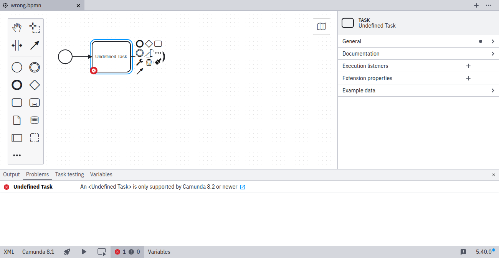
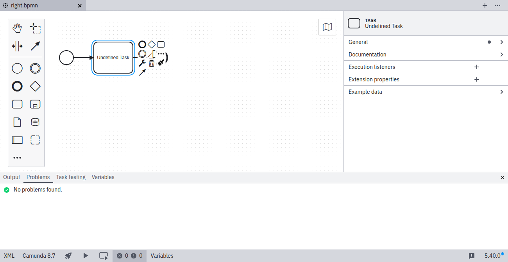

The element you modeled is not [supported for execution](../../../../bpmn/bpmn-coverage/) by the selected Camunda Platform version. It may be supported in a later version.

## Element type not supported by selected version

## Element type supported by selected version

## References

- [BPMN coverage](../../../../bpmn/bpmn-coverage/)
- [Rule source](https://github.com/camunda/bpmnlint-plugin-camunda-compat/tree/main/rules/camunda-cloud/element-type)
