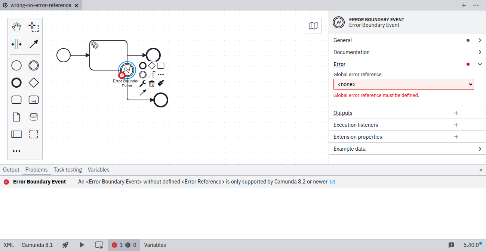
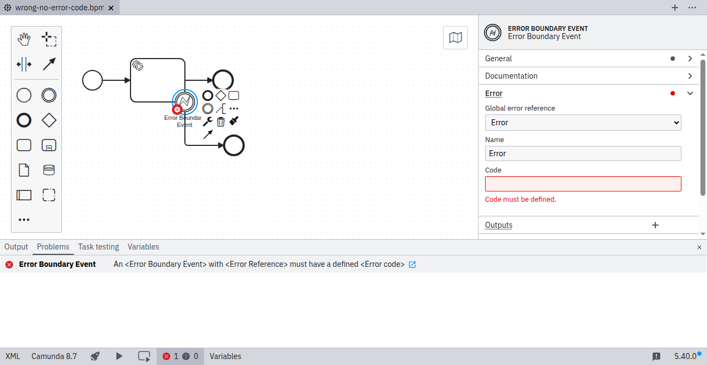

Take a closer look at [`error-reference`](https://github.com/camunda/bpmnlint-plugin-camunda-compat/blob/main/rules/camunda-cloud/error-reference.js).

An error event must reference an error defined in the process. The referenced error must have a defined error code. To fix this problem, open the **Error** group in the properties panel, select or create an error, and specify its error code. When deploying to Camunda 8.2+, no error reference is required.

## No error selected

## No error code specified

## Error selected and error code specified

Learn more about [error events](/docs/components/modeler/bpmn/error-events/).
