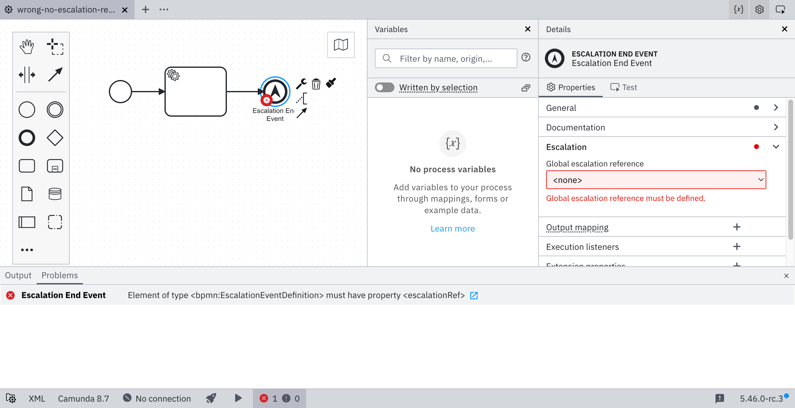
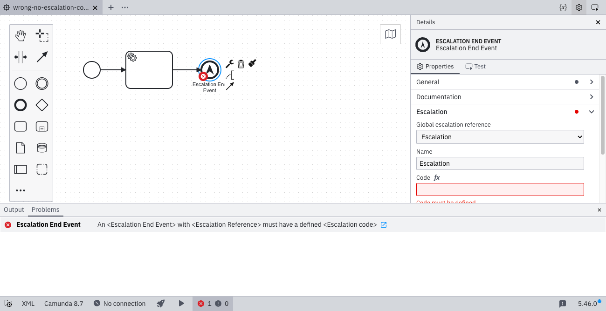
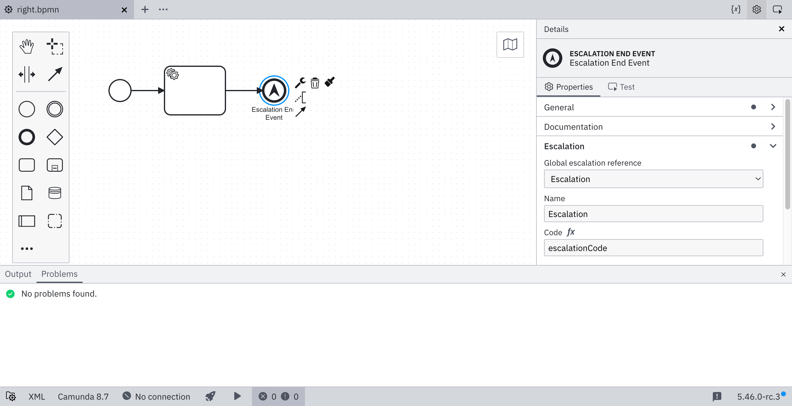

Take a closer look at [`escalation-reference`](https://github.com/camunda/bpmnlint-plugin-camunda-compat/blob/main/rules/camunda-cloud/escalation-reference.js).

An escalation event must reference an escalation defined in the process. The referenced escalation must have a defined escalation code. To fix this problem, open the **Escalation** group in the properties panel, select or create an escalation, and specify its escalation code. When deploying to Camunda 8.2+, no escalation reference is required.

## No escalation selected

## No escalation code specified

## Escalation selected and escalation code specified

Learn more about [escalation events](/docs/components/modeler/bpmn/escalation-events/).
