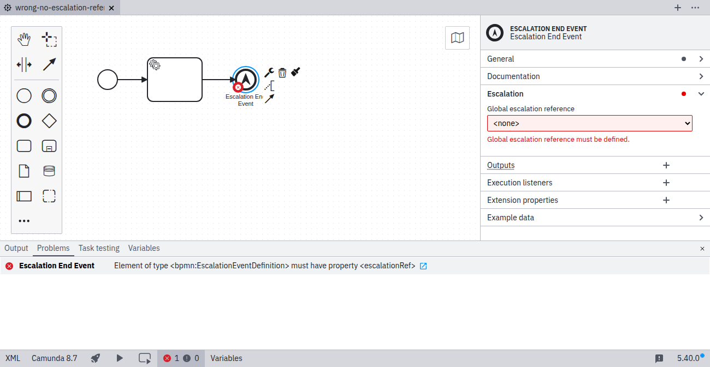
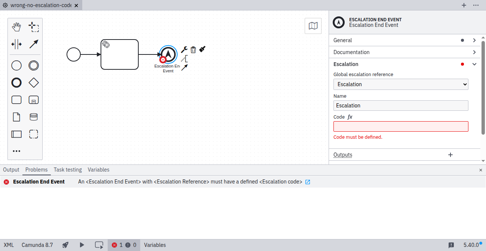
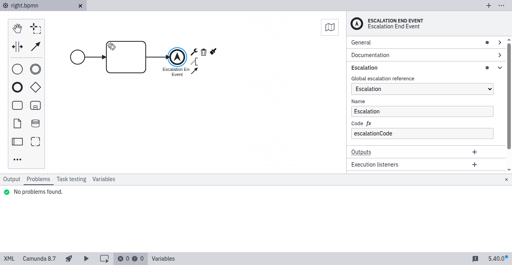

import MarkerGuideline from "@site/src/mdx/MarkerGuideline";

An [escalation event](../../../../bpmn/escalation-events/) must reference an escalation defined in the process. The referenced escalation must have a defined escalation code. To fix this problem, open the **Escalation** group in the properties panel on the right side of the screen, select or create an escalation, and specify its escalation code.

Camunda 8.2 and later support catch-all events and do not require an escalation reference.

## <MarkerGuideline.Invalid /> No escalation selected

## <MarkerGuideline.Invalid /> No escalation code specified

## <MarkerGuideline.Valid /> Escalation selected and escalation code specified

## Reference

- [Escalation events](../../../../bpmn/escalation-events/)
- [Rule source](https://github.com/camunda/bpmnlint-plugin-camunda-compat/blob/main/rules/camunda-cloud/escalation-reference.js)
