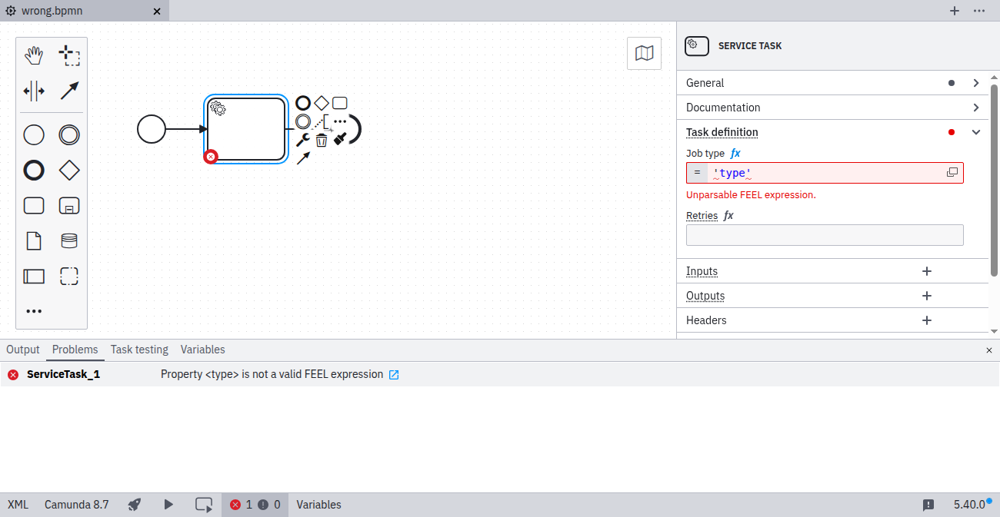
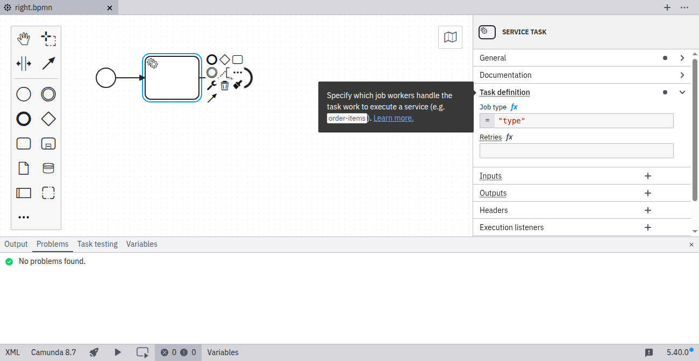

When using the [FEEL expression language](../../../../feel/what-is-feel/), you must specify a valid expression.

## Invalid FEEL expression

## Valid FEEL expression

## References

- [FEEL expressions](../../../../feel/what-is-feel/)
- [Rule source](https://github.com/camunda/bpmnlint-plugin-camunda-compat/blob/main/rules/camunda-cloud/feel.js)
