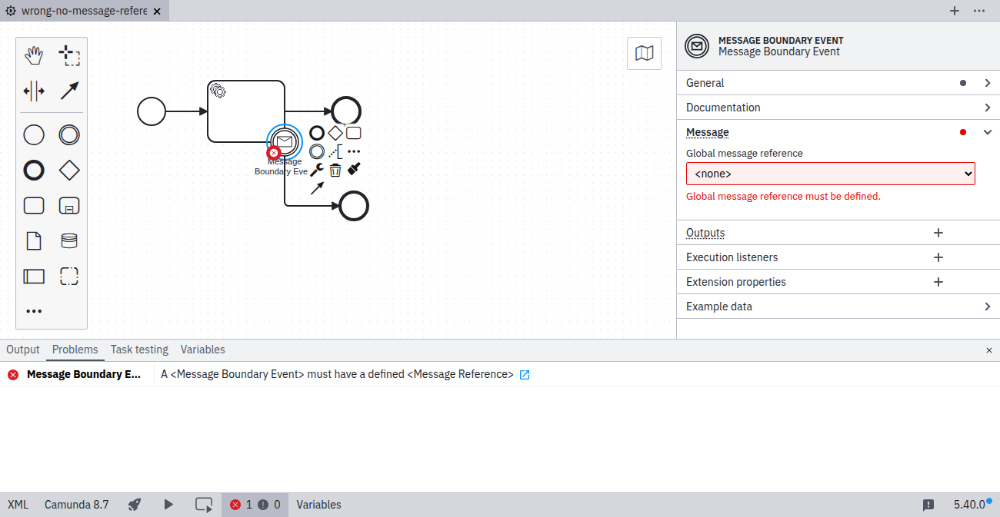
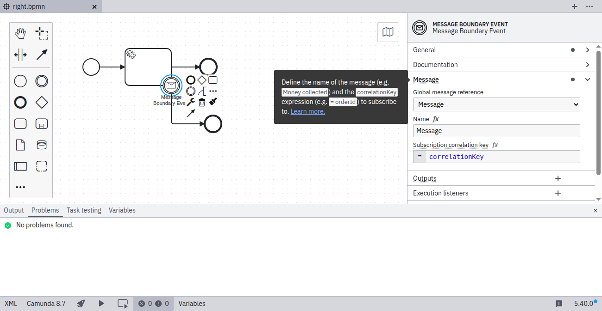

A message event or receive task must reference a message defined in the process. To fix this problem, open the **Message** group in the properties panel and select or create a message. The referenced message must have a defined correlation key (see [message subscriptions](../../../../../concepts/messages/#message-subscriptions)).

## No message selected

## Message selected

## References

- [Messages](../../../../../concepts/messages/)
- [Rule source](https://github.com/camunda/bpmnlint-plugin-camunda-compat/blob/main/rules/camunda-cloud/message-reference.js)
