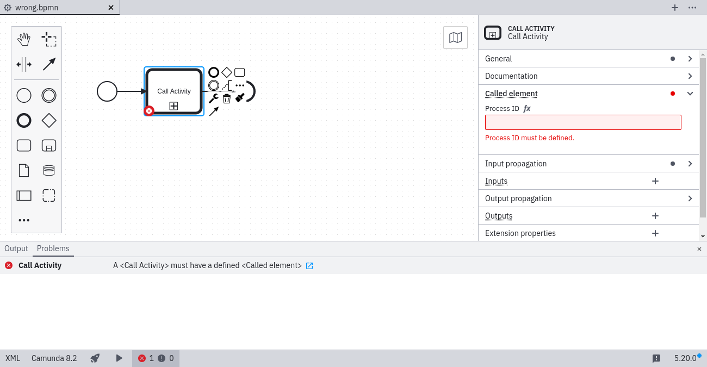
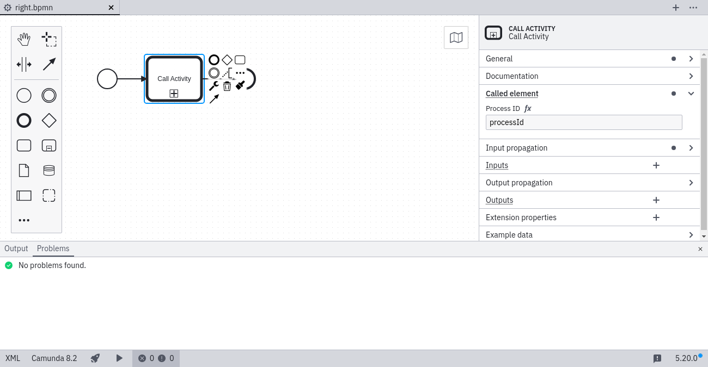

# Called Element ([`called-element`](https://github.com/camunda/bpmnlint-plugin-camunda-compat/blob/main/rules/camunda-cloud/called-element.js))

Call activities must specify the process ID of the called process. To fix this problem, open the _Called element_ group in the properties panel and specify the process ID of the called process.

### ❌ No process ID specified

### ✔️ Process ID specified

Learn more about [call activities](/docs/components/modeler/bpmn/call-activities/#defining-the-called-process).
