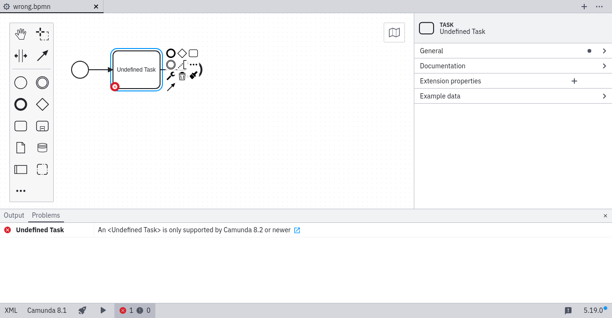
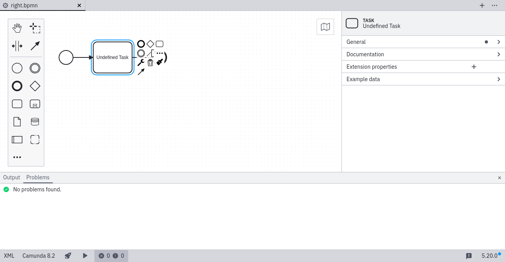

# Element Type ([`element-type`](https://github.com/camunda/bpmnlint-plugin-camunda-compat/tree/main/rules/camunda-cloud/element-type))

While you can model using any BPMN element supported by the modeler, there are some elements that are not supported by older versions of Zeebe. Depending on the version you've selected the modeler will mark elements that are not supported by that version. They might be supported by a newer version of Zeebe.

### ❌ Element type not supported by selected version

### ✔️ Element type supported by selected version

Learn more about [BPMN coverage](/docs/next/components/modeler/bpmn/bpmn-coverage/).
