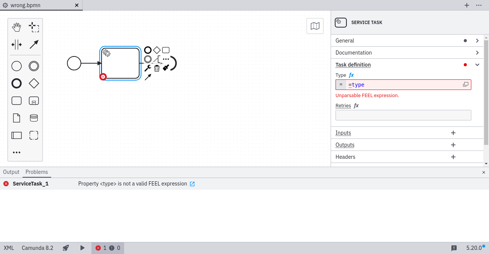
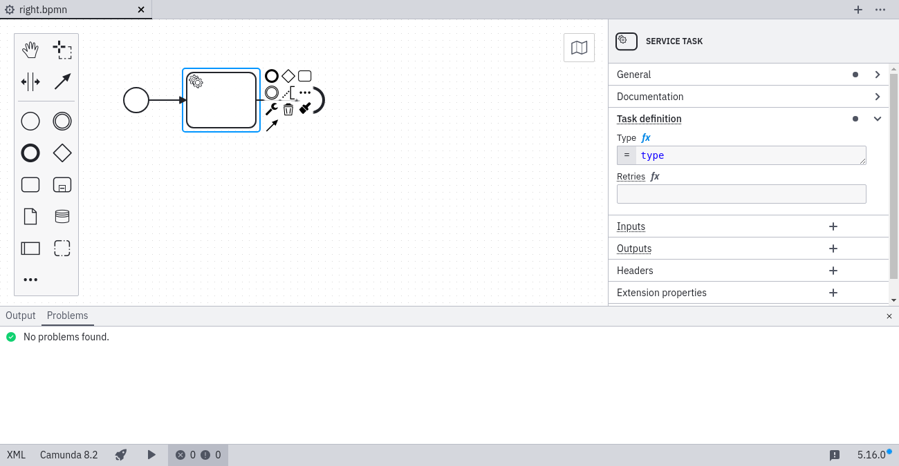

# FEEL ([`FEEL`](https://github.com/camunda/bpmnlint-plugin-camunda-compat/blob/main/rules/camunda-cloud/feel.js))

When using the [FEEL expression language](/docs/components/modeler/feel/what-is-feel/) you must specify a valid expression.

### ❌ Invalid FEEL expression

### ✔️ Valid FEEL expression

Learn more about [FEEL expressions](/docs/components/modeler/feel/what-is-feel/)
