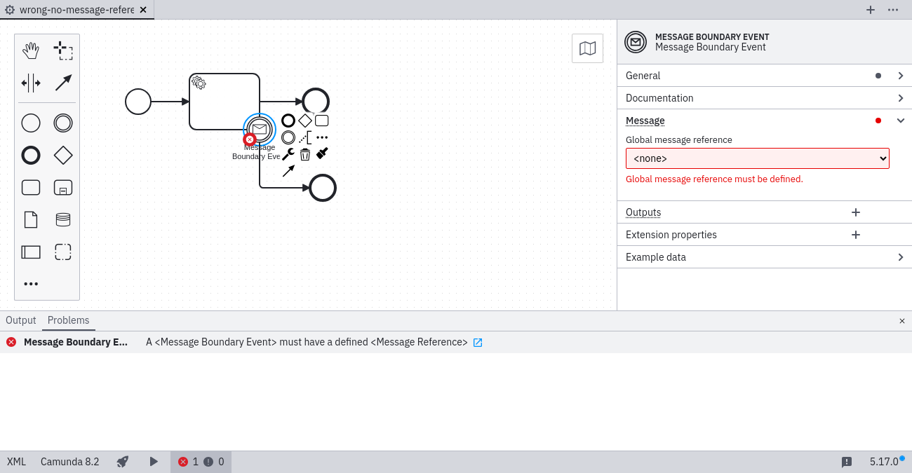
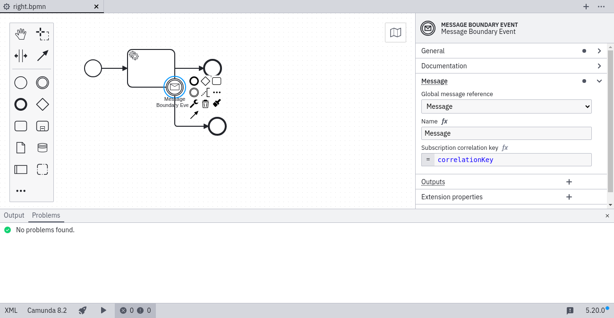

# Message Reference ([`message-reference`](https://github.com/camunda/bpmnlint-plugin-camunda-compat/blob/main/rules/camunda-cloud/message-reference.js))

A message event or receive task must reference a message defined in the process. To fix this problem, open the _Message_ group in the properties panel and select or create a message. The referenced message must have a defined correlation key (see [message subscriptions](/docs/components/concepts/messages/#message-subscriptions)).

### ❌ No message selected

### ✔️ Message selected

Learn more about [messages](/docs/components/concepts/messages/).
