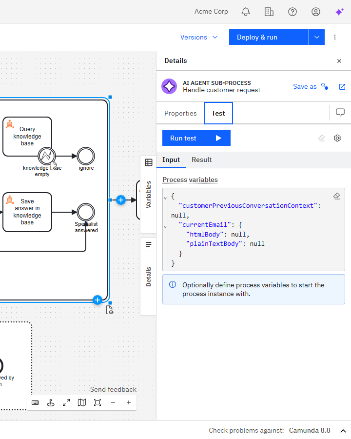

Test a BPMN activity directly from the modeler to verify your implementation without running the entire process.

Task testing provides immediate feedback on your implementation, variable mappings, and configuration within the modeler.

The selected element runs on the connected Camunda 8 engine, as it does during normal process execution.

## How it works

When you test an element, the following occurs:

1. The modeler deploys the process to the connected Camunda 8.8+ orchestration cluster.
2. You define the process context by providing input variables.
3. The engine executes the selected element:
   - Input mappings are applied as configured.
   - The actual task logic (connector, script, or external task) is executed by the engine.
   - Output mappings are applied as configured.
4. The modeler displays the **Result** tab containing the execution log, process variables, and local variables, as well as any incidents or errors.

:::warning
Testing executes elements with live data on the connected cluster. Any configured actions (emails, API calls, database updates, payments, etc.) will run as defined.

Do not use a production environment.
:::

## Prerequisites

- A connection to an active Camunda 8.8 or later orchestration cluster.
- Appropriate credentials and permissions to deploy and run processes.

After running a test, you can view the resulting process instance in [Operate](../../components/operate/operate-introduction.md) for additional insights into execution details or incidents. Test instances are deployed as standard process instances and can be viewed, managed, or deleted as usual.

For configuration steps, see:

- [Test in Web Modeler](./web-modeler/validation/task-testing.md)
- [Test in Desktop Modeler](./desktop-modeler/task-testing.md)

## Supported elements

You can test the following BPMN elements:

- **Task elements** — service tasks, script tasks, user tasks, business rule tasks, and send tasks.
- **Sub-processes** — embedded sub-processes can be tested directly, executing all contained elements.
- **Tasks inside sub-processes** — individual tasks within a sub-process can also be tested.

The following elements are not supported:

- Call activities
- Events (start, end, boundary)
- Gateways

## Variable persistence

When a test completes:

- Input variables are stored locally for reuse in subsequent test runs.
- The last test result of an element is persisted, including output variables.
- You can rerun tests with the same input set or modify them to test new values.

## Best practices

- Use a staging cluster or sandbox environment for testing live integrations.
- Mock external API calls and disable production credentials when possible.
- Review results in Operate to confirm behavior and variable mappings.
