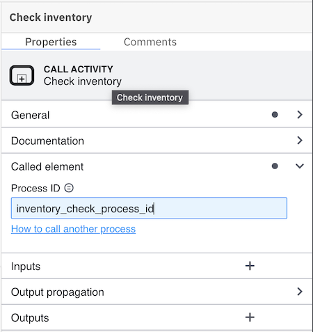

You can use one of the following approaches to link the process to be called by a [call activity](/components/modeler/bpmn/call-activities/call-activities.md).

## Using the link button

1. Select a call activity task from the canvas and a link button will appear at the bottom right.
2. Click on the button and choose any diagram from the same project.
3. Click the **Link** button to complete the linking process. The process ID of the diagram you chose to link is automatically copied to the **Called element** section in the properties panel.

For call activities that are already linked, clicking on the link button opens a dialog which shows the name of the diagram the call activity is linked to. It is possible to navigate to the linked diagram by clicking on it, or you can use the **Unlink** button to remove the link.

## Using the properties panel

You may also enter the process ID directly in the **Called element** section in the properties panel.

:::info
Deploying a diagram does not automatically deploy linked diagrams. Ensure you deploy linked diagrams separately.
:::
